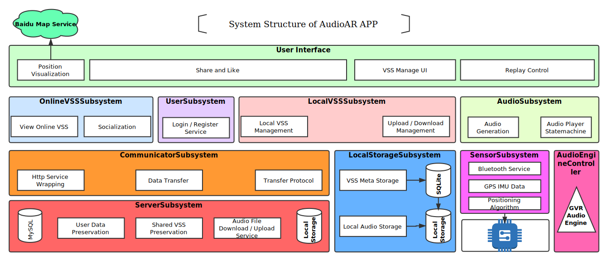

## AudioAR
# 用户手册

版本<1>
修订历史记录

|日期|版本|修订说明|作者|
|:-|:-|:-|:-|
|2018-06-22|0|提供基本的格式|丁雨晨|
|2018-06-24|1|补充内容|丁雨晨|

## 1. 引言

### 1.1 编写目的
本文档是用户的使用指导手册，是在整个用户使用过程中参考的主要文档，指导用户安装、使用、处
理问题。此文档针对使用者，也可以用于外界人员的审查和参考。

### 1.2 适用范围
此文档适用于AudioAR项目的全部软件及系统。

### 1.3 定义
相关定义见词汇表[@doc/需求定义和分析/词汇表.md](/需求定义和分析/词汇表.md)

### 1.4 参考资料
|文件标题|文件编号|发表日期|出版单位|来源|
|:-:|:-|:-|:-|:-|
|面向对象软件工程实践指南|ISBN9787313162182|2016年 12月 第1版|上海交通大学出版社|图书资料|
|用户手册模版|-|-|-|-|课程资料|

### 1.5 概述
本文档[在第2部分]给出了软件概述，[在第3部分]给出了运行环境，[在第4部分]给出了使用过程，
[在第5部分]给出了运行说明。

## 2. 软件概述
- 项目简介见文档[@项目简介](../team_project_proposal.md#项目简介)
- 项目要求见文档[@可行性研究报告.md](../计划/可行性研究报告.md#21-要求)

### 2.1 软件构成

- 程序：AudioAR(prototype)
- 子系统：见文档[@软件架构文档.md](../设计/软件架构文档.md#43-系统逻辑视图)
- 数据库：见文档[@软件架构文档.md](../设计/软件架构文档.md#48-数据管理设计)

### 2.2 主要功能和性能
- 主要功能见文档[@软件需求规约.md](../需求定义和分析/软件需求规约.md#32-功能需求)
- 主要性能见文档[@软件需求规约.md](../需求定义和分析/软件需求规约.md#33-非功能需求)

## 3. 运行环境
### 3.1 硬件环境
#### 最低配置
- 具有四核心的6GB RAM、64GB ROM的Android智能机
- 单机、联机工作
- 数据网络接入

### 3.2 支持软件
#### 最低配置
- Android 4.4 操作系统

### 3.3 数据结构
- 所需数据设计见文档[@软件架构文档.md](../设计/软件架构文档.md#48-数据管理设计)

## 4. 使用过程
### 4.1 安装与初始化
- 下载发布的最新版Android apk
- 打开安装包，进行标准Android apk安装，等待安装完成即可
- 进入应用，按照界面提示进行注册登录，即可使用各种功能

### 4.2 输入
TODO : declare input for different use case.

### 4.3 输出
TODO : declare output

### 4.4 帮助信息获取
- 点击界面按钮或输入框，可以获取帮助和提示
- 留意弹出的提示
- 访问官方技术文档[@技术文档](https://github.com/AudioAR/doc)获取帮助

## 5. 运行说明

### 5.1 运行步骤

### 5.2 非常规过程
#### 致用户：
- 程序出现卡顿时，请耐心等待
- 程序出错停止运行时，尝试重启应用来解决问题
- 若程序出现信息错误，请及时向我们反映，我们会尽快作出回应

#### 致维护人员：
- 任何时候请勿擅自修改发布源代码
- 请按照维护协议进行维护
- 程序无法正常响应维护时，将问题反映给我们，我们将尽快作出回应
