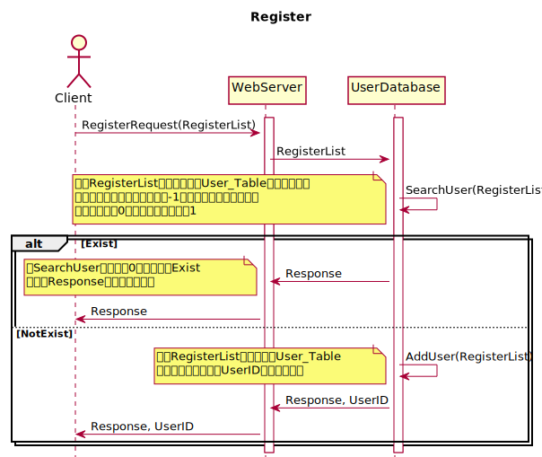
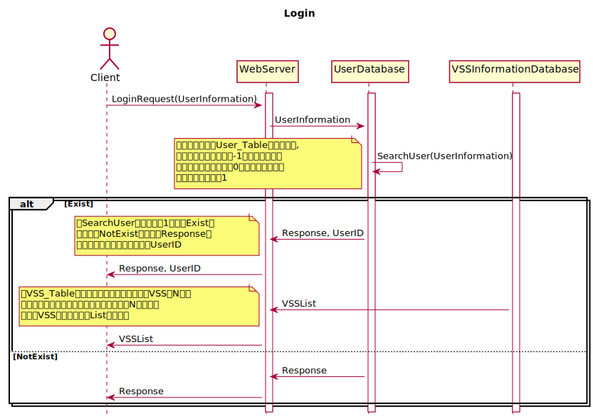
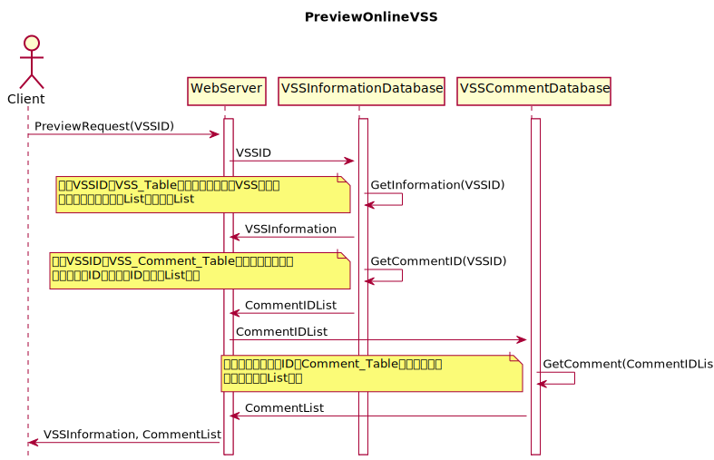
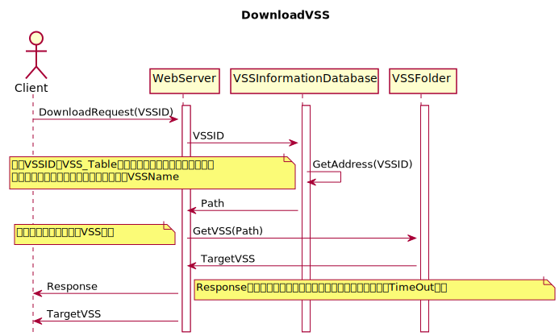
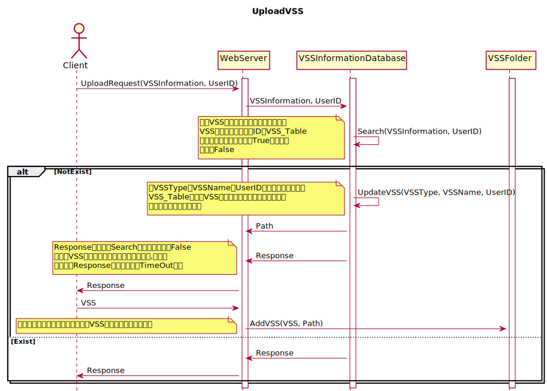
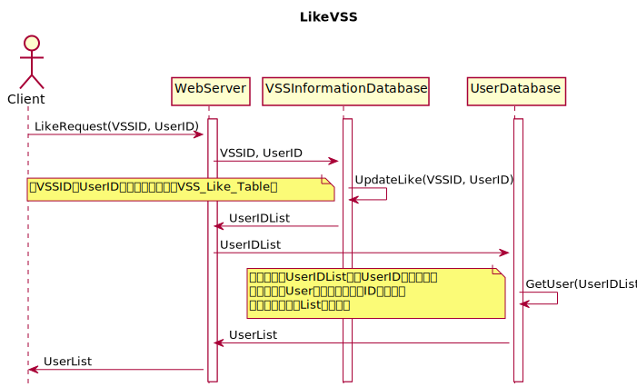
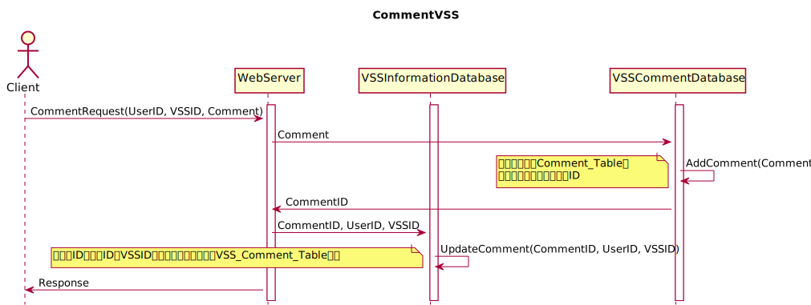

#### 设计动态模型

## 1.Register




```PlantUML
@startuml
hide footbox
title Register
actor Client
activate WebServer
activate UserDatabase
Client->WebServer:RegisterRequest(RegisterList)
WebServer->UserDatabase:RegisterList
UserDatabase->UserDatabase:SearchUser(RegisterList)
note left: 根据RegisterList提供的信息在User_Table中进行查询，\n若已存在相同的用户名则返回-1，若已存在相同的电子邮\n箱地址则返回0，若均不存在则返回1
alt Exist
  UserDatabase->WebServer:Response
  note left: 当SearchUser小于等于0的时候进入Exist\n并利用Response传递相应的信息
  WebServer->Client:Response
else NotExist
  UserDatabase->UserDatabase:AddUser(RegisterList)
  note left: 根据RegisterList的内容更新User_Table\n并给该用户创建一个UserID传送到客户端
  UserDatabase->WebServer:Response, UserID
  WebServer->Client:Response, UserID
end
@enduml
```

## 2.Login




```PlantUML
@startuml
hide footbox
title Login
actor Client
activate WebServer
activate UserDatabase
activate VSSInformationDatabase
Client->WebServer:LoginRequest(UserInformation)
WebServer->UserDatabase:UserInformation
UserDatabase->UserDatabase:SearchUser(UserInformation)
note left:根据登陆信息在User_Table中进行查询,\n如用户名不存在则返回-1，如用户名存在\n但是密码不匹配则返回0，如果用户名存在\n且密码匹配则返回1
alt Exist
  UserDatabase->WebServer:Response, UserID
  note left: 当SearchUser的结果等于1时进入Exist，\n否则进入NotExist，并通过Response传\n递相应数值以及该用户对应的UserID
  WebServer->Client:Response, UserID
  VSSInformationDatabase->WebServer:VSSList
  note left: 从VSS_Table中提取类型为地图和演唱会的VSS各N个，\n排序顺序依照点赞数量由大到小排序，取前N个，将被\n选中的VSS的信息整合成List传输出去
  WebServer->Client:VSSList
else NotExist
  UserDatabase->WebServer:Response
  WebServer->Client:Response
end
@enduml
```

## 3.PreviewOnlineVSS



```PlantUML
@startuml
title PreviewOnlineVSS
hide footbox
actor Client
activate WebServer
activate VSSInformationDatabase
activate VSSCommentDatabase
Client->WebServer:PreviewRequest(VSSID)
WebServer->VSSInformationDatabase:VSSID
VSSInformationDatabase->VSSInformationDatabase:GetInformation(VSSID)
note left: 根据VSSID在VSS_Table中进行查询得到该VSS的信息\n并将这些信息整理成List，返回此List
VSSInformationDatabase->WebServer:VSSInformation
VSSInformationDatabase->VSSInformationDatabase:GetCommentID(VSSID)
note left: 根据VSSID在VSS_Comment_Table中进行查询，得到\n相应的评论ID，将这些ID构成的List返回
VSSInformationDatabase->WebServer:CommentIDList
WebServer->VSSCommentDatabase:CommentIDList
VSSCommentDatabase->VSSCommentDatabase:GetComment(CommentIDList)
note left: 根据所给的评论的ID在Comment_Table中进行查询，\n将评论整合成List返回
VSSCommentDatabase->WebServer:CommentList
WebServer->Client:VSSInformation, CommentList
@enduml
```

## 4.DownloadVSS



```PlantUML
@startuml
title DownloadVSS
hide footbox
actor Client
activate WebServer
activate VSSInformationDatabase
activate VSSFolder
Client->WebServer:DownloadRequest(VSSID)
WebServer->VSSInformationDatabase:VSSID
VSSInformationDatabase->VSSInformationDatabase:GetAddress(VSSID)
note left: 根据VSSID在VSS_Table中查询出其存储路径并返回该路径\n注：此路径包含文件名，文件名前缀即为VSSName
VSSInformationDatabase->WebServer:Path
WebServer->VSSFolder:GetVSS(Path)
note left: 根据该路径找到对应的VSS文件
VSSFolder->WebServer:TargetVSS
WebServer->Client:Response
note right: Response为一信号，客户端可根据得到此信号的时间来进行TimeOut判定
WebServer->Client:TargetVSS
@enduml
```

## 5.UploadVSS



```PlantUML
@startuml
title UploadVSS
hide footbox
actor Client
activate WebServer
activate VSSInformationDatabase
activate VSSFolder
Client->WebServer:UploadRequest(VSSInformation, UserID)
WebServer->VSSInformationDatabase:VSSInformation, UserID
VSSInformationDatabase->VSSInformationDatabase:Search(VSSInformation, UserID)
note left: 根据VSS的类型（地图或是演唱会），\nVSS的名称和上传者的ID在VSS_Table\n中进行查询如果存在返回True，不存在\n则返回False
alt NotExist
  VSSInformationDatabase->VSSInformationDatabase:UpdateVSS(VSSType, VSSName, UserID)
note left: 将VSSType，VSSName和UserID构成的键值对更新至\nVSS_Table并为此VSS建立一个存储路径，返还此路径\n注：此路径不包含文件名
  VSSInformationDatabase->WebServer:Path
  VSSInformationDatabase->WebServer:Response
  note left: Response即为上面Search的结果，如果为False\n则允许VSS传输进入服务器，否则则不允许,客户端\n根据收到Response的时间来进行TimeOut判定
  WebServer->Client:Response
  Client->WebServer:VSS
  WebServer->VSSFolder:AddVSS(VSS, Path)
  note left: 根据所给路径将传输进入服务器的VSS储存到对应的文件夹下
else Exist
  VSSInformationDatabase->WebServer:Response
  WebServer->Client:Response
end
@enduml
```

## 6.LikeVSS



```PlantUML
@startuml
title LikeVSS
hide footbox
actor Client
activate WebServer
activate VSSInformationDatabase
activate UserDatabase
Client->WebServer:LikeRequest(VSSID, UserID)
WebServer->VSSInformationDatabase:VSSID, UserID
VSSInformationDatabase->VSSInformationDatabase:UpdateLike(VSSID, UserID)
note left: 将VSSID和UserID构成的键值对存入VSS_Like_Table中
VSSInformationDatabase->WebServer:UserIDList
WebServer->UserDatabase:UserIDList
UserDatabase->UserDatabase:GetUser(UserIDList)
note left: 根据传入的UserIDList中的UserID进行查询，\n得到对应的User的信息（昵称，ID等）并将\n这些信息制作成List返还出来
UserDatabase->WebServer:UserList
WebServer->Client:UserList
@enduml
```
## 7.CommentVSS



```PlantUML
@startuml
title CommentVSS
hide footbox
actor Client
activate WebServer
activate VSSInformationDatabase
activate VSSCommentDatabase
Client->WebServer:CommentRequest(UserID, VSSID, Comment)
WebServer->VSSCommentDatabase:Comment
VSSCommentDatabase->VSSCommentDatabase:AddComment(Comment)
note left: 将评论添加到Comment_Table中\n并返回该评论在此表中的ID
VSSCommentDatabase->WebServer:CommentID
WebServer->VSSInformationDatabase:CommentID, UserID, VSSID
VSSInformationDatabase->VSSInformationDatabase:UpdateComment(CommentID, UserID, VSSID)
note left: 将评论ID，用户ID和VSSID构成的关系键值对存入VSS_Comment_Table表中
WebServer->Client:Response
@enduml
```
