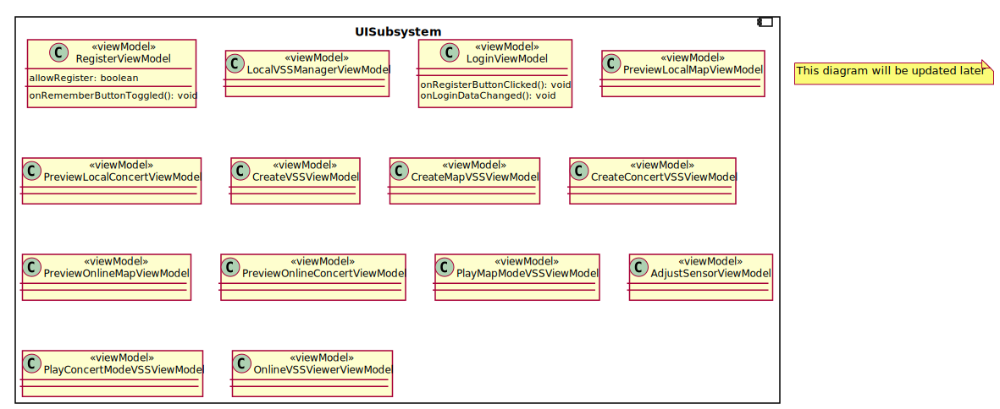
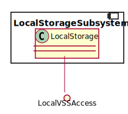
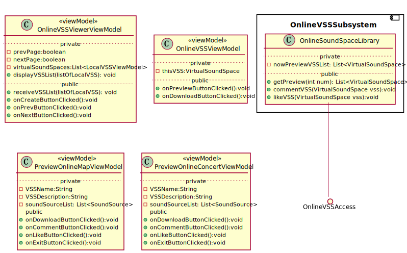
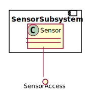
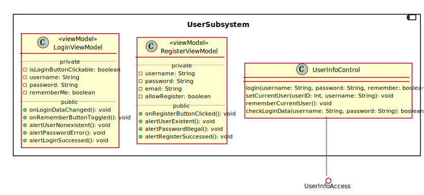
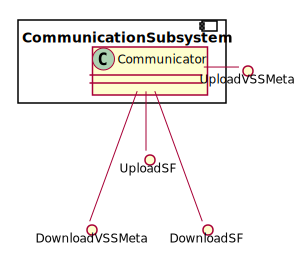
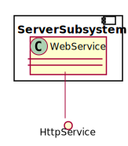
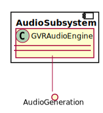
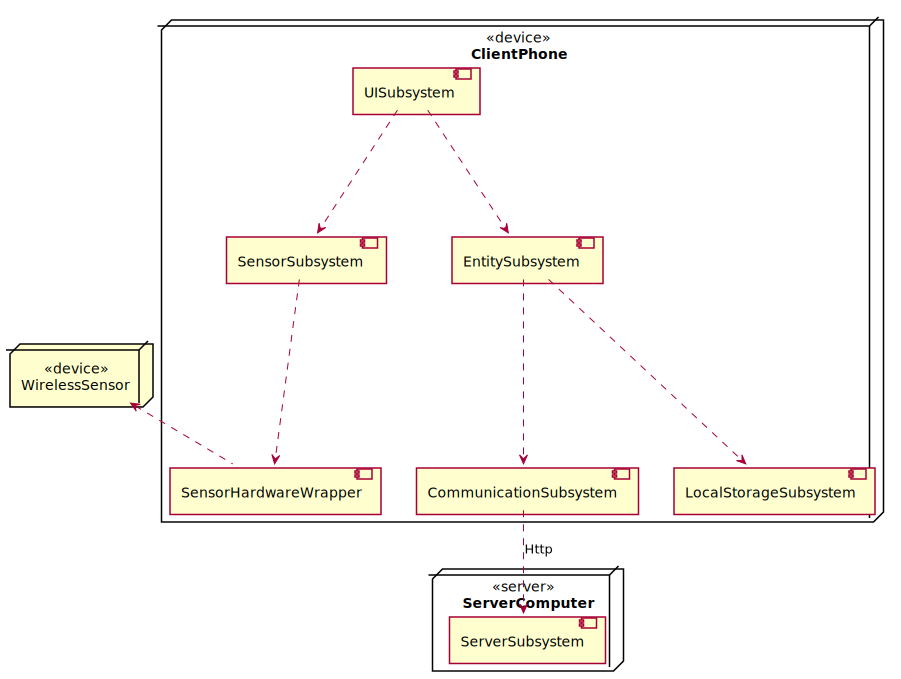

#软件架构设计

版本<1>

修订历史记录

|日期|版本|修订说明|作者|
|:-|:-|:-|:-|
|2018-04-27|0|提供基本的格式|刘知峻|
|2018-05-01|1|撰写引言部分|缪本杰|


## 1. 引言

### 1.1 编写目的
本文档拟定软件架构的设计，包括分解子系统、子系统之间的服务、子系统中的对象模型与详细的流程顺序图。本文档确定了项目开发时的大体结构，指导之后的系统实现。

### 1.2 适用范围
此文档适用于AudioAR项目的全部软件及系统。

### 1.3 定义
相关定义见词汇表[@doc/需求定义和分析/词汇表.md](/需求定义和分析/词汇表.md)

### 1.4 参考资料
|文件标题|文件编号|发表日期|出版单位|来源|
|:-:|:-|:-|:-|:-|
|面向对象软件工程实践指南|ISBN9787313162182|2016年 12月 第1版|上海交通大学出版社|图书资料|
|软件架构设计模版|-|-|-|课程资料|

### 1.5 概述
本文档首先[在第2部分]整理了目前业界存在的类似软件系统架构，并[在第3部分]提出了本软件系统架构的设计目标。之后[在第4部分]我们详细定义我们建议的软件系统架构。

## 2. 目前的软件系统架构
[@doc/计划/可行性研究报告.md#行业现有系统分析](https://github.com/AudioAR/doc/blob/master/%E8%AE%A1%E5%88%92/%E5%8F%AF%E8%A1%8C%E6%80%A7%E7%A0%94%E7%A9%B6%E6%8A%A5%E5%91%8A.md#3-%E8%A1%8C%E4%B8%9A%E7%8E%B0%E6%9C%89%E7%B3%BB%E7%BB%9F%E5%88%86%E6%9E%90)

## 3. 软件系统架构设计目标
根据[@doc/需求定义与分析/软件需求规约](/需求定义和分析/软件需求规约.md#33-非功能需求)中的“非功能需求”部分，我们进一步整理出系统架构的设计目标如下：
- 可用性：生成的虚拟声场拥有声音的真实性，音频流与真实的立体声音难以区分
- 实时性：实时生成的音频流不具有明显的卡顿
- 可靠性：要求的运行环境内可以长时间、无差错、少维护地工作
- 性能要求：用户位置的获取具有水平5m左右，垂直20cm左右的精确度；头部运动捕捉比较准确
- 可支持性：可扩展的吞吐量和服务提供能力，服务器能稳定提供几名用户的资源请求和相关通讯

## 4. 建议的软件系统架构

### 4.1 概述
本软件在整体上采用MVVM的系统架构，最大程度地使UI界面和数据模型解耦合。

在系统逻辑方面，共分为十个子系统，分别处理不同的任务模块。

系统采用Client-Server的模式，通过服务器来完成用户与在线数据的交互。服务器端使用数据库进行数据存储，本地使用安卓自带的SQLite模块进行本地数据存取。

下面介绍具体的软件设计架构模型。
- [用例视图](#42-用例视图)
- [系统逻辑视图](#43-系统逻辑视图)
- [系统运行视图](#44-系统运行视图)
- [系统实现视图](#45-系统实现视图)
- [系统物理视图](#46-系统物理视图)
- [边界条件设计](#47-边界条件设计)

### 4.2 用例视图
详见[@需求定义和分析/软件需求规约.md](../需求定义和分析/软件需求规约.md#342-用例模型)中的用例视图。

### 4.3 系统逻辑视图
#### 4.3.1 子系统分解

子系统划分为十大部分，其中各个子系统的功能说明如下：

|子系统名称|功能|提供服务|接口形式|
|:-|:-|:-|:-|
|UISubsystem|提供用户界面和用户界面控制包含了许多相对独立的ViewModels|-|-|
|UserSubsystem|提供用户信息相关的服务|-|Java|
|OnlineVSSSubsystem|关于在线VSS相关的所有服务，包括在线VSS库的浏览、预览、评论、点赞等|-|Java|
|LocalVSSSubsystem|关于本地VSS相关的所有服务，包括创建、重命名、删除、上传、下载|-|Java|
|PlayVSSSubsystem|关于游览VSS的子系统|-|Java|
|CommunicationSubsystem|在本地和服务器端的通信子系统，实现显示简介、上传、下载、用户信息管理|UploadVSS<br>DownloadVSS<br>GetVSSReview<br>UserInfo|Java|
|SensorSubsystem|提供对处理过的传感器数据访问的子系统，通过访问传感器接口，客户能够接收到传感器提供的各种高级信息，包括经纬度，高度，速度，方向，加速等|SensorAccess|Java|
|SensorHardwareWrapper|传感器硬件封装系统|封装了各种传感器原始信息的获取工作，单独运行在一个线程中。一旦传感器连接，便开始自动运行。|Java|
|LocalStorageSubsystem|提供本地数据库访问|LocalStorage|Java|
|ServerSubsystem|服务器端的相关服务，该服务的接口属于Http接口，传输格式是json格式|WebAccess|HTTP-json|


```PlantUML
@startuml Diagrams/SubsystemDecomposition
skinparam componentStyle uml2

interface "LocalStorage" as LS

interface "SensorAccess" as SA
interface "RawSensorDataAccess" as BC
interface "UserInfoAccess" as UIA
interface "OnlineVSSAccess" as OVA
interface "LocalVSSAccess" as LVA
interface "AudioControl" as AC


package "CommunicationService" {
    interface "UploadVSSMeta" as UL
    interface "DownloadVSSMeta" as DL
    interface "UploadSF" as GR
    interface "DownloadSF" as US
}
component "CommunicationSubsystem" as CommunicationSubsystem

    UL -- CommunicationSubsystem
    DL -- CommunicationSubsystem
    GR -- CommunicationSubsystem
    US -- CommunicationSubsystem

[LocalVSSSubsystem]
[OnlineVSSSubsystem]
[SensorSubsystem] -up- SA
[SensorHardwareWrapper] -up- BC
[SensorSubsystem] ..> BC
[UserSubsystem] -up- UIA
[UISubsystem] ..> UIA

[LocalStorageSubsystem] -up- LS
[LocalVSSSubsystem] ..> LS
[AudioSubsystem] -up- AC
[UISubsystem] .-r.> AC


UIA <. [OnlineVSSSubsystem]


[CommunicationSubsystem] .down.> HttpService
[ServerSubsystem] -up- HttpService
[OnlineVSSSubsystem] -up- OVA
[LocalVSSSubsystem] -up- LVA

[LocalVSSSubsystem] .down.> UL
[LocalVSSSubsystem] .up.> GR
[LocalVSSSubsystem] .down.> US
[OnlineVSSSubsystem] .-down.> DL
[UserSubsystem] .-down-> US

[UISubsystem] -down.> OVA
[UISubsystem] .down.> LVA
[UISubsystem] ..> SA
@enduml
```
#### 4.3.2 子系统综述

##### UISubsystem

###### 子系统接口定义
UISubsystem不提供接口

###### 类图



```PlantUML
@startuml Diagrams/UISubsystemClassDiagram
note "This diagram will be updated later" as notes

component UISubsystem {
    class RegisterViewModel <<viewModel>> {
    }
    class LocalVSSManagerViewModel <<viewModel>> {

    }
    class LoginViewModel <<viewModel>> {

    }
    class PreviewLocalMapViewModel <<viewModel>> {

    }
    class PreviewLocalConcertViewModel <<viewModel>> {

    }
    class CreateVSSViewModel <<viewModel>> {

    }
    class CreateMapVSSViewModel <<viewModel>> {

    }
    class CreateConcertVSSViewModel <<viewModel>> {

    }
    class PreviewOnlineMapViewModel <<viewModel>> {

    }
    class PreviewOnlineConcertViewModel <<viewModel>> {

    }
    class PlayMapModeVSSViewModel <<viewModel>> {

    }

    class AdjustSensorViewModel <<viewModel>> {

    }
    class PlayConcertModeVSSViewModel <<viewModel>> {

    }

    class OnlineVSSViewerViewModel <<viewModel>> {

    }
}

@enduml
```

##### LocalStorageSubsystem
###### 子系统接口定义
###### 类图



```PlantUML
@startuml Diagrams/LocalStorageSubsystemClassDiagram
component LocalStorageSubsystem {
    class LocalStorage {

    }
}
LocalStorage --() LocalVSSAccess
@enduml
```

##### OnlineVSSSubsystem
###### 子系统接口定义
###### 类图



```PlantUML
@startuml Diagrams/OnlineVSSSubsystemClassDiagram
component OnlineVSSSubsystem {
    class OnlineSoundSpaceLibrary {

    }
}
OnlineSoundSpaceLibrary --() OnlineVSSAccess
@enduml
```

##### SensorSubsystem
###### 子系统接口定义

* SensorAccess implemented by **Sensor**

|Signature|Description|
|:-|:-|
|Position getCurrentLocation()|returns the latest updated position calculated fron sensor data.|
|boolean isSensorOnline() |returns the status of sensor, which can be offline and online.|
|void callWhenUpdated(Callable task)|give sensor a task object for it to call its this.run() method in another thread when an update of position is avaliable.|
|void callWhenUpdatedDelay(int millisecond)|the overload version of the above function only that this will not call callback function until assigned milliseconds has passed.|
|Quaternion getHeadPose()|returns a Quaternion describing the position of the user's head.|
|void clearTask()|remove all the tasks that are running. Notice that if the sensor goes offline, the Sensor class can not return to normal state but will stuck at the same Location and Pose.|

###### 类图



```PlantUML
@startuml Diagrams/SensorSubsystemClassDiagram
component SensorSubsystem {
    class Sensor {

    }
}
Sensor --() SensorAccess

@enduml
```

##### UserSubsystem
###### 子系统接口定义
###### 类图



```PlantUML
@startuml Diagrams/UserSubsystemClassDiagram

component UserSubsystem {
    class UserInfoControl {

    }
}
UserInfoControl --() UserInfoAccess
@enduml

```


##### CommunicationSubsystem
###### 子系统接口定义
###### 类图



```PlantUML
@startuml Diagrams/CommunicationSubsystemClassDiagram
component CommunicationSubsystem {
    class Communicator {

    }
}
Communicator -() UploadVSSMeta
Communicator ---() DownloadVSSMeta
Communicator --() UploadSF
Communicator ---() DownloadSF
@enduml
```

##### ServerSubsystem
###### 子系统接口定义

|Signature|Description|
|:-|:-|
|RegisterRequest(username:String, password:String, email:String):int,int|第一个返回值为询问结果，-1表示用户名已存在，0表示电子邮箱已被注册，1表示注册成功，第二个返回值为用户的ID，第一个返回值为-1或0的时候返回的ID为0|
|LoginRequest(username: String, password: String):int,int|第一个返回值为问询结果，-1表示用户名不存在，0表示密码错误，1表示登录成功，第二个返回值为登录用户对应的ID，若第一个返回值为-1或0则返回的ID为0|
|UploadRequest(VSSID:int, UserID:int):boolean|判断改VSS是否已在服务器中，如在则返回false，不在则返回true|
|UploadRequest(list<SFHash>):list<SFHash>|告知服务器即将上传的SF的SFHash，在服务器筛选掉重复的SF后返回正式的需要上传的SFHash列表|
|UploadRequest(SFAddress):void|根据要上传的SF的地址得到对应的SF并上传给服务器|
|LikeRequest(VSSID:int, UserID:int):void|更新服务器中的VSS_Like_Table以对相应的VSS增添新的点赞用户|
|removeLike(VSSID:int, UserID:int):void|更新服务器中的VSS_Like_Table以对相应的VSS删除该用户的点赞信息|
|DownloadRequest(SFHash)：SF|向服务器发送需要下载的SF的SFHash，服务器将目标SF传到客户端|
|CommentRequest(VSSID:int, UserID:int, Comment:String):void|将评论信息更新到服务器|
|PreviewRequest(VSSID:int):list<String>,list<String>|将想要获得评论信息和点赞信息的VSSID发送给服务器，由服务器传回两个列表，第一个列表为点赞的用户名列表，第二个列表为评论信息（包含评论者的用户名，存成统一格式的字段）|
|BrowseRequest(pagenumber:int):list<VirtualSoundSpace>|将页数发送给服务器，由服务器返回相应数量的VSS构成的列表|

###### 类图




```PlantUML
@startuml Diagrams/ServerSubsystemClassDiagram
component ServerSubsystem {
    class WebService {

    }
}
WebService --() HttpService
@enduml
```

##### AudioSubsystem
###### 子系统接口定义

接口直接采用GVRAudioEngine的接口
[@GVRAudioEngine API Documentation](https://developers.google.cn/vr/reference/android/com/google/vr/sdk/audio/package-summary)

###### 类图



```PlantUML
@startuml Diagrams/AudioSubsystemClassDiagram
component AudioSubsystem {
    class GVRAudioEngine {

    }
}
GVRAudioEngine --() AudioGeneration
@enduml
```

##### SensorHardwareWrapper:***该部分技术难度较高，推迟到相应的实现阶段进行***

#### 4.3.3 用例实现
@[参见软件设计模型](./顺序图.md)

#### 4.3.4 子系统协作

选择了能够体现子系统关系的几个用例进行说明。

##### DownloadVSS


```PlantUML
@startuml Diagrams/DownloadVSSSystemSequenceDiagram
hide footbox
skinparam sequenceParticipant underline
actor "User" as user
participant ":UISubsystem" as ui
participant ":OnlineVSSSubsystem" as online
participant ":LocalVSSSubsystem" as local
participant ":CommunicationSubsystem" as com
participant ":ServerSubsystem" as server
participant ":LocalStorageSubsystem" as storage

activate user
    user -> ui: viewListOfOnlineVSS
activate ui
    ui -> online: askForVSSMetadata
activate online
    online -> com: askForVSSMetadata
activate com
    com -> server: askForVSSMetadata
activate server
    server --> com: metadata
deactivate server
    com --> online: metadata
deactivate com

    online --> ui: constructedVSSObjects
deactivate online
    ui -> user: listOfVSS
deactivate ui
    user -> ui: downloadThisVSS
activate ui
    ui -> local: registerVSSInLocalStorage(thisVSS)
deactivate ui
deactivate user
activate local
    local -> storage: storeThisVSS(thisVSS)
activate storage
deactivate storage
    local -> com: downloadAllAudioFragments
activate com
    com -> server: askForAudioFragments
activate server
    server --> com: audioFragments
deactivate server
    com --> local: audioFragments
deactivate com
    local --> ui: alertDownloadFinished
deactivate local
@enduml
```

##### UploadVSS


```PlantUML
@startuml Diagrams/UploadVSSSubsystemSequenceDiagram
hide footbox
skinparam sequenceParticipant underline

actor "User" as user
participant ":UISubsystem" as ui
participant ":LocalVSSSubsystem" as local
participant ":CommunicationSubsystem" as com
participant ":ServerSubsystem" as server

activate user
    user -> ui: uploadThisVSS
activate ui
deactivate user
    ui -> local: uploadThisVSS(thisVSS)
deactivate ui
activate local
    local -> com: UploadVSSMeta
activate com
    com -> server: sendVSSMeta
activate server
deactivate com
deactivate server
    local -> com: uploadSoundFragments
deactivate local

activate com
    com -> server: sendSoundFragments
activate server
deactivate server
deactivate com

@enduml
```

##### PlayConcertMode/MapModeVSS


```PlantUML
@startuml Diagrams/PlayVSSSubsystemSequenceDiagram
hide footbox
skinparam sequenceParticipant underline
actor "User" as user
participant ":UISubsystem" as ui
participant ":SensorSubsystem" as sensor
participant ":SensorHardwareWrapper" as hard
participant ":LocalVSSAccess" as local
participant ":AudioSubsystem" as audio

activate user
    user -> ui: playVSS
activate ui
    ui -> local: getSoundFragments
    activate local
    local --> ui: soundFragmentReferences
    deactivate local
    ui -> sensor: registerCallbacks
    activate audio
    activate hard
    activate sensor
    loop while playing
        hard -\ sensor: rawData
        sensor -\ audio: updateCurrentLocation
        user -\ ui: interaction
        ui -\ audio: controlCurrentPlayback

    end
@enduml
```

##### Register


```PlantUML
@startuml Diagrams/RegisterSubsystemSequenceDiagram
hide footbox
skinparam sequenceParticipant underline
actor "User" as user
participant ":UISubsystem" as ui
participant ":UserSubsystem" as info
participant ":CommunicationSubsystem" as com
participant ":ServerSubsystem" as server

activate user
    user -> ui: registerInformation
activate ui
    ui -> info: checkUsername
    activate info
    info -> com: askUsername
activate com
    com -> server: GET askUsername
    activate server
    server --> com: response
    deactivate server
    com --> info: response
deactivate com
    info --> ui: response
deactivate info
deactivate ui
    user -> ui: register
activate ui
    ui -> info: register
deactivate ui

activate info
    info -> com: register
activate com
    deactivate info

    com -> server: register
deactivate com

activate server

@enduml
```

### 4.4 系统运行视图

总体上使用Android提供的多线程框架和事件系统进行实现。
ServerSubsystem通过Flask自带的服务器实现多线程处理。
Sensor子系统提供一个事件循环钩子接口，外界可以通过注册事件处理器实现事件控制。

此外SensorSubsystemWrapper和SensorSubsystem分别运行在单独的线程上。而不是运行在Android主线程上。

### 4.5 系统实现视图

#### 系统开发环境

*  Android Studio 3.0.1
*  Gradle 3.0.1
*  Android Support Library
*  Atom editor & PlantUML for document generation
*  VSCode editor & PlantUML & SVG extention for document generation
*  git & github for version control and team management
*  python3 & Flask for server
*  SQLite for on device storage
*  MySQL for server storage


### 4.6 系统物理视图




```PlantUML
@startuml Diagrams/DeploymentDiagram
skinparam componentStyle uml2

node ClientPhone <<device>> {
    component UISubsystem
    component SensorSubsystem
    component CommunicationSubsystem
    component LocalStorageSubsystem
    component LocalVSSSubsystem
    component OnlineVSSSubsystem
    component UserSubsystem
    component CommunicationSubsystem
    component SensorHardwareWrapper
    UISubsystem ..> UserSubsystem
    UISubsystem ..> OnlineVSSSubsystem
    UISubsystem ..> LocalVSSSubsystem
    SensorSubsystem ..> SensorHardwareWrapper
    UISubsystem ..> SensorSubsystem
    LocalVSSSubsystem ..> LocalStorageSubsystem
    UserSubsystem ..> CommunicationSubsystem
    OnlineVSSSubsystem ..> CommunicationSubsystem
    LocalVSSSubsystem ..> CommunicationSubsystem

}

node ServerComputer <<server>> {
    component ServerSubsystem
}

CommunicationSubsystem ..> ServerSubsystem: Http

node WirelessSensor <<device>>

WirelessSensor <.. SensorHardwareWrapper

@enduml
```
### 4.7 边界条件设计


### 4.8 数据管理设计
#### 4.8.1 服务器数据管理设计
|Datatable|Database|Description|
|:-|:-|:-|
|VSS_Table|VSSInformationDatabase|包含VSS的本地ID，上传VSS的用户的ID，以这两个ID的组合为VSS的唯一标示，还包含与VSS相关联的所有SF的SFHash以及点赞者的数量共四列|
|VSS_Like_Table|VSSInformationDatabase|包含VSS的唯一标识（即本地ID和上传者ID）和点赞者的ID，共三列|
|VSS_Comment_Table|VSSInformationDatabase|包含VSS的唯一标识（即本地ID和上传者ID）和CommentID，共三列|
|Comment_User_Table|VSSInformationDatabase|包含评论的ID和评论者的ID，共两列|
|Comment_Table|VSSCommentDatabase|包含评论的ID以及评论的内容，共两列|
|User_Table|UserDatabase|包含用户的用户名，ID，电子邮箱地址以及密码，共四列|
### 4.9 其他设计
