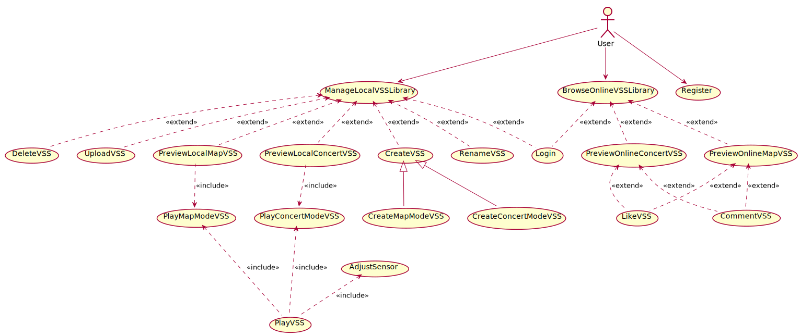
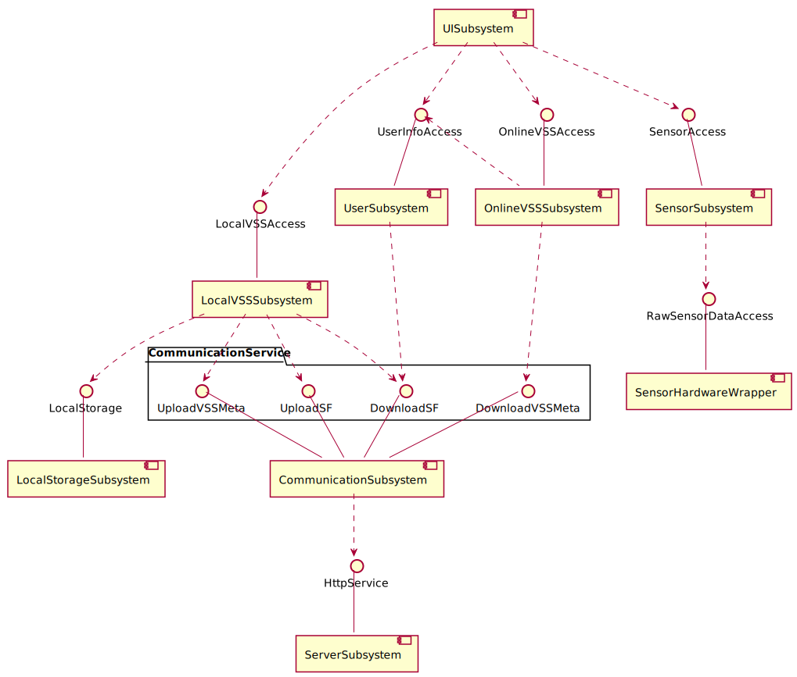

#软件设计模型

修订历史记录
|日期|版本|修订说明|作者|
|:-|:-|:-|:-|
|2018-04-27|0|提供基本的格式|刘知峻|

## 1. 引言

### 1.1 编写目的

### 1.2 适用范围

### 1.3 定义

### 1.4 参考资料

### 1.5 概述

## 2. 用例视图

关于用例部分，详见[@软件需求规约#用例模型](../需求定义和分析/用例模型.md)

## 3. 逻辑视图

### 3.1 系统结构

详见[@软件架构文档#系统逻辑视图](./软件架构文档.md#43-系统逻辑视图)

### 3.2 Use-Case实现

详见[@用例顺序图](./顺序图.md)

### 3.3 设计类图

### 3.4 其他图

## 4. 实现视图

***推迟到实现阶段完成***

## 5. 进程视图

***推迟到实现阶段完成***

## 6. 部署视图

详见[@./软件架构文档.md#46-系统物理视图](./软件架构文档.md#46-系统物理视图)
