#### 设计动态模型


[TOC]

## 1.Register


```PlantUML
@startsalt Diagrams/RegisterUIMockUP
{
    Welcome to AudioAR
    ==
    Login | "MyName"
    Email | "Development@AudioAR.org"
    Password | "******"
    Reenter Password | "******"
    passwordStrength <&check><&check><&check><&check><&x>
    [X] Remember me next time
    ==
    [Cancel] | [Register <&account-login>]
}
@endsalt
```


```PlantUML
@startuml Diagrams/Register
hide footbox
skinparam sequenceParticipant underline

actor User as user
participant ":LoginViewModel" as loginpage
participant ":RegisterViewModel" as boundary
participant ":UserInfoControl" as control
participant ":LocalVSSManagerViewModel" as nextpage

note right of control: The UserInfoControl is activated since the start of the entire program.

user -> loginpage: onRegisterButtonClicked(): void

create boundary
loginpage -> boundary: <<create>>

user -> boundary: onRememberButtonToggled(): void
loop not finished or incorrect or UserID is 0
    note right of user
        the UI will give the user some reaction if the form is not finished.
    end note
    user -> boundary: onChangeRegisterData(): void
    boundary -> boundary: checkInputLegitimate(): void
    boundary -> boundary: checkPasswordStrength(): int
    boundary -> control: isAvailable(): int
    control ->:RegisterRequest(username:String, password:String, email:String):int,input
    control <-:Response, UserID
    control->boundary:Response
    note left:若Response=-1则说明用户名已被注册，若Response=0则说明邮箱已被使用
end

boundary -> control: signUp(username: String, password: String, remember: boolean): boolean

control -> control: setCurrentUser(userID: int, username: String): void
alt remember me selected
    control -> control: rememberCurrentUser(): void
end
create nextpage
control -> nextpage: <<create>>
@enduml
```

## 1.1.Register

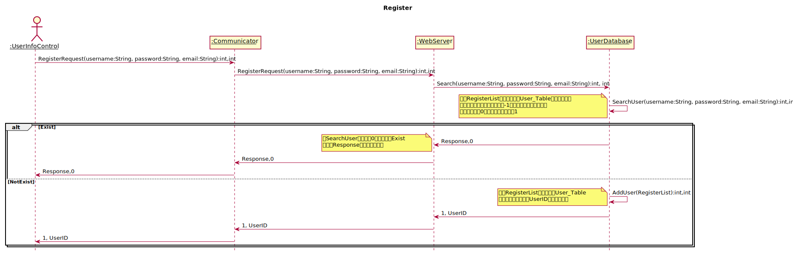

```PlantUML
@startuml Diagrams/RRegisterServerSequence
hide footbox
skinparam sequenceParticipant underline
title Register
actor ":UserInfoControl" as Client
participant ":Communicator" as Communicator
participant ":WebServer" as WebServer
participant ":UserDatabase" as UserDatabase
Client->Communicator:RegisterRequest(username:String, password:String, email:String):int,int
Communicator->WebServer:RegisterRequest(username:String, password:String, email:String):int,int
WebServer->UserDatabase:Search(username:String, password:String, email:String):int, int
UserDatabase->UserDatabase:SearchUser(username:String, password:String, email:String):int,int
note left: 根据RegisterList提供的信息在User_Table中进行查询，\n若已存在相同的用户名则返回-1，若已存在相同的电子邮\n箱地址则返回0，若均不存在则返回1
alt Exist
  UserDatabase->WebServer:Response,0
  note left: 当SearchUser小于等于0的时候进入Exist\n并利用Response传递相应的信息
  WebServer->Communicator:Response,0
  Communicator->Client:Response,0
else NotExist
  UserDatabase->UserDatabase:AddUser(RegisterList):int,int
  note left: 根据RegisterList的内容更新User_Table\n并给该用户创建一个UserID传送到客户端
  UserDatabase->WebServer:1, UserID
  WebServer->Communicator:1, UserID
  Communicator->Client:1, UserID
end
@enduml
```

## 2.Login


```PlantUML
@startsalt Diagrams/LoginUIMockUP
{
    User Login Panel
    ==
    Username or Email | "someEmail@AudioAR.org"
    Password | "****"
    [X] Remember me next time
    ==
    [Sign IN <&account-login>]
    ==
    New to AudioAR? Click to register:
    [Sign UP <&key>]
}
@endsalt
```


```PlantUML
@startuml Diagrams/Login
hide footbox
skinparam sequenceParticipant underline

actor User as user
participant ":LoginViewModel" as boundary
participant ":UserInfoControl" as control
participant ":LocalVSSManagerViewModel" as nextpage


[-> boundary: <<create>>
user -> boundary: onLoginDataChanged(): void
boundary -> control: login(username: String, password: String, remember: boolean): int
control ->: LoginRequest(username: String, password: String):int,int
control <-:Response, UserID

loop UserID is 0
    control --> boundary: Response
    note left:若Response为-1则说明用户名不存在，若Response为0则说明密码错误
    user -> boundary: onLoginDataChanged(): void
    boundary -> control: login(username: String, password: String, remember: boolean): boolean
    control ->: LoginRequest(username: String, password: String):int,int
    control <-:Response, UserID
end
control --> boundary: 1
control -> control: setCurrentUser(userID: int, username: String): void

alt remember me selected
    control -> control: rememberCurrentUser(): void
end
create nextpage
control -> nextpage: <<create>>
@enduml
```

## 2.1.Login

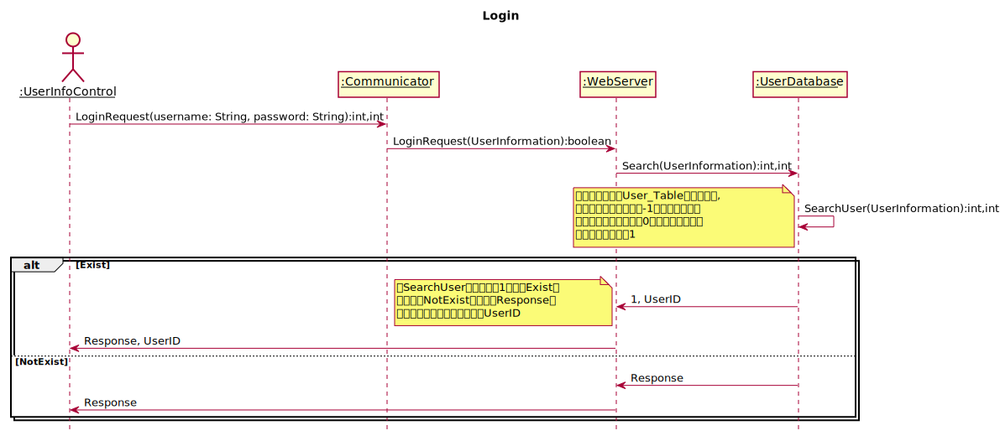

```PlantUML
@startuml Diagrams/LoginServerSequenceDiagram.svg
hide footbox
title Login
skinparam sequenceParticipant underline
actor ":UserInfoControl" as Client
participant ":Communicator" as Communicator
participant ":WebServer" as WebServer
participant ":UserDatabase" as UserDatabase
Client->Communicator:LoginRequest(username: String, password: String):int,int
Communicator->WebServer:LoginRequest(username: String, password: String):int,int
WebServer->UserDatabase:Search(username: String, password: String):int,int
UserDatabase->UserDatabase:SearchUser(username: String, password: String):int,int
note left:根据登陆信息在User_Table中进行查询,\n如用户名不存在则返回-1，如用户名存在\n但是密码不匹配则返回0，如果用户名存在\n且密码匹配则返回1
alt Exist
  UserDatabase->WebServer:1, UserID
  note left: 当SearchUser的结果等于1时进入Exist，\n否则进入NotExist，并通过Response传\n递相应数值以及该用户对应的UserID
  WebServer->Communicator:1, UserID
  Communicator->Client:1, UserID
else NotExist
  UserDatabase->WebServer:Response, 0
  WebServer->Communicator:Response, 0
  Communicator->Client:Response, 0
end
@enduml
```

## 3.ManageLocalVSSLibrary


```PlantUML
@startsalt Diagrams/ManageLocalVSSLibraryUIMockUp
{
  User's LocalVSSManager
  ==
  {/ <b>LocalVSS | OnlineVSS }
  {+
    VSS1.vss
    --
    Description1
    [Delete] | [Rename]
    [Preview] | [Upload]
  }
  {+
    VSS2.vss
    --
    Description2
    [Delete] | [Rename]
    [Preview] | [Upload]
  }
  ==
  [Create]
  {[Prev]|[Next]}
}
@endsalt
```


```PlantUML
@startuml Diagrams/ManageLocalVSSLibrary
hide footbox
skinparam sequenceParticipant underline

actor User as user
participant ":LocalVSSManagerViewModel" as boundary
participant ":LocalSoundSpaceLibrary" as library

create boundary
[-> boundary: <<create>>
boundary -> library: getVSSList(pageNo: int): List
library --> boundary: listOfLocalVSS: List<VirtualSoundSpace>
participant ":LocalVSSViewModel" as lvvw
create lvvw
boundary -> lvvw: <<create>>
boundary -> lvvw: displayVSSList(listOfLocalVSS):void

loop
    alt CreateVSS
        user -> boundary: createVSS
        ...described in PlayVSS...
    else RenameVSS
        user -> lvvw: onRenameButtonClicked():void
        ...described in RenameVSS...
    else DeleteVSS
        user -> lvvw: onDeleteButtonClicked():void
        ...described in DeleteVSS...
    else UploadVSS
        user -> lvvw: onUploadButtonClicked():void
        ...described in UploadVSS...
    else PreviewVSS
        user -> lvvw: onPreviewButtonClicked():void
        alt local map
            participant ":PreviewLocalMapPage" as plmp
            create plmp
            boundary -> plmp: <<create>>

        else local concert
            participant ":PreviewLocalConcertPage" as plcp
            create plcp
            boundary -> plcp: <<create>>
        end
    else prevPage
        user -> boundary: prevPage()
        boundary -> boundary: prevPage()
        boundary -> library: getVSSList(nextPageNo)
        library --> boundary: listOfLocalVSS: List<VirtualSoundSpace>
        boundary -> lvvw: displayVSSList(listOfLocalVSS):void
    else nextPage
    ...similar, omitted...
    end
end
@enduml
```

## 4.CreateVSS


```PlantUML
@startuml Diagrams/CreateVSS
hide footbox
skinparam sequenceParticipant underline

actor User as user
participant ":LocalVSSManagerPage" as manage
participant ":CreateVSSPage" as page
participant ":CreateMapVSSPage" as map
participant ":CreateConcertVSSPage" as concert

user -> manage: createVSS
create page
manage -> page: <<create>>
alt create Map Mode VSS
    user -> page: createMapModeVSS
    create map
    page -> map: <<create>>
    ...Go to CreateMapVSS...
else create Concert Mode VSS
    user -> page: createConcertModeVSS
    create concert
    page -> concert: <<create>>
    ...Go to CreateConcertModeVSS...
end

@enduml
```

## 5.CreateMapModeVSS


```PlantUML
@startuml Diagrams/CreateMapModeVSS
hide footbox
skinparam sequenceParticipant underline


actor User as user
participant ":CreateMapVSSPage" as createboundary
participant ":CreateMapVSSControl" as createcontrol
participant ":LocalSoundSpaceLibrary" as library
participant ":Sensor" as sensor
participant "newSoundSpace:MapModeVirtualSoundSpace" as newspace


[-> createboundary: <<create>>
create createcontrol
createboundary -> createcontrol: <<create>>
create newspace
createcontrol -> newspace: <<create>>
create sensor
createboundary -> sensor: <<create>>
participant ":MapSoundSourceViewModel" as mssv
create mssv
createboundary -> mssv: <<create>>
createboundary -> mssv: displayMapSoundSourceList(listOfLocalMapSoundSource):void
loop add virual sound source
    alt add from library
        note right of user: Notice that there are no shared SoundSources here, each time, only the SoundFragment object is reused.
        user -> createboundary: onAddFromLibraryButtonClicked():void
        createboundary -> library: getLocalSoundFragments
        library --> createboundary: filteredSoundFragments
        createboundary --> createboundary: displayAvailableLocalSoundFragments
        user -> createboundary: selectSoundFragment
        createboundary -> createcontrol: addSoundFragment
    else add from file
        user -> createboundary: onAddFromFileButtonClicked():void
        ...somehow CreateMapVSSControl got the new SoundFragment # specify during implementation...

    end

    createcontrol -> sensor: getCurrentLocation()
    sensor --> createcontrol: currentLocation: Position

    participant ":SoundSource" as source
    create source
    createcontrol -> source: <<create>>
    createcontrol -> source: setSoundFragment
    createcontrol -> source: setLocation

    alt user choose to alter position
        user -> createboundary: setCurrentSoundSourceLocation
        createboundary -> createcontrol : setLocation
        createcontrol -> source: setLocation
    end
    user -> createboundary: setSoundSourceMode
    createboundary -> source: setSoundSourceMode
    createboundary -> mssv: displayMapSoundSourceList(listOfLocalMapSoundSource):void
    alt confirm
        createcontrol -> newspace: addSoundSource(soundSource)
    else cancel
        createcontrol -> newspace: <<destroy>>
        destroy newspace
    end
end
user -> createboundary: setVSSNameAndDescription
createboundary -> createcontrol: setVSSNameAndDescription
createcontrol -> newspace: setVSSNameAndDescription
alt confirm
    user -> createboundary: comfirmVSSCreation
    createboundary -> createcontrol: comfirmVSSCreation
    createcontrol -> library: addSoundSpace(newSoundSpace)
else cancel

end
createboundary -> sensor: <<destroy>>
destroy sensor
createboundary -> createboundary: <<destroy>>
destroy createboundary
createcontrol -> sensor: <<destroy>>
destroy sensor
destroy createcontrol
@enduml
```

## 6.CreateConcertModeVSS


```PlantUML
@startuml Diagrams/CreateConcertModeVSS
hide footbox
skinparam sequenceParticipant underline


actor User as user
participant ":CreateConcertVSSPage" as createboundary
participant ":CreateConcertVSSControl" as createcontrol
participant ":LocalSoundSpaceLibrary" as library
participant "newSoundSpace:ConcertModeVirtualSoundSpace" as newspace
participant ":ConcertSoundSourceViewModel" as cssvm

create createboundary
-> createboundary: <<create>>
create createcontrol
createboundary -> createcontrol: <<create>>
create newspace
createboundary -> newspace: <<create>>
create cssvm
createboundary -> cssvm: <<create>>
createboundary -> cssvm: displayConcertSoundSourceList(listOfLocalConcertSoundSource):void

loop add virual sound source
    alt add from library
        note right of user: Notice that there are no shared SoundSources here, each time, only the SoundFragment object is reused.
        user -> createboundary: onAddFromLibraryButtonClicked(): void
        createboundary -> library: getLocalSoundFragments
        library --> createboundary: filteredSoundFragments
        createboundary --> createboundary: displayAvailableLocalSoundFragments
        user -> createboundary: selectSoundFragment
        createboundary -> createcontrol: addSoundFragment
    else add from file
        user -> createboundary: onAddFromFileButtonClicked(): void
        ...somehow CreateMapVSSControl got the new SoundFragment # specify during implementation...
    end


    participant ":SoundSource" as source
    user -> user: wakeUp(self)
    create source
    createcontrol -> source: <<create>>
    createcontrol -> source: setSoundFragment
    alt confirm
        user -> createboundary: confirmAddition
        createboundary -> createcontrol: confirmAddition
        createcontrol -> newspace: addSoundSource(soundSource)
    else cancel
        user -> createboundary: cancelAddition
        createboundary -> createcontrol: confirmAddition
        createcontrol -> newspace: <<destroy>>
        destroy newspace
    end

end
user -> createboundary: setVSSNameAndDescription
createboundary -> newspace: setVSSNameAndDescription
createboundary -> cssvm: displayConcertSoundSourceList(listOfLocalConcertSoundSource):void
alt confirm
    user -> createboundary: onConfirmButtonClicked(): void
    createboundary -> createboundary: comfirmVSSCreation
    createboundary -> library: addSoundSpace(newSoundSpace)
else cancel
    user -> createboundary: onCancelButtonClicked(): void
end
createcontrol -> createboundary: <<destroy>>
destroy createboundary
destroy createcontrol
@enduml
```

## 7.RenameVSS


```plantUML
@startsalt 
{
  Rename VSS
  ==
  {+
    Name | "newName   "
    Description | "newDescription"
    [Cancel] | [Save]
  }
}
@endsalt
```

**The LocalSoundSpaceLibrary acts like a facade.**


```PlantUML
@startuml Diagrams/RenameVSS
hide footbox
skinparam sequenceParticipant underline

actor User as user
participant ":RenameVSSViewModel" as viewModel
participant ":LocalSoundSpaceLibrary" as library

-> viewModel: <<create>>
user -> viewModel: onRenameDataChanged()
user -> viewModel: onSaveButtonClicked()
viewModel -> library: renameVSS(whichVSS, newName, newDescription)
library -> library: checkNewNameAndDescription(whichVSS, newName, newDescription)
loop wrong input
    library -> viewModel: notifyWrongInput
    user -> viewModel: onRenameDataChanged()
    user -> viewModel: onSaveButtonClicked()
    library -> library: checkNewNameAndDescription(whichVSS, newName, newDescription)
end
    library -> viewModel: notifyValidInput
    library -> viewModel: <<destroy>>
    destroy viewModel


@enduml
```

## 8.DeleteVSS

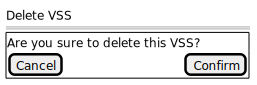

```PlantUML
@startsalt
{
  Delete VSS
  ==
  {+
    Are you sure to delete this VSS?
    {[Cancel] | [Confirm]}
  }
}
@endsalt
```


```PlantUML
@startuml Diagrams/DeleteVSS
hide footbox
skinparam sequenceParticipant underline

actor User as user
participant ":LocalVSSViewModel" as viewModel
participant ":DeleteVSSPage" as page
participant ":LocalSoundSpaceLibrary" as library

user -> viewModel: onDeleteButtonClicked()
viewModel -> page: <<create>>
alt confirm
    user -> page: onConfirmButtonClicked()
    page -> viewModel: confirmDeleteMessage
    viewModel -> library: deleteVSS(whichVSS)
    viewModel -> library: getVSSList(viewModelNo)
    library --> viewModel: receiveVSSList(listOfLocalVSS)
    viewModel -> viewModel: displayVSSList(listOfLocalVSS)
else cancel
    user -> page: onCancelButtonClicked()
    destroy page
end

@enduml
```

## 9.UploadVSS


```PlantUML
@startuml Diagrams/UploadVSS
hide footbox
skinparam sequenceParticipant underline

actor User as user
participant ":LocalVSSViewModel" as viewModel
participant ":LocalSoundSpaceLibrary" as library

user -> viewModel: onUploadButtonClicked()
viewModel -> library: uploadVSS(whichVSS)
control -> library: beamMeUp(whichVSS)
library->:UploadRequest(VSSID:int, UserID:int):boolean
library<-:Response
alt Response is True
  library -> library: GetSFList(whichVSS):list<SFHash>
  library->:UploadRequest(list<SFHash>):list<SFHash>
  library<-:MisssionList
  loop list is not empty
  note left:每上传成功一个任务push掉一个任务
    library->:UploadRequest(SFAddress):void
  end
  library->control:Response
  control->page:Response
end
@enduml
```
## 9.1.UploadVSS
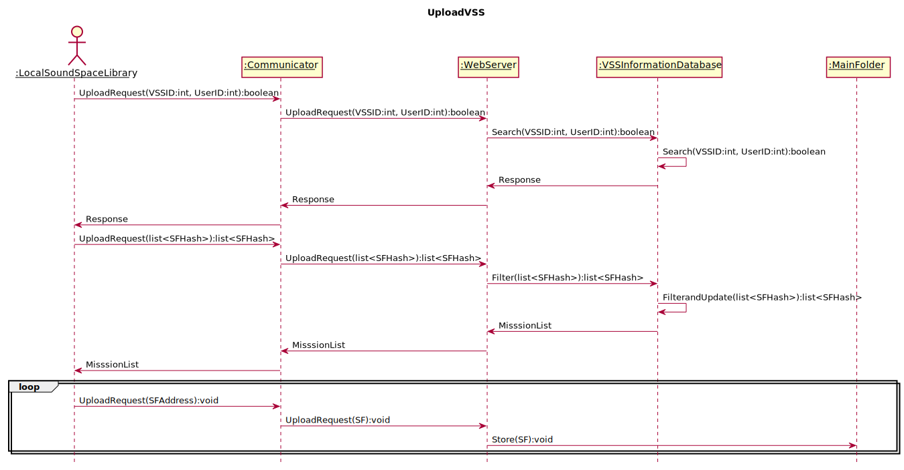

```PlantUML
@startuml Diagrams/UploadVSSServerSequenceDiagram
title UploadVSS
hide footbox
skinparam sequenceParticipant underline
actor ":LocalSoundSpaceLibrary" as Client
participant ":Communicator" as Communicator
participant ":WebServer" as WebServer
participant ":VSSInformationDatabase" as VSSInformationDatabase
participant ":MainFolder" as MainFolder
Client->Communicator:UploadRequest(VSSID:int, UserID:int):boolean
Communicator->WebServer:UploadRequest(VSSID:int, UserID:int):boolean
WebServer->VSSInformationDatabase:Search(VSSID:int, UserID:int):boolean
VSSInformationDatabase->VSSInformationDatabase:Search(VSSID:int, UserID:int):boolean
VSSInformationDatabase->WebServer:Response
WebServer->Communicator:Response
Communicator->Client:Response
Client->Communicator:UploadRequest(list<SFHash>):list<SFHash>
Communicator->WebServer:UploadRequest(list<SFHash>):list<SFHash>
WebServer->VSSInformationDatabase:Filter(list<SFHash>):list<SFHash>
VSSInformationDatabase->VSSInformationDatabase:FilterandUpdate(list<SFHash>):list<SFHash>
VSSInformationDatabase->WebServer:MisssionList
WebServer->Communicator:MisssionList
Communicator->Client:MisssionList
loop
  Client->Communicator:UploadRequest(SFAddress):void
  Communicator->WebServer:UploadRequest(SF):void
  WebServer->MainFolder:Store(SF):void
end
@enduml
```

## 10. LikeVSS


```PlantUML
@startuml Diagrams/LikeVSS
hide footbox
skinparam sequenceParticipant underline
actor User as user
participant ":PreviewOnline***ViewModel" as viewModel
participant ":UserInfoControl" as info
participant ":OnlineSoundSpaceLibrary" as library

user -> viewModel: onLikeButtonToggled()
alt not liked
    viewModel -> info: getCurrentUserID()
    info --> viewModel: currentUserID
    viewModel -> library: addLike(thisVSS)
else already liked
    viewModel -> info: getCurrentUserID()
    info --> viewModel: currentUserID
    viewModel -> library: removeLike(thisVSS)
    note left: In this case, the VSS is disliked.
end

@enduml
```

## 10.1.LikeVSS


```PlantUML
@startuml Diagrams/LikeVSSServerSequenceDiagram
title LikeVSS
hide footbox
skinparam sequenceParticipant underline
actor ":OnlineSoundSpaceLibrary" as Client
participant ":Communicator" as Communicator
participant ":WebServer" as WebServer
participant ":VSSInformationDatabase" as VSSInformationDatabase
alt
  Client->Communicator:addLike(thisVSS):void
  Communicator->WebServer:LikeRequest(VSSID:int, UserID:int):void
  WebServer->VSSInformationDatabase:LikeRequest(VSSID:int, UserID:int):void
  VSSInformationDatabase->VSSInformationDatabase:UpdateLike(VSSID, UserID):void
  note left: 将VSSID和UserID构成的数对存入VSS_Like_Table中
else
  Client->Communicator:removeLike(thisVSS):void
  Communicator->WebServer:removeLike(VSSID:int, UserID:int):void
  WebServer->VSSInformationDatabase:removeLike(VSSID:int, UserID:int):void
  VSSInformationDatabase->VSSInformationDatabase:removeLike(VSSID:int, UserID:int):void
  note left: 将VSSID和UserID构成的数对从VSS_Like_Table中删除
end
@enduml
```

## 11. DownloadVSS


```PlantUML
@startuml Diagrams/DownloadVSS
hide footbox
skinparam sequenceParticipant underline
actor User as user
participant ":PreviewOnline***Page" as page
participant ":PreviewOnline***Control" as control
participant ":LocalSoundSpaceLibrary" as library
user -> page: downloadVSS
page -> control: downloadVSS
control -> library: downloadVSS(thisVSS)
library->library:GetVSSID(thisVSS):list<SFHash>
loop list is not empty
  library->:DownloadRequest(SFHash)
  note left: 每完成一个SF的下载便从任务列表中pop出这个SF对应的SFHash
  library<-:SF
end
library->control:Response
control->page:Response
@enduml
```

## 11.1. Download
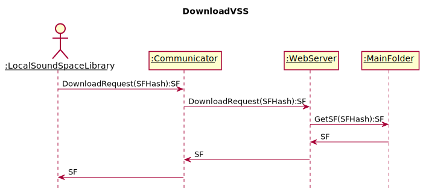

```PlantUML
@startuml Diagrams/DownloadVSSServerSequenceDiagram
title DownloadVSS
hide footbox
skinparam sequenceParticipant underline
actor ":LocalSoundSpaceLibrary" as Client
participant ":Communicator" as Communicator
participant ":WebServer" as WebServer
participant ":MainFolder" as Folder
Client->Communicator:DownloadRequest(SFHash):SF
Communicator->WebServer:DownloadRequest(SFHash):SF
WebServer->Folder:GetSF(SFHash):SF
Folder->WebServer:SF
WebServer->Communicator:SF
Communicator->Client:SF
@enduml
```
## 12. CommentVSS


```PlantUML
@startuml Diagrams/CommentVSS
hide footbox
skinparam sequenceParticipant underline
actor User as user
participant ":PreviewOnline***Page" as page
participant ":PreviewOnline***Control" as control
participant ":UserInfoControl" as info
participant ":OnlineSoundSpaceLibrary" as library

user -> page: submitComment(comment: String)
page -> control: submitComment(commit: String)
control -> info: getCurrentUserID()
info --> control: currentUserID
control -> library: addCommit(whichVSS, userid:int, comment:String)
library->:CommentRequest(VSSID:int, userid:int, comment:String)
@enduml
```

## 12.1. CommentVSS
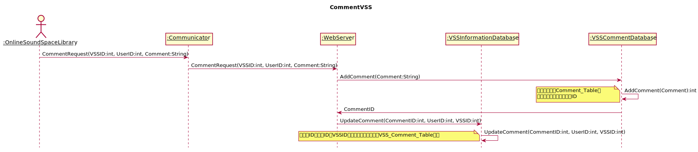

```PlantUML
@startuml Diagrams/CommentVSSServerSequenceDiagram
title CommentVSS
hide footbox
skinparam sequenceParticipant underline
actor ":OnlineSoundSpaceLibrary" as Client
participant ":Communicator" as Communicator
participant ":WebServer" as WebServer
participant ":VSSInformationDatabase" as VSSInformationDatabase
participant ":VSSCommentDatabase" as VSSCommentDatabase
Client->Communicator:CommentRequest(VSSID:int, UserID:int, Comment:String)
Communicator->WebServer:CommentRequest(VSSID:int, UserID:int, Comment:String)
WebServer->VSSCommentDatabase:AddComment(Comment:String)
VSSCommentDatabase->VSSCommentDatabase:AddComment(Comment):int
note left: 将评论添加到Comment_Table中\n并返回该评论在此表中的ID
VSSCommentDatabase->WebServer:CommentID
WebServer->VSSInformationDatabase:UpdateComment(CommentID:int, UserID:int, VSSID:int)
VSSInformationDatabase->VSSInformationDatabase:UpdateComment(CommentID:int, UserID:int, VSSID:int)
note left: 将评论ID，用户ID和VSSID构成的关系键值对存入VSS_Comment_Table表中
@enduml
```

## 13. PlayVSS(Abstract)

## 14. PreviewVSS(Abstract)
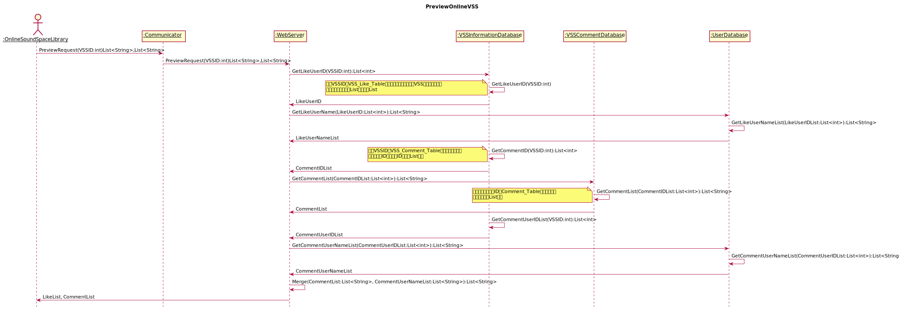


```PlantUML
@startuml
title PreviewOnlineVSS
hide footbox
skinparam sequenceParticipant underline
actor ":OnlineSoundSpaceLibrary" as Client
participant ":Communicator" as Communicator
participant ":WebServer" as WebServer
participant ":VSSInformationDatabase" as VSSInformationDatabase
participant ":VSSCommentDatabase" as VSSCommentDatabase
participant ":UserDatabase" as UserDatabase
Client->Communicator:PreviewRequest(VSSID:int)List<String>,List<String>
Communicator->WebServer:PreviewRequest(VSSID:int)List<String>,List<String>
WebServer->VSSInformationDatabase:GetLikeUserID(VSSID:int):List<int>
VSSInformationDatabase->VSSInformationDatabase:GetLikeUserID(VSSID:int)
note left: 根据VSSID在VSS_Like_Table中进行查询得到点赞了该VSS的用户的用户名\n并将这些信息整理成List，返回此List
VSSInformationDatabase->WebServer:LikeUserID
WebServer->UserDatabase:GetLikeUserName(LikeUserID:List<int>):List<String>
UserDatabase->UserDatabase:GetLikeUserNameList(LikeUserIDList:List<int>):List<String>
UserDatabase->WebServer:LikeUserNameList
VSSInformationDatabase->VSSInformationDatabase:GetCommentID(VSSID:int):List<int>
note left: 根据VSSID在VSS_Comment_Table中进行查询，得到\n相应的评论ID，将这些ID构成的List返回
VSSInformationDatabase->WebServer:CommentIDList
WebServer->VSSCommentDatabase:GetCommentList(CommentIDList:List<int>):List<String>
VSSCommentDatabase->VSSCommentDatabase:GetCommentList(CommentIDList:List<int>):List<String>
note left: 根据所给的评论的ID在Comment_Table中进行查询，\n将评论整合成List返回
VSSCommentDatabase->WebServer:CommentList
VSSInformationDatabase->VSSInformationDatabase:GetCommentUserIDList(VSSID:int):List<int>
VSSInformationDatabase->WebServer:CommentUserIDList
WebServer->UserDatabase:GetCommentUserNameList(CommentUserIDList:List<int>):List<String>
UserDatabase->UserDatabase:GetCommentUserNameList(CommentUserIDList:List<int>):List<String>
UserDatabase->WebServer:CommentUserNameList
WebServer->WebServer:Merge(CommentList:List<String>, CommentUserNameList:List<String>):List<String>
WebServer->Client:LikeList, CommentList
@enduml
```


## 15. PreviewLocalMapVSS

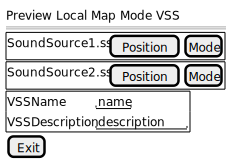

```PlantUML
@startsalt
{
  Preview Local Map Mode VSS
  ==
  {+
      SoundSource1.ss | [Position] | [Mode]
  }
  {+
      SoundSource2.ss | [Position] | [Mode]
  }
  {+
    VSSName| "name"
    VSSDescription|"description"
  }
  [Exit]
}
@endsalt
```


```PlantUML
@startuml Diagrams/PreviewLocalMapVSS
hide footbox
skinparam sequenceParticipant underline
actor User as user
participant ":PreviewLocalMapViewModel" as viewModel
participant ":LocalSoundSpaceLibrary" as library
create viewModel
[-> viewModel: <<create>>
viewModel -> library: getMetadata(VSS_ID)
library --> viewModel: metadatas
viewModel -> viewModel: displayMetadata(VSSName, VSSDescription, soundSourceList)

@enduml
```

## 16. PreviewOnlineMapVSS

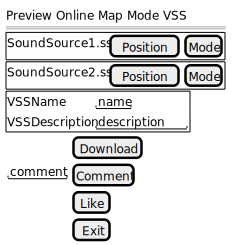

```PlantUML
@startsalt
{
  Preview Online Map Mode VSS
  ==
  {+
      SoundSource1.ss | [Position] | [Mode]
  }
  {+
      SoundSource2.ss | [Position] | [Mode]
  }
  {+
    VSSName| "name"
    VSSDescription|"description"
  }
  {
    . |[Download]
    "comment"|[Comment]
    . |[Like]
    . |[Exit]
  }
}
@endsalt
```


```PlantUML
@startuml Diagrams/PreviewOnlineMaplibrary
hide footbox
skinparam sequenceParticipant underline
actor User as user

participant ":PreviewOnlineMapViewModel" as viewModel
participant ":OnlineSoundSpaceLibrary" as library
create viewModel
[-> viewModel: <<create>>
viewModel -> library: getMetadata(VSS_ID)
library --> viewModel: metadatas
viewModel -> viewModel: displayMetadata(VSSName, VSSDescription, soundSourceList)
note right
details are left out for designs.
end note

@enduml
```

## 17. PreviewLocalConcertVSS

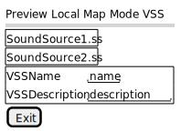

```
@startsalt
{
  Preview Local Map Mode VSS
  ==
  {+
      SoundSource1.ss
  }
  {+
      SoundSource2.ss
  }
  {+
    VSSName| "name"
    VSSDescription|"description"
  }
  [Exit]
}
@endsalt
```


```PlantUML
@startuml Diagrams/PreviewLocalConcertVSS
hide footbox
skinparam sequenceParticipant underline
actor User as user
participant ":PreviewLocalConcertViewModel" as viewModel
participant ":LocalSoundSpaceLibrary" as library
create viewModel
[-> viewModel: <<create>>
viewModel -> library: getMetadata(VSS_ID)
library --> viewModel: metadatas
viewModel -> viewModel: displayMetadata(VSSName, VSSDescription, soundSourceList)

note right
details are left out for designs.
end note
@enduml
```

## 18. PreviewOnlineConcertVSS

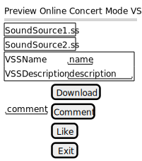

```PlantUML
@startsalt
{
  Preview Online Concert Mode VSS
  ==
  {+
      SoundSource1.ss
  }
  {+
      SoundSource2.ss
  }
  {+
    VSSName| "name"
    VSSDescription|"description"
  }
  {
    . |[Download]
    "comment"|[Comment]
    . |[Like]
    . |[Exit]
  }
}
@endsalt
```


```PlantUML
@startuml Diagrams/PreviewOnlineConcertVSS
hide footbox
skinparam sequenceParticipant underline
actor User as user

participant ":PreviewOnlineConcertViewModel" as viewModel
participant ":OnlineSoundSpaceLibrary" as library
create viewModel
[-> viewModel: <<create>>
viewModel -> library: getMetadata(VSS_ID)
library --> viewModel: metadatas
viewModel -> viewModel: displayMetadata(VSSName, VSSDescription, soundSourceList)
note right
details are left out for designs.
end note
@enduml
```

## 19. PlayMapModeVSS

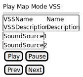

```plantUML
@startsalt
{ Play Map Mode VSS
  ==
  {+
    VSSName |  Name
    VSSDescription | Description
  }
  {+
    SoundSource1
  }
  {+
    SoundSource2
  }
  {[Play] | [Pause]}
  {[Prev] | [Next]}
}
@endsalt
```


```PlantUML
@startuml Diagrams/PlayMapModeVSS
hide footbox
skinparam sequenceParticipant underline

actor User as user
participant ":PlayMapModeVSSViewModel" as page
participant ":LocalSoundSpaceLibrary" as library
participant "thisVSS:MapModeVirtualSoundSpace" as vss
participant ":Sensor" as sensor
participant ":GVRAudioEngine" as audio
participant ":AdjustSensorPage" as adpage
participant "task:Callable" as task

create page
[-> page: <<create>>
page -> library: checkAllNessarySoundFragmentDownloaded()
alt downloaded
    library --> page: confirm
else not yet
    library --> page: deny
    page -> page: warning
    page -> page: <<destroy>>
    destroy page
end
page -> vss: getSoundSources()
vss --> page: soundSourceList
page -> page: displayMapSoundSourceList(listOfLocalMapSoundSource):void
create sensor
page -> sensor: <<create>>
create audio
page -> audio: <<create>>
create adpage
page -> adpage: <<create>>
...adjust sensor...
user -> user: wakeup
destroy adpage
create task
page -> task: new Callable()
page -> sensor: callWhenUpdatedDelay(task, 50)

loop
    sensor --> page: currentLocation: Positon
    page -> audio: updateCurrentLocation(currentLocation: Position)

    alt startPlay
        user -> page: onPlayButtonClicked(soundSource):void
        page -> page: play(soundSource):void
        page -> audio: play(soundFragment)
    else pause
        user -> page: onPauseButtonClicked():void
        page -> page: pause()
        page -> audio: pause()
    else next
        user -> page: onNextButtonClicked():void
        page -> page: play(soundSource):void
        page -> audio: play(soundFragment)
    else prev
        user -> page: onPrevButtonClicked():void
        page -> page: play(soundSource):void
        page -> audio: play(soundFragment)
    end
end
page -> sensor: clearTask()
page -> audio: stopAll()
page -> audio: <<destroy>>
destroy audio
page -> sensor: <<destroy>>
destroy sensor
page -> page: <<destroy>>
destroy page

@enduml
```

## 20. PlayConcertModeVSS


```plantUML
@startsalt
{ Play Concert Mode VSS
  ==
  {+
    VSSName |  Name
    VSSDescription | Description
  }
  {+
    SoundSource1
  }
  {+
    SoundSource2
  }
  {[Play] | [Pause]}
  {[Prev] | [Next]}
}
@endsalt
```


```PlantUML
@startuml Diagrams/PlayConcertModeVSS
hide footbox
skinparam sequenceParticipant underline

actor User as user
participant ":PlayConcertModeVSSViewModel" as page
participant ":ConcertModeVirtualSoundSpace" as vss
participant ":LocalSoundSpaceLibrary" as library
participant ":Sensor" as sensor
participant ":GVRAudioEngine" as audio
participant ":AdjustSensorPage" as adpage
participant "task:Callable" as task


create page
[-> page: <<create>>
page -> library: checkAllNessarySoundFragmentDownloaded()
alt downloaded
    library --> page: confirm
else not yet
    library --> page: deny
    page -> page: warning
    page -> page: <<destroy>>
    destroy page
end
page -> vss: getSoundSources()
vss --> page: soundSourceList
page -> page: displayConcertSoundSourceList(listOfLocalConcertSoundSource):void
create sensor
page -> sensor: <<create>>
create audio
page -> audio: <<create>>
create adpage
page -> adpage: <<create>>
...adjust sensor...
user -> user: wakeup
destroy adpage
create task
page -> task: new Callable()
page -> sensor: callWhenUpdatedDelay(task, 50)
loop
    sensor --\ page: currentLocation: Positon
    page -> audio: updateCurrentLocation(currentLocation: Position)
    alt startPlay
        user -> page: onPlayButtonClicked(soundSource):void
        page -> page: play(soundSource):void
        page -> audio: play(soundFragment)
    else pause
        user -> page: onPauseButtonClicked():void
        page -> page: pause()
        page -> audio: pause()
    else next
        user -> page: onNextButtonClicked():void
        page -> page: play(soundSource):void
        page -> audio: play(soundFragment)
    else prev
        user -> page: onPrevButtonClicked():void
        page -> page: play(soundSource):void
        page -> audio: play(soundFragment)
    end
end
page -> audio: stopAll()
page -> audio: <<destroy>>
destroy audio
page -> sensor: <<destroy>>
destroy sensor
page -> page: <<destroy>>
destroy page

@enduml
```


## 21. BrowseOnlineVSSLibrary


```PlantUML
@startuml Diagrams/BrowseOnlineVSSLibrary
hide footbox
skinparam sequenceParticipant underline

actor User as user
participant ":OnlineVSSViewerPage" as page
participant ":OnlineVSSLibraryControl" as control
participant ":OnlineSoundSpaceLibrary" as library


create page
[-> page: <<create>>
create control
page -> control: <<create>>
control -> library: getVSSList(pageNo: int):List
library->:BrowseRequest(pagenumber:int)
library<-:listOfOnlineVSS:List<VirtualSoundSpace>
library --> control: listOfOnlineVSS: List<VirtualSoundSpace>
control -> page: displayVSSList(listOfOnlineVSS)
alt previewVSS
    user -> page: previewVSS(whichVSS)
    page -> control: previewVSS(whichVSS)
    alt concert mode vss is selected
        participant ":PreviewOnlineConcertPage" as pocp
        create pocp
        control -> pocp: <<create>>
    else map mode vss is selected
        participant ":PreviewOnlineMapPage" as pomp
        create pomp
        control -> pomp: <<create>>

    end
else nextPage
    control -> library: getVSSList(pageNo: int):List
    library->:BrowseRequest(pagenumber:int)
    library<-:listOfOnlineVSS:List<VirtualSoundSpace>
    library --> control: listOfOnlineVSS: List<VirtualSoundSpace>
    control -> page: displayVSSList(listOfOnlineVSS)
else prevPage
    control -> library: getVSSList(pageNo: int):List
    library->:BrowseRequest(pagenumber:int)
    library<-:listOfOnlineVSS:List<VirtualSoundSpace>
    library --> control: listOfOnlineVSS: List<VirtualSoundSpace>
    control -> page: displayVSSList(listOfOnlineVSS)
end

@enduml
```
## 21.1. BrowseOnlineVSSLibrary


```PlantUML
@startuml Diagrams/BrowseOnlineVSSLibrarySSD
title BrowseOnlineVSS
hide footbox
skinparam sequenceParticipant underline

actor ":OnlineSoundSpaceLibrary" as Client
participant ":Communicator" as Communicator
participant ":WebServer" as WebServer
participant ":VSSInformationDatabase" as VSSInformationDatabase
participant ":MainFolder" as Folder

Client->Communicator:BrowseRequest(pagenumber:int):List<VirtualSoundSpace>
Communicator->WebServer:BrowseRequest(pagenumber:int):List<VirtualSoundSpace>
WebServer->VSSInformationDatabase:GetVSS(pagenumber:int):List<int>
VSSInformationDatabase->WebServer:VSSIDList
WebServer->Folder:GetVSS(VSSIDList:List<int>):List<VirtualSoundSpace>
Folder->WebServer:listOfOnlineVSS
WebServer->Communicator:listOfOnlineVSS
Communicator->Client:listOfOnlineVSS
@enduml
```

## 22. AdjustSensor


**AdjustSensor用例中Sensor 和 Control 高度耦合，而且具体的步骤需要等到技术开发结束才能知道，因此暂时放在这里。**

```PlantUML
@startuml Diagrams/AdjustSensor
hide footbox
skinparam sequenceParticipant underline

actor User as user
participant ":AdjustSensorPage" as page
participant ":AdjustSensorControl" as control
participant ":Sensor" as sensor

[-> page: <<create>>
note over control: Sensor control should be coupled with Sensor
create control
page -> control: <<create>>
note right of sensor: this sensor object is created before adjusting sensor
loop for each operation
    control -> page: demand
    page -> user: demand
    loop while adjust demand satisfied
        user -> user: move
        sensor -> sensor: collectData
    end
    sensor -> control: demandSatisfied
end

control -> page: <<destroy>>
destroy page
destroy control


@enduml
```
