#### 设计动态模型

## 1.Register


```PlantUML
@startsalt Diagrams/RegisterUIMockUP
{
    Welcome to AudioAR
    ==
    Login | "MyName"
    Email | "Development@AudioAR.org"
    Password | "******"
    Reenter Password | "******"
    passwordStrength <&check><&check><&check><&check><&x>
    [X] Remember me next time
    ==
    [Cancel] | [Register <&account-login>]
}
@endsalt
```

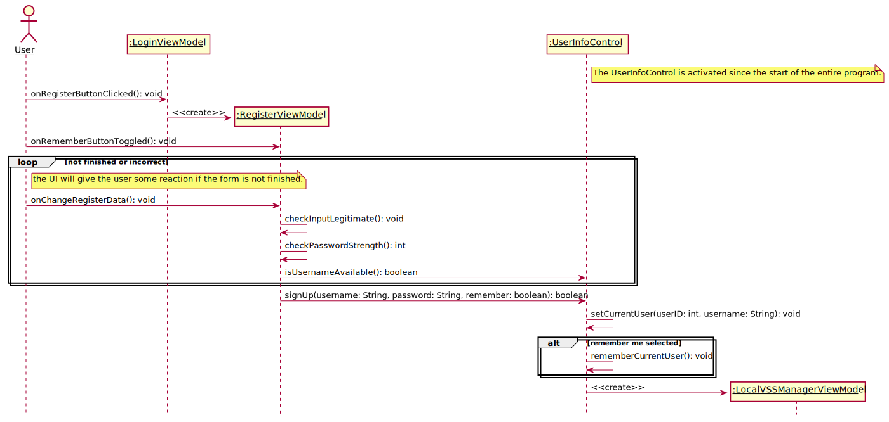


```PlantUML
@startuml Diagrams/Register
hide footbox
skinparam sequenceParticipant underline

actor User as user
participant ":LoginViewModel" as loginpage
participant ":RegisterViewModel" as boundary
participant ":UserInfoControl" as control
participant ":LocalVSSManagerViewModel" as nextpage

note right of control: The UserInfoControl is activated since the start of the entire program.

user -> loginpage: onRegisterButtonClicked(): void

create boundary
loginpage -> boundary: <<create>>

user -> boundary: onRememberButtonToggled(): void
loop not finished or incorrect
    note right of user
        the UI will give the user some reaction if the form is not finished.
    end note
    user -> boundary: onChangeRegisterData(): void
    boundary -> boundary: checkInputLegitimate(): void
    boundary -> boundary: checkPasswordStrength(): int
    boundary -> control: isUsernameAvailable(): boolean
end

boundary -> control: signUp(username: String, password: String, remember: boolean): boolean

control -> control: setCurrentUser(userID: int, username: String): void
alt remember me selected
    control -> control: rememberCurrentUser(): void
end
create nextpage
control -> nextpage: <<create>>
@enduml
```

## 2.Login


```PlantUML
@startsalt Diagrams/LoginUIMockUP
{
    User Login Panel
    ==
    Username or Email | "someEmail@AudioAR.org"
    Password | "****"
    [X] Remember me next time
    ==
    [Sign IN <&account-login>]
    ==
    New to AudioAR? Click to register:
    [Sign UP <&key>]
}
@endsalt
```

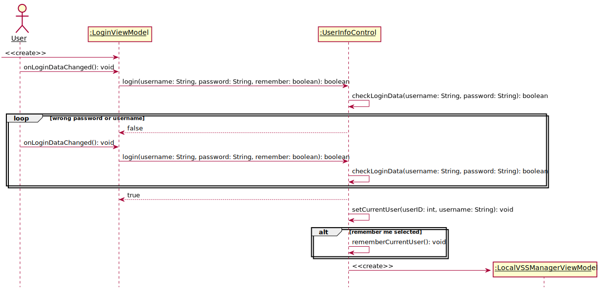

```PlantUML
@startuml Diagrams/Login
hide footbox
skinparam sequenceParticipant underline

actor User as user
participant ":LoginViewModel" as boundary
participant ":UserInfoControl" as control
participant ":LocalVSSManagerViewModel" as nextpage


[-> boundary: <<create>>
user -> boundary: onLoginDataChanged(): void
boundary -> control: login(username: String, password: String, remember: boolean): boolean
control -> control: checkLoginData(username: String, password: String): boolean

loop wrong password or username
    control --> boundary: false
    user -> boundary: onLoginDataChanged(): void
    boundary -> control: login(username: String, password: String, remember: boolean): boolean
    control -> control: checkLoginData(username: String, password: String): boolean
end
control --> boundary: true
control -> control: setCurrentUser(userID: int, username: String): void

alt remember me selected
    control -> control: rememberCurrentUser(): void
end
create nextpage
control -> nextpage: <<create>>
@enduml
```
## 3.ManageLocalVSSLibrary

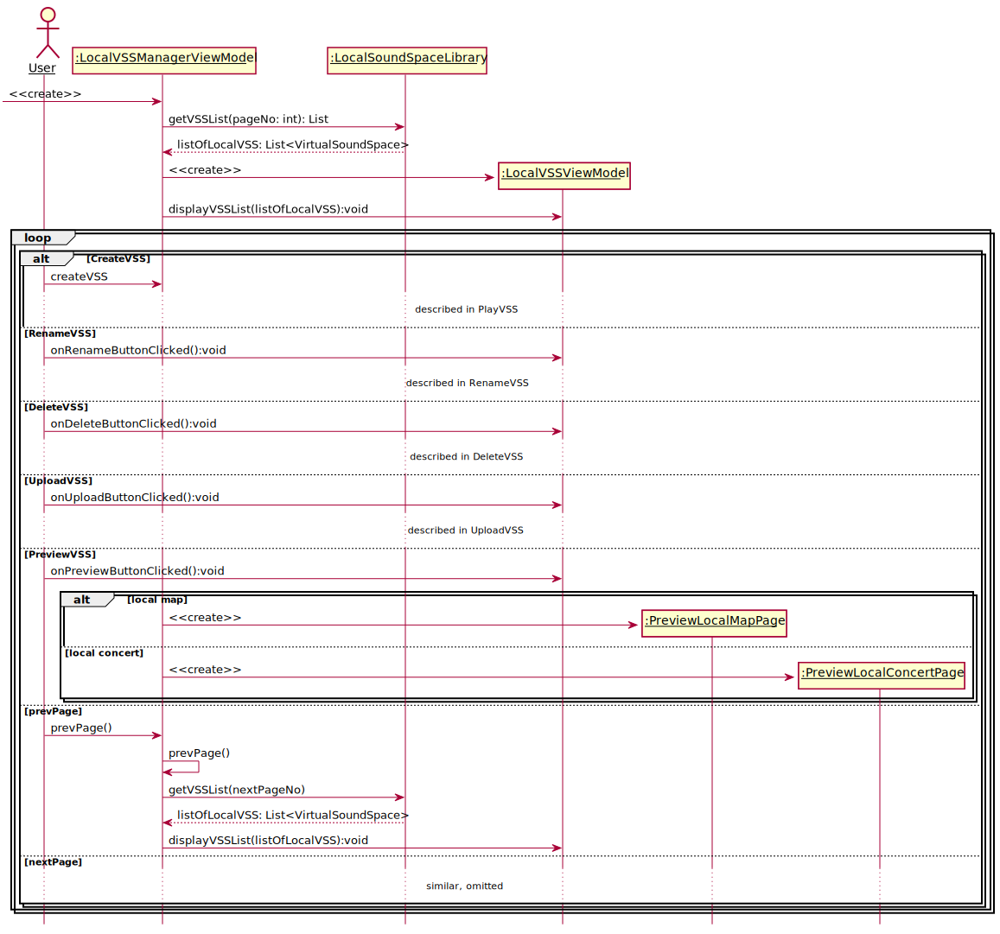

```PlantUML
@startuml Diagrams/ManageLocalVSSLibrary
hide footbox
skinparam sequenceParticipant underline

actor User as user
participant ":LocalVSSManagerPage" as boundary
participant ":LocalVSSLibraryControl" as control
participant ":LocalSoundSpaceLibrary" as library

create boundary
[-> boundary: <<create>>
create control
boundary -> control: <<create>>
control -> library: getVSSList(pageNo: int): List
library --> control: listOfLocalVSS: List<VirtualSoundSpace>
control -> boundary: displayVSSList(listOfLocalVSS)

loop
    alt CreateVSS
        user -> boundary: createVSS
        ...described in PlayVSS...
    else RenameVSS
        user -> boundary: renameVSS(whichVSS)
        ...described in RenameVSS...
    else DeleteVSS
        user -> boundary: deleteVSS(whichVSS)
        ...described in DeleteVSS...
    else UploadVSS
        user -> boundary: uploadVSS(whichVSS)
        ...described in UploadVSS...
    else PreviewVSS
        user -> boundary: previewVSS(whichVSS)
        boundary -> control: previewVSS(whichVSS)
        alt local map
            participant ":PreviewLocalMapPage" as plmp
            create plmp
            control -> plmp: <<create>>

        else local concert
            participant ":PreviewLocalConcertPage" as plcp
            create plcp
            control -> plcp: <<create>>
        end
    else prevPage
        user -> boundary: prevPage()
        boundary -> control: prevPage()
        control -> library: getVSSList(nextPageNo)
        library --> control: listOfLocalVSS: List<VirtualSoundSpace>
        control -> boundary: displayVSSList(listOfLocalVSS)
    else nextPage
    ...similar, omitted...
    end
end
@enduml
```

## 4.CreateVSS

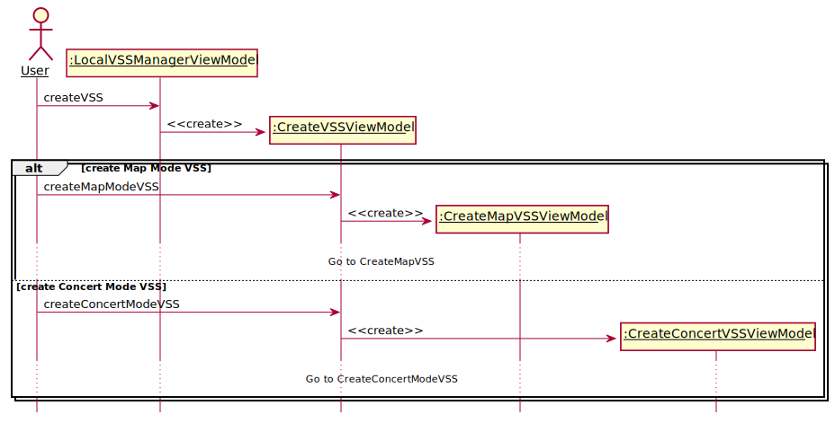

```PlantUML
@startuml Diagrams/CreateVSS
hide footbox
skinparam sequenceParticipant underline

actor User as user
participant ":LocalVSSManagerPage" as manage
participant ":CreateVSSPage" as page
participant ":CreateMapVSSPage" as map
participant ":CreateConcertVSSPage" as concert

user -> manage: createVSS
create page
manage -> page: <<create>>
alt create Map Mode VSS
    user -> page: createMapModeVSS
    create map
    page -> map: <<create>>
    ...Go to CreateMapVSS...
else create Concert Mode VSS
    user -> page: createConcertModeVSS
    create concert
    page -> concert: <<create>>
    ...Go to CreateConcertModeVSS...
end

@enduml
```

## 5.CreateMapModeVSS

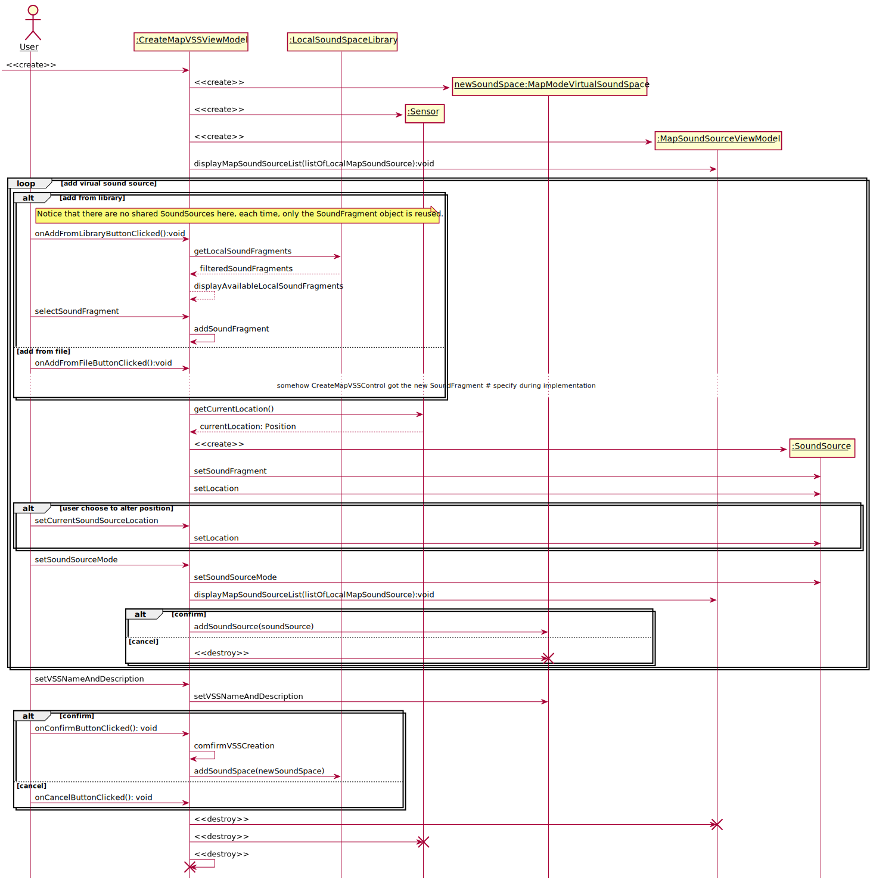

```PlantUML
@startuml Diagrams/CreateMapModeVSS
hide footbox
skinparam sequenceParticipant underline


actor User as user
participant ":CreateMapVSSPage" as createboundary
participant ":CreateMapVSSControl" as createcontrol
participant ":LocalSoundSpaceLibrary" as library
participant ":Sensor" as sensor
participant "newSoundSpace:MapModeVirtualSoundSpace" as newspace


[-> createboundary: <<create>>
create createcontrol
createboundary -> createcontrol: <<create>>
create newspace
createcontrol -> newspace: <<create>>
create sensor
createcontrol -> sensor: <<create>>
loop add virual sound source
    alt add from library
        note right of user: Notice that there are no shared SoundSources here, each time, only the SoundFragment object is reused.
        user -> createboundary: selectExistedSoundSource
        createboundary -> createcontrol: getLocalSoundFragments
        createcontrol -> library: getLocalSoundFragments
        library --> createcontrol: filteredSoundFragments
        createcontrol --> createboundary: displayAvailableLocalSoundFragments
        user -> createboundary: selectSoundFragment
        createboundary -> createcontrol: addSoundFragment
    else add from file
        user -> createboundary: selectFromFileSystem
        ...somehow CreateMapVSSControl got the new SoundFragment # specify during implementation...

    end

    createcontrol -> sensor: getCurrentLocation()
    sensor --> createcontrol: currentLocation: Position

    participant ":SoundSource" as source
    create source
    createcontrol -> source: <<create>>
    createcontrol -> source: setSoundFragment
    createcontrol -> source: setLocation

    alt user choose to alter position
        user -> createboundary: setCurrentSoundSourceLocation
        createboundary -> createcontrol : setLocation
        createcontrol -> source: setLocation
    end
    user -> createboundary: setSoundSourceMode
    createboundary -> createcontrol: setSoundSourceMode
    createcontrol -> source: setSoundSourceMode
    alt confirm
        createcontrol -> newspace: addSoundSource(soundSource)
    else cancel
        createcontrol -> newspace: <<destroy>>
        destroy newspace
    end
end
user -> createboundary: setVSSNameAndDescription
createboundary -> createcontrol: setVSSNameAndDescription
createcontrol -> newspace: setVSSNameAndDescription
alt confirm
    user -> createboundary: comfirmVSSCreation
    createboundary -> createcontrol: comfirmVSSCreation
    createcontrol -> library: addSoundSpace(newSoundSpace)
else cancel

end
createcontrol -> createboundary: <<destroy>>
destroy createboundary
createcontrol -> sensor: <<destroy>>
destroy sensor
destroy createcontrol
@enduml
```

## 6.CreateConcertModeVSS

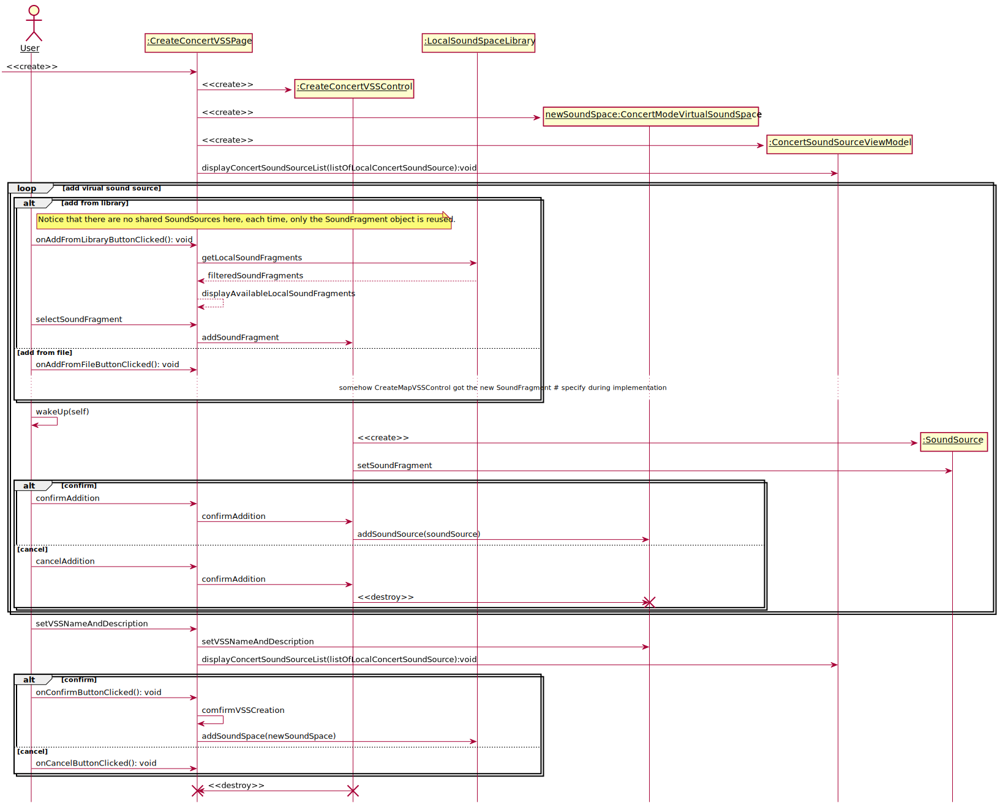

```PlantUML
@startuml Diagrams/CreateConcertModeVSS
hide footbox
skinparam sequenceParticipant underline


actor User as user
participant ":CreateConcertVSSPage" as createboundary
participant ":CreateConcertVSSControl" as createcontrol
participant ":LocalSoundSpaceLibrary" as library
participant "newSoundSpace:ConcertModeVirtualSoundSpace" as newspace

create createboundary
-> createboundary: <<create>>
create createcontrol
createboundary -> createcontrol: <<create>>
create newspace
createcontrol -> newspace: <<create>>

loop add virual sound source
    alt add from library
        note right of user: Notice that there are no shared SoundSources here, each time, only the SoundFragment object is reused.
        user -> createboundary: selectExistedSoundSource
        createboundary -> createcontrol: getLocalSoundFragments
        createcontrol -> library: getLocalSoundFragments
        library --> createcontrol: filteredSoundFragments
        createcontrol --> createboundary: displayAvailableLocalSoundFragments
        user -> createboundary: selectSoundFragment
        createboundary -> createcontrol: addSoundFragment
    else add from file
        user -> createboundary: selectFromFileSystem
        ...somehow CreateMapVSSControl got the new SoundFragment # specify during implementation...
    end


    participant ":SoundSource" as source
    user -> user: wakeUp(self)
    create source
    createcontrol -> source: <<create>>
    createcontrol -> source: setSoundFragment
    alt confirm
        user -> createboundary: confirmAddition
        createboundary -> createcontrol: confirmAddition
        createcontrol -> newspace: addSoundSource(soundSource)
    else cancel
        user -> createboundary: cancelAddition
        createboundary -> createcontrol: confirmAddition
        createcontrol -> newspace: <<destroy>>
        destroy newspace
    end

end
user -> createboundary: setVSSNameAndDescription
createboundary -> createcontrol: setVSSNameAndDescription
createcontrol -> newspace: setVSSNameAndDescription
alt confirm
    user -> createboundary: comfirmVSSCreation
    createboundary -> createcontrol: comfirmVSSCreation
    createcontrol -> library: addSoundSpace(newSoundSpace)
else cancel
end
createcontrol -> createboundary: <<destroy>>
destroy createboundary
destroy createcontrol
@enduml
```

## 7.RenameVSS

**The LocalSoundSpaceLibrary acts like a facade.**

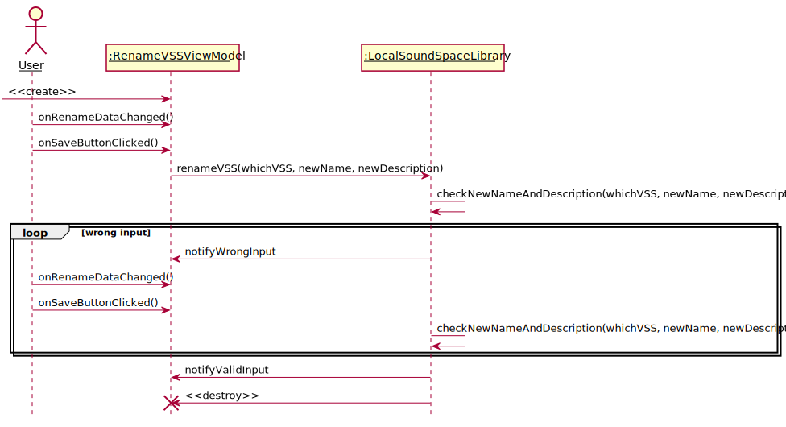

```PlantUML
@startuml Diagrams/RenameVSS
hide footbox
skinparam sequenceParticipant underline

actor User as user
participant ":LocalVSSManagerPage" as page
participant ":LocalVSSLibraryControl" as control
participant ":LocalSoundSpaceLibrary" as library

user -> page: renameVSS
user -> page: enterNewLocalVSSNameAndDescription
page -> control: newNameAndDescriptionEntered(whichVSS, newName, newDescription)
control -> control: checkNewNameAndDescription
alt wrong input
    control -> page: notifyWrongInput
else good input
    control -> library: setNameAndDescription(whichVSS, newName, newDescription)
end

@enduml
```

## 8.DeleteVSS
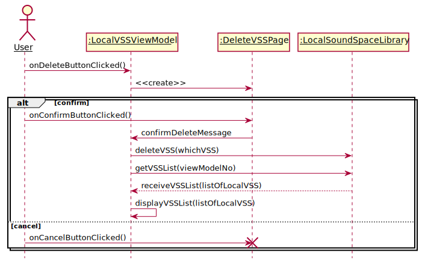

```PlantUML
@startuml Diagrams/DeleteVSS
hide footbox
skinparam sequenceParticipant underline

actor User as user
participant ":LocalVSSManagerPage" as page
participant ":LocalVSSLibraryControl" as control
participant ":LocalSoundSpaceLibrary" as library

user -> page: deleteVSS(whichVSS)
page -> control: deleteVSS(whichVSS)
control -> page: comfirmDialog
alt confirm
    user -> page: confirmDelete
    page -> control: confirm
    control -> library: deleteVSS(whichVSS)
    control -> library: getVSSList(pageNo)
    library --> control: listOfLocalVSS
    library -> page: displayVSSList(listOfLocalVSS)
else cancel
    user -> page: cancelDelete
    page -> control: cancelDelete
end


@enduml
```

## 9.UploadVSS
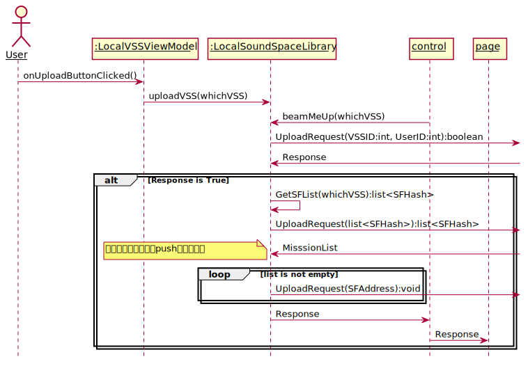

```PlantUML
@startuml Diagrams/UploadVSS
hide footbox
skinparam sequenceParticipant underline

actor User as user
participant ":LocalVSSManagerPage" as page
participant ":LocalVSSLibraryControl" as control
participant ":LocalSoundSpaceLibrary" as library

user -> page: uploadVSS(whichVSS)
page -> control: uploadVSS(whichVSS)
control -> library: beamMeUp(whichVSS)
...LocalSoundSpaceLibrary doing magic trick, using android system to show download progress...
...There are no other ways to show that a local sound space is finished uploading other than android system notices...
@enduml
```

## 10. LikeVSS
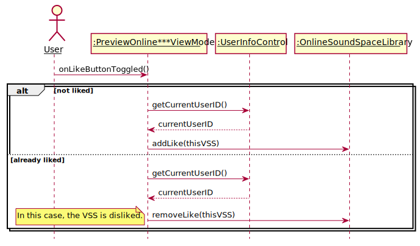

```PlantUML
@startuml Diagrams/LikeVSS
hide footbox
skinparam sequenceParticipant underline
actor User as user
participant ":PreviewOnline***Page" as page
participant ":PreviewOnline***Control" as control
participant ":UserInfoControl" as info
participant ":OnlineSoundSpaceLibrary" as library

user -> page: toggleLikeStatus
alt not liked
    page -> control: likeVSS
    control -> info: getCurrentUserID()
    info --> control: currentUserID
    control -> library: addLike(thisVSS)
else already liked
    page -> control: dislikeVSS
    control -> info: getCurrentUserID()
    info --> control: currentUserID
    control -> library: removeLike(thisVSS)
end

@enduml
```


## 11. DownloadVSS


```PlantUML
@startuml Diagrams/DownloadVSS
hide footbox
skinparam sequenceParticipant underline
actor User as user
participant ":PreviewOnline***Page" as page
participant ":PreviewOnline***Control" as control
participant ":LocalSoundSpaceLibrary" as library
user -> page: downloadVSS
page -> control: downloadVSS
control -> library: downloadVSS(thisVSS)


@enduml
```

## 12. CommentVSS
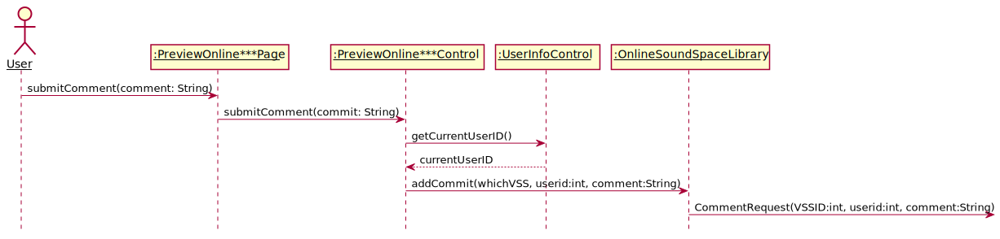

```PlantUML
@startuml Diagrams/CommentVSS
hide footbox
skinparam sequenceParticipant underline
actor User as user
participant ":PreviewOnline***Page" as page
participant ":PreviewOnline***Control" as control
participant ":UserInfoControl" as info
participant ":OnlineSoundSpaceLibrary" as library

user -> page: submitComment(comment: String)
page -> control: submitComment(commit: String)
control -> info: getCurrentUserID()
info --> control: currentUserID
control -> library: addCommit(whichVSS, userid, comment)
@enduml
```


## 13. PlayVSS(Abstract)

## 14. PreviewVSS(Abstract)

## 15. PreviewLocalMapVSS


```PlantUML
@startuml Diagrams/PreviewLocalMapVSS
hide footbox
skinparam sequenceParticipant underline
participant ":PreviewLocalMapPage" as page
participant ":PreviewLocalMapControl" as control
participant "localMapVSS:VirtualSoundSpace" as vss
create page
[-> page: <<create>>
create control
page -> control: <<create>>
control -> vss: get metadata
vss --> control: metadata
control -> page: display metadata


@enduml
```


## 16. PreviewOnlineMapVSS
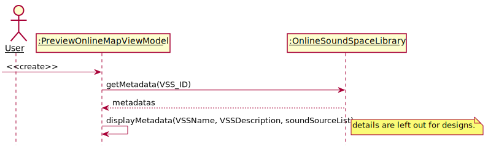

```PlantUML
@startuml Diagrams/PreviewOnlineMapVSS
hide footbox
skinparam sequenceParticipant underline
actor User as user

participant ":PreviewOnlineMapPage" as page
participant ":PreviewOnlineMapControl" as control
participant "onlineMapVSS:VirtualSoundSpace" as vss
create page
[-> page: <<create>>
create control
page -> control: <<create>>
control -> vss: get metadata
vss -> control: metadata
control -> page: display metadata
note right
details are left out for designs.
end note
@enduml
```

## 17. PreviewLocalConcertVSS
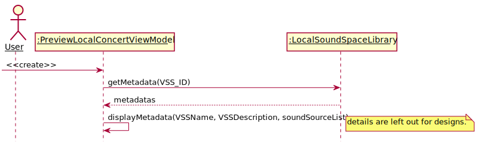

```PlantUML
@startuml Diagrams/PreviewLocalConcertVSS
hide footbox
skinparam sequenceParticipant underline
actor User as user

participant ":PreviewLocalConcertPage" as page
participant ":PreviewLocalConcertControl" as control
participant "localConcertVSS:VirtualSoundSpace" as vss
create page
[-> page: <<create>>
create control
page -> control: <<create>>
control -> vss: get metadata
vss -> control: metadata
control -> page: display metadata
note right
details are left out for designs.
end note
@enduml
```


## 18. PreviewOnlineConcertVSS
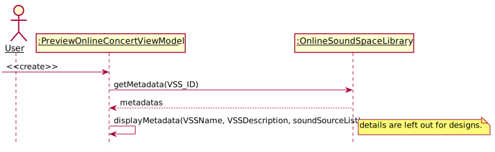

```PlantUML
@startuml Diagrams/PreviewOnlineConcertVSS
hide footbox
skinparam sequenceParticipant underline
actor User as user

participant ":PreviewConcer" as page
participant ":PreviewOnlineConcertPage" as control
participant "onlineConcertVSS:VirtualSoundSpace" as vss
create page
[-> page: <<create>>
create control
page -> control: <<create>>
control -> vss: get metadata
vss -> control: metadata
control -> page: display metadata
note right
details are left out for designs.
end note
@enduml
```


## 19. PlayMapModeVSS


```PlantUML
@startuml Diagrams/PlayMapModeVSS
hide footbox
skinparam sequenceParticipant underline

actor User as user
participant ":PlayMapModeVSSPage" as page
participant ":MapVSSPlayControl" as control
participant ":LocalSoundSpaceLibrary" as library
participant "thisVSS:MapModeVirtualSoundSpace" as vss
participant ":Sensor" as sensor
participant ":GVRAudioEngine" as audio
participant ":AdjustSensorPage" as adpage
participant "task:Callable" as task

create page
[-> page: <<create>>
create control
page -> control: <<create>>
control -> library: checkAllNessarySoundFragmentDownloaded()
alt downloaded
    library --> control: confirm
else not yet
    library --> control: deny
    control -> page: warning
    control -> page: <<destroy>>
    destroy control
    destroy page
end
control -> vss: getSoundSources()
vss --> control: soundSourceList
control -> page: displaySoundSourceList
create sensor
control -> sensor: <<create>>
create audio
control -> audio: <<create>>
create adpage
control -> adpage: <<create>>
...adjust sensor...
user -> user: wakeup
destroy adpage
create task
control -> task: new Callable()
control -> sensor: callWhenUpdatedDelay(task, 50)

loop
    sensor --\ control: currentLocation: Positon
    control -> audio: updateCurrentLocation(currentLocation: Position)

    alt startPlay
        user -> page: play(soundSource)
        page -> control: play(soundSource)
        control -> audio: play(soundFragment)
    else pause
        user -> page: pause()
        page -> control: pause()
        control -> audio: pause()
    else next
        user -> page: next()
        page -> control: play(soundSource)
        control -> audio: play(soundFragment)
    else prev
        user -> page: prev()
        page -> control: play(soundSource)
        control -> audio: play(soundFragment)
    end
end
control -> sensor: clearTask()
control -> audio: stopAll()
control -> audio: <<destroy>>
destroy audio
control -> sensor: <<destroy>>
destroy sensor
control -> page: <<destroy>>
destroy page
destroy control


@enduml
```


## 20. PlayConcertModeVSS


```PlantUML
@startuml Diagrams/PlayConcertModeVSS
hide footbox
skinparam sequenceParticipant underline

actor User as user
participant ":PlayConcertModeVSSPage" as page
participant ":ConcertVSSPlayControl" as control
participant ":ConcertModeVirtualSoundSpace" as vss
participant ":LocalSoundSpaceLibrary" as library
participant ":Sensor" as sensor
participant ":GVRAudioEngine" as audio
participant ":AdjustSensorPage" as adpage
participant "task:Callable" as task


create page
[-> page: <<create>>
create control
page -> control: <<create>>
control -> library: checkAllNessarySoundFragmentDownloaded()
alt downloaded
    library --> control: confirm
else not yet
    library --> control: deny
    control -> page: warning
    control -> page: <<destroy>>
    destroy control
    destroy page
end
control -> vss: getSoundSources()
vss --> control: soundSourceList
control -> page: displaySoundSourceList
create sensor
control -> sensor: <<create>>
create audio
control -> audio: <<create>>
create adpage
control -> adpage: <<create>>
...adjust sensor...
user -> user: wakeup
destroy adpage
create task
control -> task: new Callable()
control -> sensor: callWhenUpdatedDelay(task, 50)
loop
    sensor --\ control: currentLocation: Positon
    control -> audio: updateCurrentLocation(currentLocation: Position)
    alt startPlay
        user -> page: play(soundSource)
        page -> control: play(soundSource)
        control -> audio: play(soundFragment)
    else pause
        user -> page: pause()
        page -> control: pause()
        control -> audio: pause()
    else next
        user -> page: next()
        page -> control: play(soundSource)
        control -> audio: play(soundFragment)
    else prev
        user -> page: prev()
        page -> control: play(soundSource)
        control -> audio: play(soundFragment)
    end
end
control -> audio: stopAll()
control -> audio: <<destroy>>
destroy audio
control -> sensor: <<destroy>>
destroy sensor
control -> page: <<destroy>>
destroy page
destroy control

@enduml
```


## 21. BrowseOnlineVSSLibrary
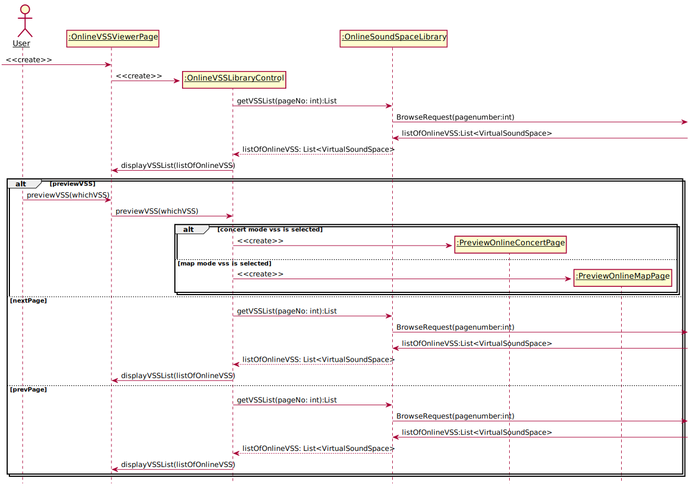

```PlantUML
@startuml Diagrams/BrowseOnlineVSSLibrary
hide footbox
skinparam sequenceParticipant underline

actor User as user
participant ":OnlineVSSViewerPage" as page
participant ":OnlineVSSLibraryControl" as control
participant ":OnlineSoundSpaceLibrary" as library


create page
[-> page: <<create>>
create control
page -> control: <<create>>
control -> library: getVSSList(pageNo: int):List
library --> control: listOfOnlineVSS: List<VirtualSoundSpace>
control -> page: displayVSSList(listOfOnlineVSS)
alt previewVSS
    user -> page: previewVSS(whichVSS)
    page -> control: previewVSS(whichVSS)
    alt concert mode vss is selected
        participant ":PreviewOnlineConcertPage" as pocp
        create pocp
        control -> pocp: <<create>>
    else map mode vss is selected
        participant ":PreviewOnlineMapPage" as pomp
        create pomp
        control -> pomp: <<create>>

    end
else nextPage
    control -> library: getVSSList(pageNo: int):List
    library --> control: listOfOnlineVSS: List<VirtualSoundSpace>
    control -> page: displayVSSList(listOfOnlineVSS)
else prevPage
    control -> library: getVSSList(pageNo: int):List
    library --> control: listOfOnlineVSS: List<VirtualSoundSpace>
    control -> page: displayVSSList(listOfOnlineVSS)
end

@enduml
```

## 22. AdjustSensor


**AdjustSensor用例中Sensor 和 Control 高度耦合，而且具体的步骤需要等到技术开发结束才能知道，因此暂时放在这里。**

```PlantUML
@startuml Diagrams/AdjustSensor
hide footbox
skinparam sequenceParticipant underline

actor User as user
participant ":AdjustSensorPage" as page
participant ":AdjustSensorControl" as control
participant ":Sensor" as sensor

[-> page: <<create>>
note over control: Sensor control should be coupled with Sensor
create control
page -> control: <<create>>
note right of sensor: this sensor object is created before adjusting sensor
loop for each operation
    control -> page: demand
    page -> user: demand
    loop while adjust demand satisfied
        user -> user: move
        sensor -> sensor: collectData
    end
    sensor -> control: demandSatisfied
end

control -> page: <<destroy>>
destroy page
destroy control


@enduml
```
