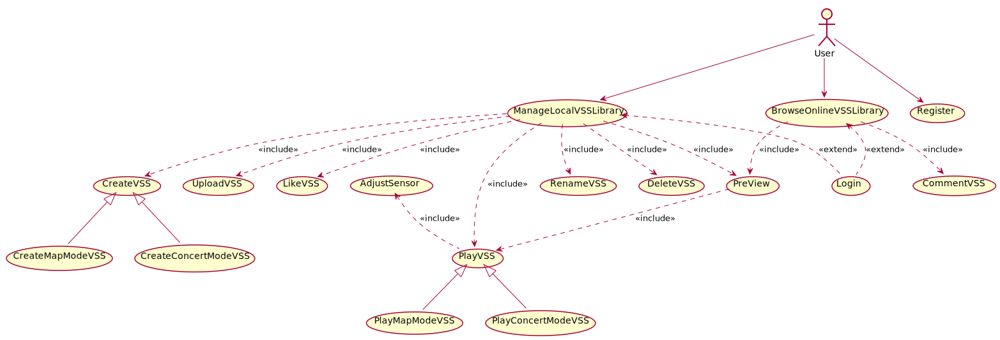

# AudioAR项目 软件需求规约
版本 <2>
修订历史
[@文档commit历史](https://github.com/AudioAR/doc/commits/master/%E8%AE%A1%E5%88%92/%E5%8F%AF%E8%A1%8C%E6%80%A7%E7%A0%94%E7%A9%B6%E6%8A%A5%E5%91%8A.md)

|日期|版本|修订说明|作者|
|:-:|:-:|:-|:-|
|2018-04-10|0|建立模版|丁雨晨|
|2018-04-13|1|按照模板填充系统要求|丁雨晨|
|2018-04-15|2|完善3.1-3.3部分|缪本杰|
|2018-04-16|3|完善系统模型|丁雨晨|
|2018-04-16|4|添加了场景|缪本杰|

## 1引言
### 1.1编写目的
拟定软件需求规约，初步确定软件总体的需求和目标。这是为了确定项目总体实施框架，细化量化用户可能的需求，为软件设计和实现指明方向。本规约同时也限定了软件开发的适用范围和禁区，避免随之而来的不利后果，增强项目开发的针对性和合理性。此文档不仅面向软件开发者，还为项目审核人员及用户提供参考。在设计和实现中如遇到特殊情况，将完全有可能修改此文档，因此仅有本文档的最新版本具有参考价值。

### 1.2适用范围
此文档适用于AudioAR项目的全部软件及系统，将从总体上限定项目的开发目标和框架。

### 1.3定义
相关定义见词汇表[@doc/需求定义/词汇表.md](https://github.com/AudioAR/doc/blob/master/%E9%9C%80%E6%B1%82%E5%AE%9A%E4%B9%89/%E8%AF%8D%E6%B1%87%E8%A1%A8.md)


### 1.4参考资料
- Object-oriented Software Engineering Using UML, Patterns, and Java
- 《软件工程实践指南》 曹健 上海交通大学出版社
- 《软件需求规约模板》 曹健

### 1.5概述
为了满足用户对于现实生活中的声音在虚拟空间中重现的需求，本产品应当完成对用户位置信息的获取、声音资源的输入输出、立体声场的构建和其他和用户的交互功能。
为此，不仅仅需要重现现实固有的声音资源，还有能够任意地产生需要的声场，这将是对软件实用性的综合考验。本文档将从顶层视角大致规定软件的开发需求，将从已有系统的概况、希望完成的改进系统的功能与非功能需求、以及目标系统应当可以实现的应用场景和用例模型这些方面进行介绍。本文档将需要以用户视角为主要视角来叙述，力求满足在将来应用中对用户的友好和对用户需求的友好。

## 2目前系统
行业目前不存在工作目标相同的现有系统，仅存在处于原型阶段或功能有一定重叠的系统，下面做简要介绍：
虚拟音频是近几年VR产业的研究热点，基于音频与位置传感相结合，用于提供娱乐体验的系统尚未有先例。但有市场上各种产品提供了部分类似的功能，下面分析其中几款具有强关联性的产品：

-   [Google AR](https://developers.google.com/ar/discover/concepts)
    -   Google ARCore 提供了AR开发的基本功能：运动跟踪、光学环境理解、光估测、可跟踪对象
    -   ARCore 基于特别的校准过的高性能惯性传感器，这些传感器被安装在屈指可数的Android 平台手机中，因此目前开发前景有限
    -   从AR方面来讲，该系统成本过高，没有考虑音频方面的处理。实时利用摄像机数据进行计算的算法复杂度高，但仍然存在不稳定，条件苛刻的问题

-   [IndoorAtlas](http://www.indooratlas.com)
    -   IndoorAtlas 提供了室内地磁定位的基本功能
    -   其地磁定位服务能够达到2m左右的精度，高于我们的设计目标。提高精度的难度是很大的。
    -   IndoorAtlas 不提供带来更广应用空间的室外定位技术，同时不考虑惯性传感器进行的优化。

-   [Bose AR (this link to a relevant news)](http://www.sohu.com/a/226893286_104421)
    -  简介：Bose 作为传统耳机公司，在18年3月份宣布进军音频AR产业。Bose正在与ASICS Studio、Strava、TripAdvisor、TuneIn和Yelp等公司合作开发体验或更新现有平台。Bose推出的产品是AR智能眼镜，该产品的定位和我们的产品定位惊人地相似。该产品仍处在概念阶段
    -  数据处理流程：这款眼镜能通过蓝牙与iPhone或Android设备的GPS连接来判断位置，然后将采集的数据发送到新推出的Bose AR平台上，之后该应用再向用户返回相关的音频内容
    -  人员：该产品的开发成本预计会更低，并且由于Bose强大的生态圈，会吸引众多的内容提供者
    -  设备：该产品利用GPS定位，仍然没有结合其他的定位技术，会造成该产品室内定位得不到保证，同时位置稳定性难以得到保证
    -  费用开支：预计这样的一套智能眼镜设备价格在1000元以上，比较昂贵。
## 3建议的系统
### 3.1概述
本系统的名称为AudioAR。其设计的初衷是为了满足用户__对于现实生活中的声音在虚拟空间中重现__的需求。技术栈结构参见 @doc/team_project_proposal.md#技术原理与功能设计 经过实验验证和相关调查，将要构建的系统能够满足低成本、易推广、基本具有实时性等要求。
### 3.2功能需求
#### 3.2.1用户管理
用户注册、登陆、注销账户与个人信息设置
#### 3.2.2虚拟声音空间管理
允许用户构建、修改在虚拟声音空间，声音具有立体位置、一定的触发条件、一定的播放方式
#### 3.2.3虚拟声音空间游览
进行实时立体声音生成，通过耳机传递给用户，产生逼真的空间声音效果
#### 3.2.4空间音频图像化
给用户提供一定的图像反馈，形式包括地图、声音定位罗盘等
#### 3.2.5用户的社交功能
用户可以与其他用户添加好友，分享本地音频库、虚拟声音空间库，相互点赞、评论等
#### 3.2.6基于空间立体音频的二次应用
用户可以通过空间立体音频来进行单人、多人的游戏

### 3.3非功能需求
#### 3.3.1可用性
-   良好的实时性，实时生成的音频流不具有明显的卡顿
-   声音的真实性，音频流与真实的立体声音难以区分
#### 3.3.2可靠性
-   在软件设计要求的运行环境内可以长时间、无差错、少维护地工作，减少软件框架或主要内容大量修改的可能性
#### 3.3.3性能
-   一般的精度，处理传感器数据生成的位置信息具有水平5m左右，垂直20cm左右的精确度；头部运动捕捉比较准确
-   实时的信息处理交互，使用户可以真实感受声音的播发而无明显卡顿、滞后
#### 3.3.4可支持性
-   可扩展的吞吐量和服务提供能力，服务器能稳定提供几名用户的资源请求和相关通讯
#### 3.3.5设计约束
可参见[@项目开发计划](https://github.com/AudioAR/doc/blob/master/%E8%AE%A1%E5%88%92/%E9%A1%B9%E7%9B%AE%E5%BC%80%E5%8F%91%E8%AE%A1%E5%88%92.md#41-%E6%8A%80%E6%9C%AF%E6%A0%87%E5%87%86)
#### 3.3.6 接口
##### 3.3.6.1用户界面
-  手机应用端的用户界面，主要给用户提供必要的流程提示、可视化场景与、
交互场景。
-  管理端的用户界面主要给系统管理员进行用户和系统的管理。
-  用户界面以简约为风格。用户界面的主要内容见3.4.3系统界面部分。  
##### 3.3.6.2 硬件接口
使用***维特智能*9轴姿态角度传感器**，[@产品简介](http://www.wit-motion.com/index.php?m=goods&a=details&content_id=43)。
-    传感器测量值转化为TTL电平传输到本机。
-    具体信号编码见传感器说明书。

##### 3.3.6.3 软件接口
本项目目前主要用到了以下开发包
-  [Google VR](https://vr.google.com/)
    该开发包主要用来根据传入的位置参数产生空间音源
- [百度地图开放平台](https://lbsyun.baidu.com/)
    该开发包主要完成地图功能
##### 3.3.6.4通信接口
使用HTTP接口来实现本机到服务器端的通信。
#### 3.3.7 法律、版权及其他声明
参见[@可行性研究报告-法律方面的可行性](https://github.com/AudioAR/doc/blob/master/%E8%AE%A1%E5%88%92/%E5%8F%AF%E8%A1%8C%E6%80%A7%E7%A0%94%E7%A9%B6%E6%8A%A5%E5%91%8A.md#71-%E6%B3%95%E5%BE%8B%E6%96%B9%E9%9D%A2%E7%9A%84%E5%8F%AF%E8%A1%8C%E6%80%A7)
#### 3.3.8 适用的标准
参见[@项目开发计划-技术流程计划](https://github.com/AudioAR/doc/blob/master/%E8%AE%A1%E5%88%92/%E9%A1%B9%E7%9B%AE%E5%BC%80%E5%8F%91%E8%AE%A1%E5%88%92.md#4-%E6%8A%80%E6%9C%AF%E6%B5%81%E7%A8%8B%E8%AE%A1%E5%88%92)

### 3.4 系统模型
本节使用UML中的概念、方法和模型图来详细表达需求。
#### 3.4.1场景

| 场景名称 | 用户注册 |
| :---: | :--------- |
| **参与者实例** | 用户小刘 |
| **事件流** |
| 1 | 小刘对进入系统并且选择注册用户，系统出现了注册界面 |
| 2 | 小刘输入了个人信息，包括用户名、密码、邮箱、地理位置等，系统进行验证，发现小刘的输入合法 |
| 3 | 小刘成功注册，系统进入登录界面 |

| 场景名称 | 用户登录 |
| :---: | :--------- |
| **参与者实例** | 用户小刘 |
| **事件流** |
|1|小刘进入了系统登录界面|
|2|小刘输入了用户名和密码，但是不小心输错了密码，系统提示密码错误，并提示重新输入用户名密码|
|3|小刘输入了正确的用户名和密码，系统成功登录，进入本地虚拟声音空间库管理界面|

| 场景名称 | 用户管理本地虚拟声音空间库（制作新的虚拟声音空间、地图模式） |
| :---: | :--------- |
| **参与者实例** | 用户小刘 |
| **事件流** |
|1|小刘进入了用户本地虚拟声音空间库（下面简称本地库），选择制作新的虚拟声音空间（VSS），系统跳转到VSS制作界面，提供了模式选择“地图模式”，“音乐会模式”|
|2|小刘选择了地图模式，系统将自动定位到小刘当前所在的位置|
|3|小刘在本地的音频文件中选择上传的音频片段，并且设置其经纬度、高度等位置参数与音量、循环模式等播放参数|
|4|小刘重复步骤（3），直到所有的本地音频文件已经被上传完成|
|5|小刘发现某一音频文件上传设置错误，删除了该音频片段|
|6|小刘制作VSS完毕，选择制作完成选项，系统提示小刘为VSS命名|
|7|小刘输入名字，确认后完成该VSS制作，返回本地VSS库管理界面|

| 场景名称 | 用户管理本地虚拟声音空间库（制作新的虚拟声音空间、音乐会模式） |
| :---: | :--------- |
| **参与者实例** | 用户小刘 |
| **事件流** |
|1|小刘进入了用户本地虚拟声音空间库（下面简称本地库），选择制作新的虚拟声音空间（VSS），系统跳转到VSS制作界面，提供了模式选择“地图模式”，“音乐会模式”|
|2|小刘选择了音乐会模式，系统将显示一个虚拟空间|
|3|小刘在本地的音频文件中选择上传的音频片段，以播放列表的形式上传|
|4|小刘重复步骤（3），直到所有的本地音频文件已经被上传完成|
|5|小刘删除了播放列表内某音频片段|
|6|小刘改变了播放列表顺序|
|7|小刘制作VSS完毕，选择制作完成选项，系统提示小刘为VSS命名|
|8|小刘输入名字，确认后完成该VSS制作，返回本地VSS库管理界面|

| 场景名称 | 用户管理本地虚拟声音空间库（重命名，删除，上传功能） |
| :---: | :--------- |
| **参与者实例** | 用户小刘 |
| **事件流** |
|1|小刘进入了用户本地虚拟声音空间库（下面简称本地库），系统还提供对虚拟声音空间的重命名、删除、上传功能|
|2|小刘想把名字为B的VSS改名为C，选择相应选项后系统出现了重命名界面，小刘输入了新的音频名字并且确认后该片段命名被改变|
|3|小刘想把名字为D的VSS删除，选择了相应选项后系统出现确认删除界面，小刘确认后该片段被删除|
|5|小刘想把自己制作的名字为E的VSS上传到在线虚拟声音空间库，选择上传选项后系统将该VSS的信息上传到服务器上|
|6|小刘完成了本地库管理，退出了管理界面|

| 场景名称 | 浏览在线虚拟声音空间库 |
| :---: | :--------- |
| **参与者实例** | 用户小刘 |
| **事件流** |
|1|小刘进入了在线虚拟声音空间（VSS）库，界面上显示了由自己和其他用户上传的所有VSS与其简介信息|
|2|小刘看中了某VSS，进入了该VSS的预览界面，界面上显示了其简介、音频信息等基本信息|
|3|小刘决定下载该VSS。小刘选择下载到本地，系统将该VSS的所有内容（包括本地不存在的音频文件）下载到本地|
|4|小刘进入了另一VSS的预览，对这个VSS的游览效果好评有加，对VSS点赞并加以评论|
|5|小刘在自己上传的某VSS中得到了别人的评论，小刘回复了自己的评论|
|5|小刘完成了浏览，回到本地|


| 场景名称 | 传感器校准 |
| :---: | :--------- |
| **参与者实例** | 用户小刘 |
| **事件流** |
|1|小刘在游览虚拟声音空间之前，系统提示小刘进行了传感器校准|
|2|小刘根据屏幕上的提示进行传感器校准|
|3|小刘完成传感器校准，系统进入VSS游览界面|

| 场景名称 | 游览虚拟声音空间（地图模式） |
| :---: | :--------- |
| **参与者实例** | 用户小刘 |
| **事件流** |
|1|小刘在本地虚拟声音空间（VSS）库中选择了某个地图模式下的VSS，系统进入了该VSS的预览界面，显示了其简介、音频信息等基本信息|
|2|小刘选择开始游览，系统进入游览界面，读取该VSS并提示用户带上传感器和耳机|
|3|小刘移动到该VSS所在的位置附近，听到了合成的空间声场，同时，在界面上也显示了用户所在位置及图中空间声源的可视化描述|
|4|小刘移动自己的位置和自己头的方位，空间声场也实时的变化|
|5|小刘不想听了，退出了虚拟声音空间体验|

| 场景名称 | 游览虚拟声音空间（音乐会模式）|
| :---: | :--------- |
| **参与者实例** | 用户小刘 |
| **事件流** |
|1|小刘选择了本地虚拟声音空间（VSS）库中的某个音乐会模式下的VSS，系统读取该VSS并提示用户带上传感器和耳机，并进行传感器校准|
|2|小刘找了个舒服的椅子坐下，点击播放，小刘听到了虚拟的立体声效果|
|3|小刘移动自己头的方位，空间声场也实时的变化|
|4|小刘又不想听了，退出了虚拟声音空间体验|


#### 3.4.2用例模型
|参与者名称|参与者解释|
|:-:|:-:|
|用户|本系统的最终使用者，拥有用户账号，是本系统主要面向的对象|

|用例|用例级别|用例描述|
|:-:|:-:|:-:|
|Register|用户目标|用户注册身份信息，申请使用该系统|
|Login|子功能|用户提交身份信息，通过核验进入系统主界面|
|ManageLocalVSSLibrary|用户目标|管理本地虚拟声音空间库|
|CreateVSS|抽象子功能|制作虚拟声音空间|
|CreateMapModeVSS|子功能|制作地图模式虚拟声音空间|
|CreateConcertModeVSS|子功能|制作音乐厅模式虚拟声音空间|
|RenameVSS|子功能|重命名虚拟声音空间|
|DeleteVSS|子功能|删除虚拟声音空间|
|UploadVSS|子功能|上传虚拟声音空间|
|LikeVSS|子功能|为虚拟声音空间点赞|
|DownloadVSS|子功能|下载虚拟声音空间|
|CommentVSS|子功能|评论虚拟声音空间|
|PlayVSS|抽象子功能|用户体验AR声音空间|
|PlayMapModeVSS|子功能|用户体验地图模式AR声音空间|
|PlayConcertModeVSS|子功能|用户体验音乐厅模式AR声音空间|
|BrowseOnlineVSSLibrary|用户目标|浏览在线虚拟声音空间库|
|AdjustSensor|子功能|校准传感器|
|PreView|子功能|查看虚拟声音空间、音频片段的详细信息|

##### 用例图


```PlantUML
@startuml
(ManageLocalVSSLibrary) <.. (Login): <<extend>>
(BrowseOnlineVSSLibrary) <.. (Login): <<extend>>

User --> (Register)
User --> (ManageLocalVSSLibrary)
User --> (BrowseOnlineVSSLibrary)

(ManageLocalVSSLibrary) ..> (CreateVSS): <<include>>
(CreateVSS) <|-- (CreateMapModeVSS)
(CreateVSS) <|-- (CreateConcertModeVSS)
(ManageLocalVSSLibrary) ..> (RenameVSS): <<include>>
(ManageLocalVSSLibrary) ..> (DeleteVSS): <<include>>
(ManageLocalVSSLibrary) ..> (UploadVSS): <<include>>
(ManageLocalVSSLibrary) ..> (LikeVSS): <<include>>
(ManageLocalVSSLibrary) ..> (PlayVSS): <<include>>
(PlayVSS) <|-- (PlayMapModeVSS)
(PlayVSS) <|-- (PlayConcertModeVSS)
(BrowseOnlineVSSLibrary) ..> (CommentVSS): <<include>>

(AdjustSensor) <.. (PlayVSS): <<include>>

(ManageLocalVSSLibrary) ..> (PreView): <<include>>
(BrowseOnlineVSSLibrary) ..> (PreView): <<include>>

(PreView) ..> (PlayVSS): <<include>>

@enduml
```

##### 用例详细

1. Register

| 用例名称 | Register |
| :---: | :--------- |
| **参与者** | 用户 |
| **范围** | 系统用例 |
| **前置条件** | 无 |
| **后置条件** | 用户完成注册 |
|| **主流程** |
|1|用户在界面上请求注册|
|2|系统收到用户的请求，跳转到注册页面，展示注册表单|
|3|⽤户填写注册表单的⽤户名、登录密码、确认登录密码、电⼦邮箱，填写完成后请求确认注册|
|4|系统判别表单信息是否有效，若有效系统提示注册成功，并跳转⾄登录界⾯|
|| **扩展流程** |
||注册表单信息⽆效|
|1|在第3步，⽤户填写的登录密码不合法。系统提示⽤户填写的登录密码过短、过⻓或过于筒单，请⽤户修改⼀个合法的密码后重新提交|
|2|在第3步，⽤户填写的确认登录密码和登录密码不⼀致。系统提示⽤户两次填写的登录密码不⼀致，请⽤户检查修改后重新提交|
|3|在第3步，⽤户填写的⽤户名已被注册，系统提示⽤户该⽤户名已被注册，请⽤户修改后重新提交再试|
|4|在第3步，⽤户填写的电⼦邮箱已被注册。系统提示⽤户该电⼦邮箱已被注册，请⽤户检查修改后重新提交|
| **特殊需求** |无|
| **发生频率** |一般，每个用户会发生一次|

2. Login

| 用例名称 | Login |
| :---: | :--------- |
| **参与者** | 用户 |
| **范围** | 子功能 |
| **前置条件** | 用户进入登录界面 |
| **后置条件** | 用户成功进入系统 |
|| **主流程** |
|1|用户请求登录系统|
|2|系统收到⽤户的请求，跳转到登录页面，展示登录表单供填写|
|3|⽤户填写登录表单的⽤户名和登录密码。填写完成后请求登录，系统判别表单信息是否有效，若有效系统提示登陆成功，并跳转个人音频库|
|| **扩展流程** |
||登录信息⽆效|
|1|在第3步，⽤户填写的⽤户名和密码不合法|
|2|在第3步，⽤户填写的⽤户名不存在。系统提示⽤户该⽤户名不存在，请⽤户检查修改后重新提交|
|3|在第3步，⽤户填写的登录密码不正确。系统提示⽤户填写的⽤户名或登录密码有误。请⽤户检查修改后重新提交|
| **特殊需求** |无|
| **发生频率** |经常|

3. ManageLocalVSSLibrary

| 用例名称 | ManageLocalVSSLibrary |
| :---: | :--------- |
| **参与者** | 用户 |
| **范围** | 系统用例 |
| **前置条件** | 用户已登录，进入本地虚拟声音空间（VSS）库管理界面 |
| **后置条件** | 用户游览某VSS、进入“浏览在线虚拟声音空间库”或者退出系统 |
|| **主流程** |
|1|用户进入VSS库管理界面|
|2|用户选择操作，包括制作新的VSS，重命名VSS，删除VSS，上传VSS，预览VSS|
|3|若用户选择制作新的VSS，进入用例CreateVSS|
|4|若用户选择重命名VSS，进入用例RenameVSS|
|5|若用户选择删除VSS，进入用例DeleteVSS|
|6|若用户选择上传VSS，进入用例UploadVSS|
|7|若用户选择预览VSS，进入用例PreviewVSS|
|8|用户完成库管理|
|| **扩展流程** |
||无|
| **特殊需求** |无|
| **发生频率** |经常|


4. CreateVSS

| 用例名称 | CreateVSS |
| :---: | :--------- |
| **参与者** | 用户 |
| **范围** | 子功能 |
| **前置条件** | 用户已登录，通过本地虚拟声音空间（VSS）库管理界面进入该用例 |
| **后置条件** | 用户完成制作VSS |
|| **主流程** |
|1|系统提示用户选择模式，包括地图模式和音乐会模式|
|2|若用户选择“地图模式”，进入用例CreateMapModeVSS；若用户选择“音乐会模式”，进入用例CreateConcertModeVSS|
|3|用户完成VSS创建，该VSS被保存在本地VSS库，同时系统回到用例ManageLocalVSSLibrary|
|| **扩展流程** |
||用户取消操作|
|1|在用例任何步骤中，用户可以取消该操作；若取消，则回到用例ManageLocalVSSLibrary，不进行任何修改|
| **特殊需求** |无|
| **发生频率** |经常|


5. CreateMapModeVSS

| 用例名称 | CreateMapModeVSS |
| :---: | :--------- |
| **参与者** | 用户 |
| **范围** | 子功能 |
| **前置条件** | 用户由用例CreateVSS进入，用户选择制作地图模式的VSS |
| **后置条件** | 用户完成制作地图模式的VSS，返回用例CreateVSS |
|| **主流程** |
|1|根据用户的地理位置，系统定位至用户当前位置|
|2|用户在本地的音频文件中不断选择音频上传，并设置其经纬度、高度等位置信息和音量、循环模式等播放信息|
|3|用户完成所有音频上传，回到用例CreateVSS|
|| **扩展流程** |
||用户希望删除已上传的音频|
|1|在第2步时，如果用户上传音频或者设置参数有误，可以选择删除该音频|
| **特殊需求** |无|
| **发生频率** |经常|


6. CreateConcertModeVSS

| 用例名称 | CreateConcertModeVSS |
| :---: | :--------- |
| **参与者** | 用户 |
| **范围** | 子功能 |
| **前置条件** | 用户由用例CreateVSS进入，选择制作音乐会模式的VSS |
| **后置条件** | 用户完成制作音乐会模式的VSS，返回用例CreateVSS |
|| **主流程** |
|1|用户在本地的音频文件中不断选择音频上传至播放列表|
|2|用户调整播放列表的播放顺序|
|3|用户完成所有音频上传，回到用例CreateVSS|
|| **扩展流程** |
||用户希望删除已上传的音频|
|1|在第2步时，如果用户上传音频，可以选择删除该音频|
| **特殊需求** |无|
| **发生频率** |经常|

7. RenameVSS

| 用例名称 | RenameVSS |
| :---: | :--------- |
| **参与者** | 用户 |
| **范围** | 子功能 |
| **前置条件** | 用户已登录，通过本地虚拟声音空间（VSS）库管理界面进入该用例 |
| **后置条件** | 用户完成重命名VSS |
|| **主流程** |
|1|系统提示用户输入某VSS的新的名字|
|2|用户输入VSS的新的名字，系统检测其合法性|
|3|若合法，系统完成重命名，在本地库中该VSS的名字改变，同时回到用例ManageLocalVSSLibrary|
|| **扩展流程** |
||用户输入名字不合法|
|1|在第2步时，如果与现有VSS重名，则提示重名并要求用户重新输入|
|2|在第2步时，如果输入名字带有非法字符，则提示用户重新输入|
||用户取消操作|
|1|在用例任何步骤中，用户可以取消该操作；若取消，则回到用例ManageLocalVSSLibrary，不进行任何修改|
| **特殊需求** |无|
| **发生频率** |经常|

8. DeleteVSS

| 用例名称 | DeleteVSS |
| :---: | :--------- |
| **参与者** | 用户 |
| **范围** | 子功能 |
| **前置条件** | 用户已登录，通过本地虚拟声音空间（VSS）库管理界面进入该用例 |
| **后置条件** | 用户完成删除VSS |
|| **主流程** |
|1|系统询问用户是否确认删除该VSS|
|2|用户确认删除操作，在本地库中该VSS被删除改变，同时回到用例ManageLocalVSSLibrary|
|| **扩展流程** |
||用户取消操作|
|1|在用例任何步骤中，用户可以取消该操作；若取消，则回到用例ManageLocalVSSLibrary，不进行任何修改|
| **特殊需求** |无|
| **发生频率** |经常|

9. UploadVSS

| 用例名称 | DeleteVSS |
| :---: | :--------- |
| **参与者** | 用户 |
| **范围** | 子功能 |
| **前置条件** | 用户已登录，通过本地虚拟声音空间（VSS）库管理界面进入该用例 |
| **后置条件** | 用户完成上传VSS |
|| **主流程** |
|1|系统提示用户是否确认上传该VSS|
|2|用户确认上传操作，系统提示用户输入该VSS在在线虚拟声音空间库中的名字（默认为本地库中的名字）和简介（默认为空）|
|3|用户完成名字和简介输入，系统将该VSS保存在服务器，同时也保存在在线虚拟声音空间库中。
|| **扩展流程** |
||用户输入名字不合法|
|1|在第2步时，如果与现有VSS重名，则提示重名并要求用户重新输入|
|2|在第2步时，如果输入名字带有非法字符，则提示用户重新输入|
||用户取消操作|
|1|在用例任何步骤中，用户可以取消该操作；若取消，则回到用例ManageLocalVSSLibrary，不进行任何修改|
| **特殊需求** |无|
| **发生频率** |经常|


8. PreviewVSS
6. BrowseOnlineVSSLibrary
9. DownloadVSS
12. LikeVSS
13. CommentVSS
14. PlayVSS

PlayMapModeVSS
PlayConcertModeVSS
15. AdjustSensor


#### 3.4.3用户界面
主要用户界面：

|用户界面名称|英文参考名称|Enter|Next|简介|
|:-|:-|:-|:-|:-|
|注册界面|Register|Login|ManageLocalVSS|注册结束后自动登陆并进入ManageLocalVSS界面|
|登陆界面|Login| start |ManageLocalVSS|登陆并进入ManageLocalVSS界面|
|本地VSS管理界面|ManageLocalVSS|Login \ Config \ BrowseOnlineVSS|Config \ BrowseOnlineVSS \ PlayMapModeVSS \ PlayConcertModeVSS|管理本地VSS，项目主界面|
|VSS详情界面|Preview|BrowseOnlineVSS \ ManageLocalVSS|PlayMapModeVSS \ PlayConcertModeVSS \ ManageLocalVSS|查看VSS详情|
|在线VSS浏览界面|BrowseOnlineVSS|Config \ ManageLocalVSS|Config \ ManageLocalVSS \ Preview|浏览在线分享的VSS|
|配置界面|Config| anywhere | anywhere | 软件相关的配置选项，可以从任何入口进入|
|音乐厅模式VSS体验|PlayConcertModeVSS|PreView \ ManageLocalVSS|Preview \ ManageLocalVSS|-|
|地图模式VSS体验|PlayMapModeVSS|PreView \ ManageLocalVSS| PreView \ ManageLocalVSS|-|
|传感器校准|AdjustSensor|PlayMapModeVSS \ PlayConcertModeVSS| PlayConcertModeVSS \ PlayMapModeVSS| -|

```PlantUML
@startuml
[*] --> Login
Login --> Register
Register --> ManageLocalVSS
Login --> ManageLocalVSS
ManageLocalVSS --> Config
ManageLocalVSS --> BrowseOnlineVSS
ManageLocalVSS --> PlayVSS
Config --> ManageLocalVSS
BrowseOnlineVSS --> ManageLocalVSS


@enduml
```
