# 系统消息顺序图

## Notice

#### MVVM 设计
注意到我把一些控制功能交给了Page，因为这些功能太简单了，不用过于担心，MVVM中的Page和视图控制器通过同一个类：**ViewModel** 进行建模即可。因此我们组在设计阶段的类的数量将会减少。

简单起见。软件的任何异常都在开发阶段进行处理，不在设计中设计这部分内容。因过于繁琐。

#### 设计问题：网络VSS库应该对应到本地对象吗？

分析阶段已经考虑到个问题，实际上可能网络中的VSS如此之多，达到成百上千个，创建这些对象非常不经济。如果对应到本地对象，本地和服务器同步会出现问题。那么在线VSS对象从何而来呢？应该是被使用的时候通过其唯一标记，通过网络现场进行构造。

同样，本地也不将VSS保存成对象，而是从本地数据库进行数据持久化，然后在需要使用的时候将VSS从数据中构建出来。

或者说，VSS仅仅当作数据交换的容器，类似于json在接受之后转换成对象，一旦VSS使用结束，VSS对象将会被释放。

要求本地的VSS中的音频必须在本地存在，否则播放直接报错。

#### 功能的归属问题

当一个功能可能属于两个不同对象的时候就会产生这种问题，要注意看OnlineVSS方面的责任分工。

#### 不出意外，所有的容器都是有序容器

要不然保证不了Hash的唯一性

#### VSS，SS，SF，User通过什么进行识别？
首先，FS声音文件对象应该通过计算文件的Hash值（文件的二进制串）进行唯一性标记。
SS对象应该用声音源属性和声音文件对象的Hash值进行Hash作为唯一标记。
VSS对象应该通过SS对象的Hash值之和进行Hash作为唯一标记。
User通过用户名进行唯一标记。

需要判断重复的地方，按照用例的顺序进行排列，需要联网进行在线查重的地方会进行标注
|Potential Use Case|Class|Online Check Needed|
|:-:|:-:|:-|
|Register|User|Yes, user might use a existed username|
|CreateConcertModeVSS|从SS访问到SF|不需要，禁止用户添加已经添加过的音频片段|
|UploadVSS|VSS|需要，每次上传都需要联网判断是否已经上传，如果已经上传，系统不进行反应。允许使用已经存在的名称，但不允许完全相同的两个VSS存在。这种情况可能在用户上传一个刚刚下载过的VSS时出现|
|DownloadVSS|VSS|不需要，每次下载的时候在本地查看是否已经有重复的VSS，如果已经存在，系统不反应。这种情况可能在用户下载一个刚刚上传过的VSS时出现|

#### Reference Class List

视图控制还是系统控制器？在说明里有标记。系统控制器将会各种地方被使用，但是视图控制器在设计的时候会变成一个ViewModel。

Class Name|Description
:-|:-
User|存储各种用户信息
SoundSource|虚拟声源
VirtualSoundSpace|虚拟声音空间抽象类
MapModeVirtualSoundSpace|地图模式虚拟声音空间
ConcertModeVirtualSoundSpace|音乐会模式虚拟声音空间
LocalSoundSpaceLibrary|本地VSS管理
OnlineSoundSpaceLibrary|在线VSS管理库
Sensor|传感器接口类
SoundFragment|声音片段
-|-
RegisterPage|注册界面
LoginPage|登陆界面
LocalVSSManagerPage|本地VSS管理界面
OnlineVSSViewerPage|在线VSS浏览界面
VSSViewingPage-|进入VSS进行游览
PlayMapModeVSSPage*|-
PlayConcertModeVSSPage*|-
CreateVSSPage|VSS创建入口界面
CreateMapVSSPage*|MapVSS创建
CreateConcertVSSPage*|ConcertVSS创建
SensorPage|传感器矫正页面
PreviewLocalMapPage|-
PreviewOnlineMapPage|-
PreviewOnlineConcertPage|-
PreviewLocalMapPage|-
UploadLocalVSSDialog|-
-|-
UserInfoControl|用户信息管理控制器，同时作为系统控制器和视图控制器
PreviewLocalConcertControl|视图控制器
PreviewOnlineConcertControl|视图控制器
PreviewLocalMapControl|视图控制器
PreviewOnlineMapControl|视图控制器
MapVSSCreateControl*|MapVSS创建控制，视图控制器
ConcertVSSCreateControl*|ConcertVSS创建控制，视图控制器
LocalVSSLibraryControl|本地VSS管理界面控制器，视图控制器
OnlineVSSLibraryControl|在线VSS浏览界面控制器，视图控制器
SensorControl|传感器校准控制器，视图控制器
ConcertVSSPlayControl*|CVSS播放控制器，视图控制器
MapVSSPlayControl*|MVSS播放控制器，视图控制器
GVRAudioEngine*|GVR虚拟声音播放控制器，系统控制器


## 1.Register


**Actually UserInfoControl is both a View Controller and a System Controller, it should be separated in design. Check password, userid, e-mail... are written as one operation.**

```PlantUML
@startuml Register
hide footbox
skinparam sequenceParticipant underline

participant ":LoginPage" as loginpage
actor User as user
participant ":RegisterPage" as boundary
participant ":UserInfoControl" as control
participant ":User" as userdata
participant ":LocalVSSManagerPage" as nextpage

note right of control: The UserInfoControl is activated since the start of the entire program.

user -> loginpage: register
loginpage -> control: register

create boundary
control -> boundary: <<create>>
user -> boundary: enterRegisterData
boundary -> control: sendRegisterData
control -> control: checkRegisterData
loop wrong input
    control --> boundary: registerDataWrong
    user -> boundary: enterRegisterData
    boundary -> control: sendRegisterData
    control -> control: checkRegisterData
end
control --> boundary: registerSuccess
create userdata
control -> userdata: <<create>>
control -> control: setCurrentUser
create nextpage
control -> nextpage: <<create>>
@enduml
```

## 2.Login

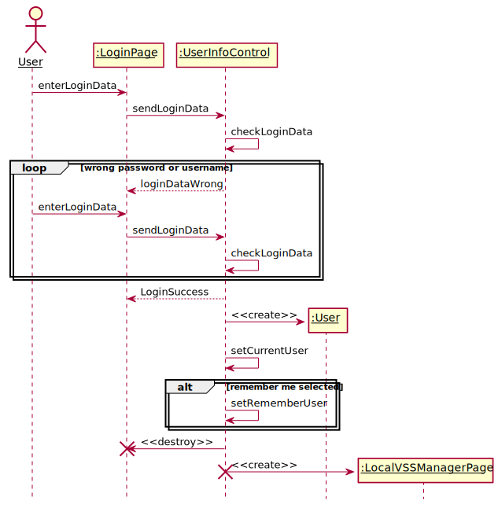

```PlantUML
@startuml Login
hide footbox
skinparam sequenceParticipant underline

actor User as user
participant ":LoginPage" as boundary
participant ":UserInfoControl" as control
participant ":User" as userdata
participant ":LocalVSSManagerPage" as nextpage

user -> boundary: enterLoginData
boundary -> control: sendLoginData
control -> control: checkLoginData
loop wrong password or username
    control --> boundary: loginDataWrong
    user -> boundary: enterLoginData
    boundary -> control: sendLoginData
    control -> control: checkLoginData
end
control --> boundary: LoginSuccess
create userdata
control -> userdata: <<create>>
control -> control: setCurrentUser
alt remember me selected
    control -> control: setRememberUser
end
create nextpage
control -> nextpage: <<create>>
@enduml
```
## 3.ManageLocalVSSLibrary

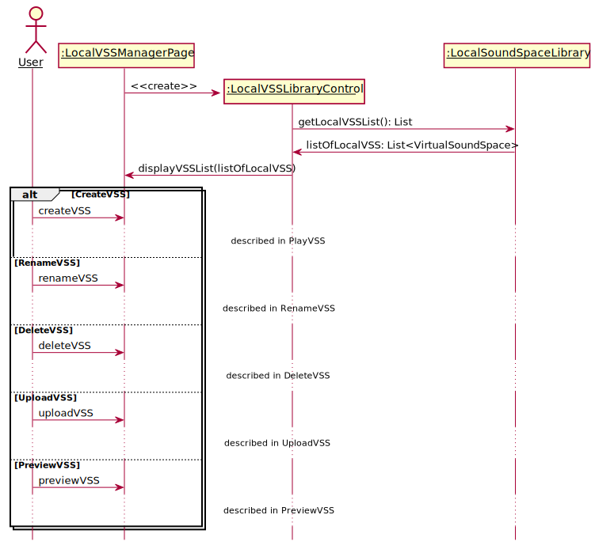

```PlantUML
@startuml ManageLocalVSSLibrary
hide footbox
skinparam sequenceParticipant underline

actor User as user
participant ":LocalVSSManagerPage" as boundary
participant ":LocalVSSLibraryControl" as control
participant ":LocalSoundSpaceLibrary" as library

create boundary
[-> boundary: <<create>>
create control
boundary -> control: <<create>>
control -> library: getVSSList(pageNo: int): List
library --> control: listOfLocalVSS: List<VirtualSoundSpace>
control -> boundary: displayVSSList(listOfLocalVSS)

loop
    alt CreateVSS
        user -> boundary: createVSS
        ...described in PlayVSS...
    else RenameVSS
        user -> boundary: renameVSS(whichVSS)
        ...described in RenameVSS...
    else DeleteVSS
        user -> boundary: deleteVSS(whichVSS)
        ...described in DeleteVSS...
    else UploadVSS
        user -> boundary: uploadVSS(whichVSS)
        ...described in UploadVSS...
    else PreviewVSS
        user -> boundary: previewVSS(whichVSS)
        boundary -> control: previewVSS(whichVSS)
        alt local map
            participant ":PreviewLocalMapPage" as plmp
            create plmp
            control -> plmp: <<create>>

        else local concert
            participant ":PreviewLocalConcertPage" as plcp
            create plcp
            control -> plcp: <<create>>
        end
    else prevPage
        user -> boundary: prevPage()
        boundary -> control: prevPage()
        control -> library: getVSSList(nextPageNo)
        library --> control: listOfLocalVSS: List<VirtualSoundSpace>
        control -> boundary: displayVSSList(listOfLocalVSS)
    else nextPage
    ...similar, omitted...
    end
end
@enduml
```

## 4.CreateVSS

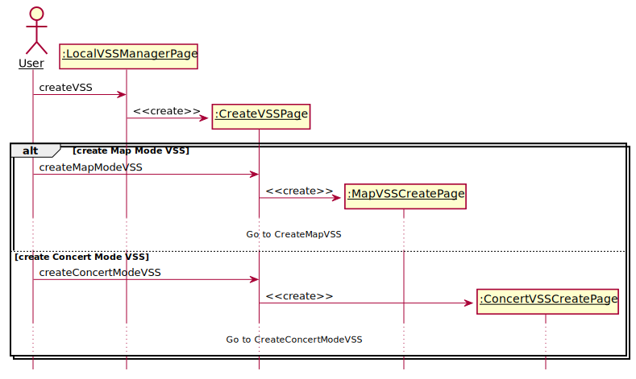

```PlantUML
@startuml CreateVSS
hide footbox
skinparam sequenceParticipant underline

actor User as user
participant ":LocalVSSManagerPage" as manage
participant ":CreateVSSPage" as page
participant ":MapVSSCreatePage" as map
participant ":ConcertVSSCreatePage" as concert

user -> manage: createVSS
create page
manage -> page: <<create>>
alt create Map Mode VSS
    user -> page: createMapModeVSS
    create map
    page -> map: <<create>>
    ...Go to CreateMapVSS...
else create Concert Mode VSS
    user -> page: createConcertModeVSS
    create concert
    page -> concert: <<create>>
    ...Go to CreateConcertModeVSS...
end

@enduml
```

## 5.CreateMapModeVSS


```PlantUML
@startuml CreateMapModeVSS
hide footbox
skinparam sequenceParticipant underline


actor User as user
participant ":MapVSSCreatePage" as createboundary
participant ":MapVSSCreateControl" as createcontrol
participant ":LocalSoundSpaceLibrary" as library
participant ":Sensor" as sensor
participant "newSoundSpace:MapModeVirtualSoundSpace" as newspace


[-> createboundary: <<create>>
create createcontrol
createboundary -> createcontrol: <<create>>
create newspace
createcontrol -> newspace: <<create>>
create sensor
createcontrol -> sensor: <<create>>
loop add virual sound source
    alt add from library
        note right of user: Notice that there are no shared SoundSources here, each time, only the SoundFragment object is reused.
        user -> createboundary: selectExistedSoundSource
        createboundary -> createcontrol: getLocalSoundFragments
        createcontrol -> library: getLocalSoundFragments
        library --> createcontrol: filteredSoundFragments
        createcontrol --> createboundary: displayAvailableLocalSoundFragments
        user -> createboundary: selectSoundFragment
        createboundary -> createcontrol: addSoundFragment
    else add from file
        user -> createboundary: selectFromFileSystem
        ...somehow MapVSSCreateControl got the new SoundFragment # specify during implementation...

    end

    createcontrol -> sensor: getCurrentLocation
    sensor --> createcontrol: currentLocation

    participant ":SoundSource" as source
    create source
    createcontrol -> source: <<create>>
    createcontrol -> source: setSoundFragment
    createcontrol -> source: setLocation

    alt user choose to alter position
        user -> createboundary: setCurrentSoundSourceLocation
        createboundary -> createcontrol : setLocation
        createcontrol -> source: setLocation
    end
    user -> createboundary: setSoundSourceMode
    createboundary -> createcontrol: setSoundSourceMode
    createcontrol -> source: setSoundSourceMode
    alt confirm
        createcontrol -> newspace: addSoundSource(soundSource)
    else cancel
        createcontrol -> newspace: <<destroy>>
        destroy newspace
    end
end
user -> createboundary: setVSSNameAndDescription
createboundary -> createcontrol: setVSSNameAndDescription
createcontrol -> newspace: setVSSNameAndDescription
alt confirm
    user -> createboundary: comfirmVSSCreation
    createboundary -> createcontrol: comfirmVSSCreation
    createcontrol -> library: addSoundSpace(newSoundSpace)
else cancel

end
createcontrol -> createboundary: <<destroy>>
destroy createboundary
createcontrol -> sensor: <<destroy>>
destroy sensor
destroy createcontrol
@enduml
```

## 6.CreateConcertModeVSS

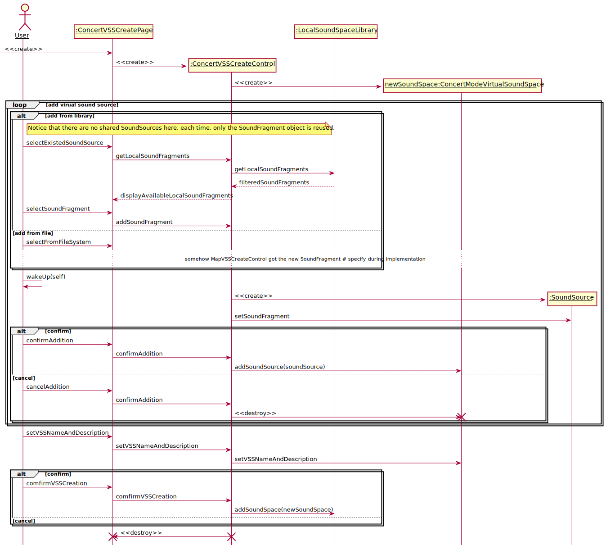

```PlantUML
@startuml CreateConcertModeVSS
hide footbox
skinparam sequenceParticipant underline


actor User as user
participant ":ConcertVSSCreatePage" as createboundary
participant ":ConcertVSSCreateControl" as createcontrol
participant ":LocalSoundSpaceLibrary" as library
participant "newSoundSpace:ConcertModeVirtualSoundSpace" as newspace

create createboundary
-> createboundary: <<create>>
create createcontrol
createboundary -> createcontrol: <<create>>
create newspace
createcontrol -> newspace: <<create>>

loop add virual sound source
    alt add from library
        note right of user: Notice that there are no shared SoundSources here, each time, only the SoundFragment object is reused.
        user -> createboundary: selectExistedSoundSource
        createboundary -> createcontrol: getLocalSoundFragments
        createcontrol -> library: getLocalSoundFragments
        library --> createcontrol: filteredSoundFragments
        createcontrol --> createboundary: displayAvailableLocalSoundFragments
        user -> createboundary: selectSoundFragment
        createboundary -> createcontrol: addSoundFragment
    else add from file
        user -> createboundary: selectFromFileSystem
        ...somehow MapVSSCreateControl got the new SoundFragment # specify during implementation...
    end


    participant ":SoundSource" as source
    user -> user: wakeUp(self)
    create source
    createcontrol -> source: <<create>>
    createcontrol -> source: setSoundFragment
    alt confirm
        user -> createboundary: confirmAddition
        createboundary -> createcontrol: confirmAddition
        createcontrol -> newspace: addSoundSource(soundSource)
    else cancel
        user -> createboundary: cancelAddition
        createboundary -> createcontrol: confirmAddition
        createcontrol -> newspace: <<destroy>>
        destroy newspace
    end

end
user -> createboundary: setVSSNameAndDescription
createboundary -> createcontrol: setVSSNameAndDescription
createcontrol -> newspace: setVSSNameAndDescription
alt confirm
    user -> createboundary: comfirmVSSCreation
    createboundary -> createcontrol: comfirmVSSCreation
    createcontrol -> library: addSoundSpace(newSoundSpace)
else cancel
end
createcontrol -> createboundary: <<destroy>>
destroy createboundary
destroy createcontrol
@enduml
```

## 7.RenameVSS

**The LocalSoundSpaceLibrary acts like a facade.**

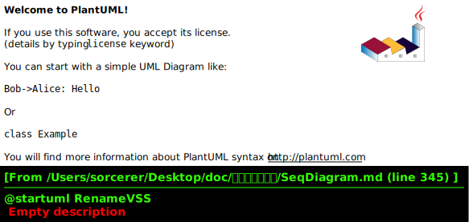

```PlantUML
@startuml RenameVSS
hide footbox
skinparam sequenceParticipant underline

actor User as user
participant ":LocalVSSManagerPage" as page
participant ":LocalVSSLibraryControl" as control
participant ":LocalSoundSpaceLibrary" as library

user -> page: renameVSS
user -> page: enterNewLocalVSSNameAndDescription
page -> control: newNameAndDescriptionEntered(whichVSS, newName, newDescription)
control -> control: checkNewNameAndDescription
alt wrong input
    control -> page: notifyWrongInput
else good input
    control -> library: setNameAndDescription(whichVSS, newName, newDescription)
end

@enduml
```

## 8.DeleteVSS


```PlantUML
@startuml DeleteVSS
hide footbox
skinparam sequenceParticipant underline

actor User as user
participant ":LocalVSSManagerPage" as page
participant ":LocalVSSLibraryControl" as control
participant ":LocalSoundSpaceLibrary" as library

user -> page: deleteVSS(whichVSS)
page -> control: deleteVSS(whichVSS)
control -> page: comfirmDialog
alt confirm
    user -> page: confirmDelete
    page -> control: confirm
    control -> library: deleteVSS(whichVSS)
    control -> library: getVSSList(pageNo)
    library --> control: listOfLocalVSS
    library -> page: displayVSSList(listOfLocalVSS)
else cancel
    user -> page: cancelDelete
    page -> control: cancelDelete
end


@enduml
```

## 9.UploadVSS
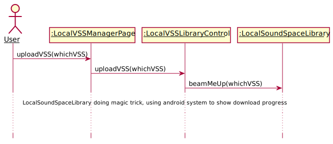

```PlantUML
@startuml UploadVSS
hide footbox
skinparam sequenceParticipant underline

actor User as user
participant ":LocalVSSManagerPage" as page
participant ":LocalVSSLibraryControl" as control
participant ":LocalSoundSpaceLibrary" as library

user -> page: uploadVSS(whichVSS)
page -> control: uploadVSS(whichVSS)
control -> library: beamMeUp(whichVSS)
...LocalSoundSpaceLibrary doing magic trick, using android system to show download progress...
...There are no other ways to show that a local sound space is finished uploading other than android system notices...
@enduml
```

## 10. LikeVSS
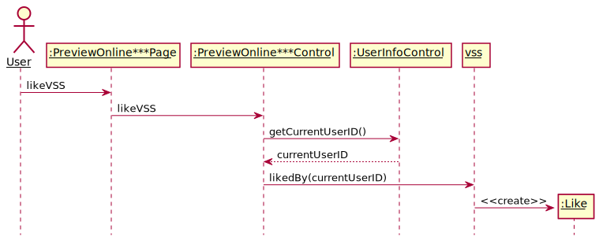

```PlantUML
@startuml LikeVSS
hide footbox
skinparam sequenceParticipant underline
actor User as user
participant ":PreviewOnline***Page" as page
participant ":PreviewOnline***Control" as control
participant ":UserInfoControl" as info
participant ":OnlineSoundSpaceLibrary" as library

user -> page: changeLikeStatus
alt already liked
    page -> control: likeVSS
    control -> info: getCurrentUserID()
    info --> control: currentUserID
    control -> library: addLike(thisVSS)
else not liked
    page -> control: dislikeVSS
    control -> info: getCurrentUserID()
    info --> control: currentUserID
    control -> library: removeLike(thisVSS)
end

@enduml
```


## 11. DownloadVSS
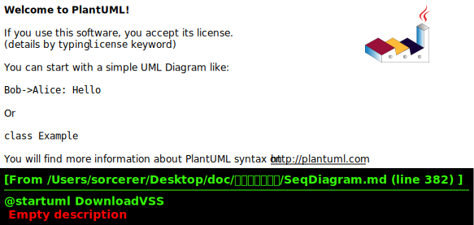

```PlantUML
@startuml DownloadVSS
hide footbox
skinparam sequenceParticipant underline
actor User as user
participant ":PreviewOnline***Page" as page
participant ":PreviewOnline***Control" as control
participant ":OnlineSoundSpaceLibrary" as onlinelib
participant "cloneVSS:VirtualSoundSpace" as clone
participant ":LocalSoundSpaceLibrary" as library
user -> page: downloadVSS
note right of onlinelib: download operation downloads every SoundSource's SoundFragment, a separate local VSS is created.
note right of onlinelib: every SoundFragment is identified uniquely by MD5 of the file.
page -> control: downloadVSS
control -> onlinelib: download(thisVSS)
create clone
onlinelib -> clone: <<create>>
onlinelib -> clone: copyMetaDataFrom(thisVSS)
note right
MetaData stands for all forms of data only that a VSS contains,
including SS, SF, but the SFs are not downloaded.
notice that we copy the references for SoundSources, it should be OK.
end note
onlinelib -> library: addSoundSpace(cloneVSS)
onlinelib -> library: downloadAllSoundFragment(cloneVSS)


@enduml
```

## 12. CommentVSS
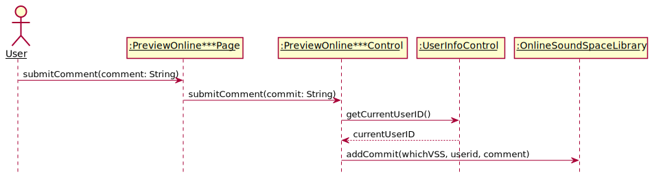

```PlantUML
@startuml CommentVSS
hide footbox
skinparam sequenceParticipant underline
actor User as user
participant ":PreviewOnline***Page" as page
participant ":PreviewOnline***Control" as control
participant ":UserInfoControl" as info
participant ":OnlineSoundSpaceLibrary" as library

user -> page: submitComment(comment: String)
page -> control: submitComment(commit: String)
control -> info: getCurrentUserID()
info --> control: currentUserID
control -> library: addCommit(whichVSS, userid, comment)
@enduml
```


## 13. PlayVSS(Abstract)

## 14. PreviewVSS(Abstract)

## 15. PreviewLocalMapVSS
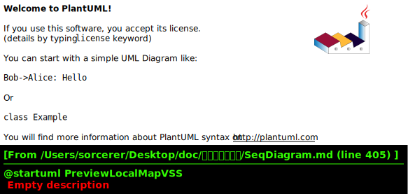

```PlantUML
@startuml PreviewLocalMapVSS
hide footbox
skinparam sequenceParticipant underline
participant ":PreviewLocalMapPage" as page
participant ":PreviewLocalMapControl" as control
participant "localMapVSS:VirtualSoundSpace" as vss
create page
[-> page: <<create>>
create control
page -> control: <<create>>
control -> vss: get metadata
vss --> control: metadata
control -> page: display metadata


@enduml
```


## 16. PreviewOnlineMapVSS


```PlantUML
@startuml PreviewOnlineMapVSS
hide footbox
skinparam sequenceParticipant underline
actor User as user

participant ":PreviewOnlineMapPage" as page
participant ":PreviewOnlineMapControl" as control
participant "onlineMapVSS:VirtualSoundSpace" as vss
create page
[-> page: <<create>>
create control
page -> control: <<create>>
control -> vss: get metadata
vss -> control: metadata
control -> page: display metadata
note right
details are left out for designs.
end note
@enduml
```

## 17. PreviewLocalConcertVSS
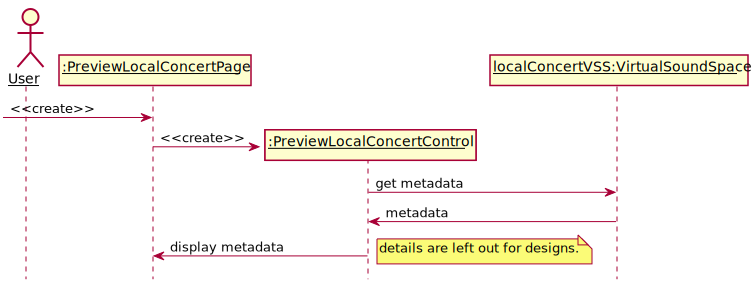

```PlantUML
@startuml PreviewLocalConcertVSS
hide footbox
skinparam sequenceParticipant underline
actor User as user

participant ":PreviewLocalConcertPage" as page
participant ":PreviewLocalConcertControl" as control
participant "localConcertVSS:VirtualSoundSpace" as vss
create page
[-> page: <<create>>
create control
page -> control: <<create>>
control -> vss: get metadata
vss -> control: metadata
control -> page: display metadata
note right
details are left out for designs.
end note
@enduml
```


## 18. PreviewOnlineConcertVSS
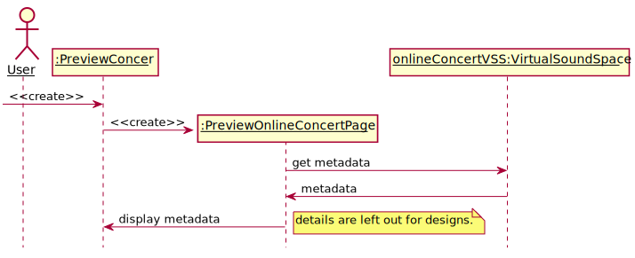

```PlantUML
@startuml PreviewOnlineConcertVSS
hide footbox
skinparam sequenceParticipant underline
actor User as user

participant ":PreviewConcer" as page
participant ":PreviewOnlineConcertPage" as control
participant "onlineConcertVSS:VirtualSoundSpace" as vss
create page
[-> page: <<create>>
create control
page -> control: <<create>>
control -> vss: get metadata
vss -> control: metadata
control -> page: display metadata
note right
details are left out for designs.
end note
@enduml
```


## 19. PlayMapModeVSS
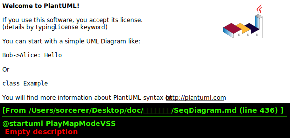

```PlantUML
@startuml PlayMapModeVSS
hide footbox
skinparam sequenceParticipant underline

actor User as user
participant ":PlayMapModeVSSPage" as page
participant ":MapVSSPlayControl" as control
participant ":LocalSoundSpaceLibrary" as library
participant "thisVSS:MapModeVirtualSoundSpace" as vss
participant ":Sensor" as sensor
participant ":GVRAudioEngine" as audio
participant ":AdjustSensor" as adpage

create page
[-> page: <<create>>
create control
page -> control: <<create>>
control -> library: checkAllNessarySoundFragmentDownloaded()
alt downloaded
    library --> control: confirm
else not yet
    library --> control: deny
    control -> page: warning
    control -> page: <<destroy>>
    destroy control
    destroy page
end
control -> vss: getSoundSources()
vss --> control: soundSourceList
control -> page: displaySoundSourceList
create sensor
control -> sensor: <<create>>
create audio
control -> audio: <<create>>
create adpage
control -> adpage: <<create>>
...adjust sensor...
user -> user: wakeup
destroy adpage
loop
    control -\ sensor: getCurrentLocation()
    note right
    async message, in another thread
    end note
    sensor --\ control: currentLocation
    control -> audio: updateCurrentLocation(currentLocation)

    alt startPlay
        user -> page: play(soundSource)
        page -> control: play(soundSource)
        control -> audio: play(soundFragment)
    else pause
        user -> page: pause()
        page -> control: pause()
        control -> audio: pause()
    else next
        user -> page: next()
        page -> control: play(soundSource)
        control -> audio: play(soundFragment)
    else prev
        user -> page: prev()
        page -> control: play(soundSource)
        control -> audio: play(soundFragment)
    end
end
control -> audio: stopAll()
control -> audio: <<destroy>>
destroy audio
control -> sensor: <<destroy>>
destroy sensor
control -> page: <<destroy>>
destroy page
destroy control


@enduml
```


## 20. PlayConcertModeVSS


```PlantUML
@startuml PlayConcertModeVSS
hide footbox
skinparam sequenceParticipant underline

actor User as user
participant ":PlayConcertModeVSSPage" as page
participant ":ConcertVSSPlayControl" as control
participant ":ConcertModeVirtualSoundSpace" as vss
participant ":LocalSoundSpaceLibrary" as library
participant ":Sensor" as sensor
participant ":GVRAudioEngine" as audio
participant ":AdjustSensor" as adpage

create page
[-> page: <<create>>
create control
page -> control: <<create>>
control -> library: checkAllNessarySoundFragmentDownloaded()
alt downloaded
    library --> control: confirm
else not yet
    library --> control: deny
    control -> page: warning
    control -> page: <<destroy>>
    destroy control
    destroy page
end
control -> vss: getSoundSources()
vss --> control: soundSourceList
control -> page: displaySoundSourceList
create sensor
control -> sensor: <<create>>
create audio
control -> audio: <<create>>
create adpage
control -> adpage: <<create>>
...adjust sensor...
user -> user: wakeup
destroy adpage
loop
    control -\ sensor: getCurrentLocation()
    note right
    async message, in another thread
    end note
    sensor --\ control: currentLocation
    control -> audio: updateCurrentLocation(currentLocation)

    alt startPlay
        user -> page: play(soundSource)
        page -> control: play(soundSource)
        control -> audio: play(soundFragment)
    else pause
        user -> page: pause()
        page -> control: pause()
        control -> audio: pause()
    else next
        user -> page: next()
        page -> control: play(soundSource)
        control -> audio: play(soundFragment)
    else prev
        user -> page: prev()
        page -> control: play(soundSource)
        control -> audio: play(soundFragment)
    end
end
control -> audio: stopAll()
control -> audio: <<destroy>>
destroy audio
control -> sensor: <<destroy>>
destroy sensor
control -> page: <<destroy>>
destroy page
destroy control

@enduml
```


## 21. BrowseOnlineVSSLibrary
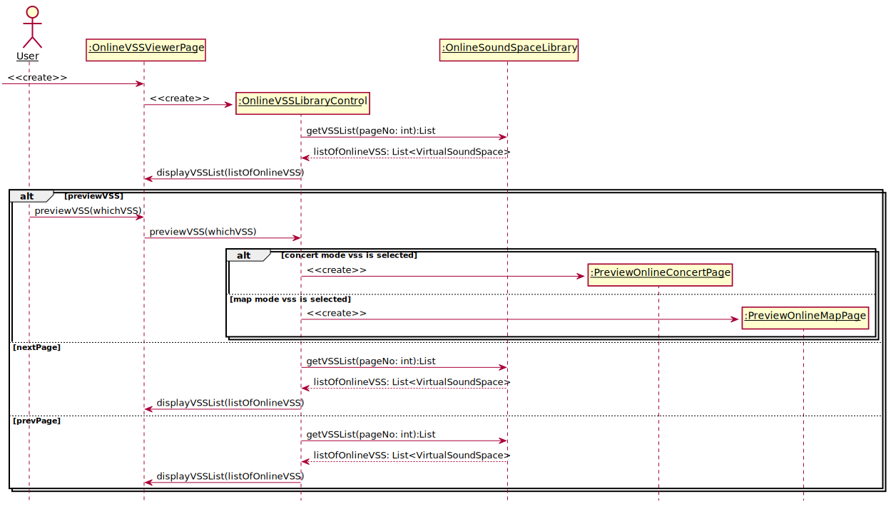

```PlantUML
@startuml BrowseOnlineVSSLibrary
hide footbox
skinparam sequenceParticipant underline

actor User as user
participant ":OnlineVSSViewerPage" as page
participant ":OnlineVSSLibraryControl" as control
participant ":OnlineSoundSpaceLibrary" as library


create page
[-> page: <<create>>
create control
page -> control: <<create>>
control -> library: getVSSList(pageNo: int):List
library --> control: listOfOnlineVSS: List<VirtualSoundSpace>
control -> page: displayVSSList(listOfOnlineVSS)
alt previewVSS
    user -> page: previewVSS(whichVSS)
    page -> control: previewVSS(whichVSS)
    alt concert mode vss is selected
        participant ":PreviewOnlineConcertPage" as pocp
        create pocp
        control -> pocp: <<create>>
    else map mode vss is selected
        participant ":PreviewOnlineMapPage" as pomp
        create pomp
        control -> pomp: <<create>>

    end
else nextPage
    control -> library: getVSSList(pageNo: int):List
    library --> control: listOfOnlineVSS: List<VirtualSoundSpace>
    control -> page: displayVSSList(listOfOnlineVSS)
else prevPage
    control -> library: getVSSList(pageNo: int):List
    library --> control: listOfOnlineVSS: List<VirtualSoundSpace>
    control -> page: displayVSSList(listOfOnlineVSS)
end

@enduml
```

## 22. AdjustSensor


```PlantUML
@startuml AdjustSensor
hide footbox
skinparam sequenceParticipant underline

actor User as user
participant ":SensorPage" as page
participant ":SensorControl" as control
participant ":Sensor" as sensor

[-> page: <<create>>
note over control: Sensor control should be coupled with Sensor
create control
page -> control: <<create>>
note right of sensor: this sensor object is created before adjusting sensor
loop for each operation
    control -> page: demand
    page -> user: demand
    loop while adjust demand satisfied
        user -> user: move
        sensor -> sensor: collectData
    end
    sensor -> control: demandSatisfied
end

control -> page: <<destroy>>
destroy page
destroy control


@enduml
```

## Class Diagram

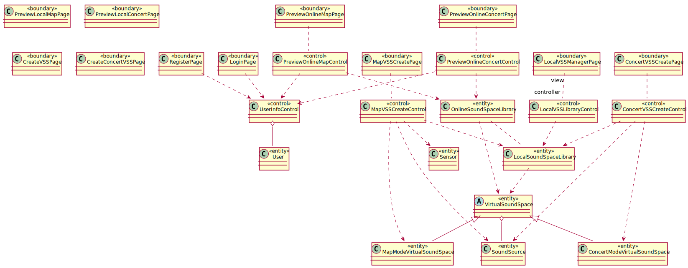

```PlantUML
@startuml ClassDiagram

class RegisterPage <<boundary>> {

}
class UserInfoControl <<control>> {

}
class LocalVSSManagerPage <<boundary>> {

}
class User <<entity>> {

}
class LoginPage <<boundary>> {

}
class LocalVSSLibraryControl <<control>> {

}
class LocalSoundSpaceLibrary <<entity>> {

}
class PreviewLocalMapPage <<boundary>> {

}
class PreviewLocalConcertPage <<boundary>> {

}
class CreateVSSPage <<boundary>> {

}
class CreateConcertVSSPage <<boundary>> {

}
class MapVSSCreatePage <<boundary>> {

}
class MapVSSCreateControl <<control>> {

}
class Sensor <<entity>> {

}
class MapModeVirtualSoundSpace <<entity>> {

}
class ConcertModeVirtualSoundSpace <<entity>> {

}
abstract VirtualSoundSpace <<entity>> {

}
class SoundSource <<entity>> {

}
class ConcertVSSCreatePage <<boundary>> {

}
class ConcertVSSCreateControl <<control>> {

}
class PreviewOnlineMapPage <<boundary>> {

}
class PreviewOnlineMapControl <<control>> {

}
class PreviewOnlineConcertPage <<boundary>> {

}
class PreviewOnlineConcertControl <<control>> {

}
class OnlineSoundSpaceLibrary <<entity>> {

}


UserInfoControl o-- User
LocalVSSManagerPage "view" .. "controller" LocalVSSLibraryControl
LocalVSSLibraryControl ..> LocalSoundSpaceLibrary
MapVSSCreatePage .. MapVSSCreateControl
MapVSSCreateControl ..> LocalSoundSpaceLibrary
LocalSoundSpaceLibrary ..> VirtualSoundSpace
VirtualSoundSpace <|-- ConcertModeVirtualSoundSpace
VirtualSoundSpace <|-- MapModeVirtualSoundSpace
LoginPage ..> UserInfoControl
RegisterPage ..> UserInfoControl
MapVSSCreateControl ..> Sensor
MapVSSCreateControl ..> MapModeVirtualSoundSpace
MapVSSCreateControl ..> SoundSource
VirtualSoundSpace o-- SoundSource
ConcertVSSCreatePage .. ConcertVSSCreateControl
ConcertVSSCreateControl ..> ConcertModeVirtualSoundSpace
ConcertVSSCreateControl ..> LocalSoundSpaceLibrary
ConcertVSSCreateControl ..> SoundSource
PreviewOnlineConcertPage .. PreviewOnlineConcertControl
PreviewOnlineMapPage .. PreviewOnlineMapControl
PreviewOnlineMapControl ..> UserInfoControl
PreviewOnlineConcertControl ..> UserInfoControl
PreviewOnlineMapControl ..> OnlineSoundSpaceLibrary
PreviewOnlineConcertControl ..> OnlineSoundSpaceLibrary
OnlineSoundSpaceLibrary ..> VirtualSoundSpace
OnlineSoundSpaceLibrary .. LocalSoundSpaceLibrary

@enduml
```
