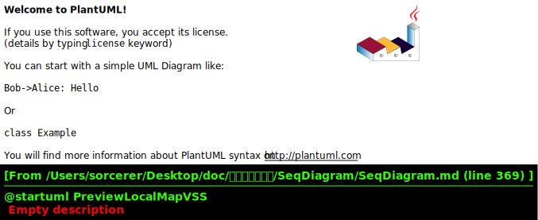
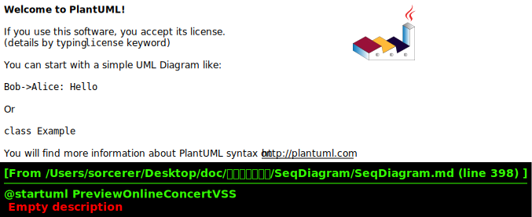

# 系统消息顺序图

## Reference Class List

|Class Name|Description|
|:-|:-|
User|存储各种用户信息
SoundSource|虚拟声源
VirtualSoundSpace|虚拟声音空间抽象类
MapModeVirtualSoundSpace|地图模式虚拟声音空间
ConcertModeSoundSpace|音乐会模式虚拟声音空间
LocalSoundSpaceLibrary|本地VSS管理
OnlineSoundSpaceLibrary|在线VSS管理库
Comment|评论存储类
Like|赞存储类
Sensor|传感器接口
SoundFragment|声音片段
|
RegisterPage|注册界面
LoginPage|登陆界面
LocalVSSManagerPage|本地VSS管理界面
OnlineVSSViewerPage|在线VSS浏览界面
VSSViewingPage|进入VSS进行游览
CreateMapVSSPage*|MapVSS创建
CreateConcertVSSPage*|ConcertVSS创建
SensorPage|传感器矫正页面
|
MapVSSCreateControl*|MapVSS创建控制
ConcertVSSCreateControl*|ConcertVSS创建控制
LocalVSSLibraryControl|本地VSS管理界面控制器
OnlineVSSLibraryControl|在线VSS浏览界面控制器
SensorControl|传感器校准控制器|
ConcertVSSPlayControl*|CVSS播放控制器
MapVSSPlayControl*|MVSS播放控制器
GVRAudioEngine*|GVR虚拟声音播放控制器


## 1.Register


```PlantUML
@startuml Register
hide footbox
skinparam sequenceParticipant underline

actor User as user
participant ":RegisterPage" as boundary
participant ":UserInfoControl" as control
participant ":User" as userdata
participant ":LocalVSSManagerPage" as nextpage

create control
boundary -> control: <<create>>
user -> boundary: enterRegisterData
boundary -> control: sendRegisterData
control -> control: checkRegisterData
loop wrong input
    control --> boundary: registerDataWrong
    user -> boundary: enterRegisterData
    boundary -> control: sendRegisterData
    control -> control: checkRegisterData
end
control --> boundary: registerSuccess
create userdata
control -> userdata: <<create>>
control -> control: setCurrentUser
control -> boundary: <<destroy>>
destroy boundary
create nextpage
control -> nextpage: <<create>>
destroy control
@enduml
```

## 2.Login


```PlantUML
@startuml Login
hide footbox
skinparam sequenceParticipant underline

actor User as user
participant ":LoginPage" as boundary
participant ":UserInfoControl" as control
participant ":User" as userdata
participant ":LocalVSSManagerPage" as nextpage

create control
boundary -> control: <<create>>
user -> boundary: enterLoginData
boundary -> control: sendLoginData
control -> control: checkLoginData
loop wrong password or username
    control --> boundary: loginDataWrong
    user -> boundary: enterLoginData
    boundary -> control: sendLoginData
    control -> control: checkLoginData
end
control --> boundary: LoginSuccess
create userdata
control -> userdata: <<create>>
control -> control: setCurrentUser
alt remember me selected
    control -> control: setRememberUser
end
control -> boundary: <<destroy>>
destroy boundary
create nextpage
control -> nextpage: <<create>>
destroy control
@enduml
```
## 3.ManageLocalVSSLibrary


```PlantUML
@startuml ManageLocalVSSLibrary
hide footbox
skinparam sequenceParticipant underline

actor User as user
participant ":LocalVSSManagerPage" as boundary

alt CreateVSS
    user -> boundary: createVSS
    ...
else RenameVSS
    user -> boundary: renameVSS
    ...
else DeleteVSS
    user -> boundary: deleteVSS
    ...
else UploadVSS
    user -> boundary: uploadVSS
    ...
else PreviewVSS
    user -> boundary: previewVSS
    ...
end
@enduml
```

## 4.CreateVSS


```PlantUML
@startuml CreateVSS
hide footbox
skinparam sequenceParticipant underline


actor User as user
participant ":LocalVSSManagerPage" as boundary
participant ":LocalVSSLibraryControl" as control
participant ":MapVSSCreateControl" as createboundary
participant ":MapVSSCreateControl" as createcontrol
participant ":LocalSoundSpaceLibrary" as library
participant ":SensorControl" as sensorcontrol
participant ":Sensor" as sensor


user -> boundary: createVSS
boundary -> control: createVSS
create createboundary
control -> createboundary: <<create>>
create createcontrol
createboundary -> createcontrol: <<create>>
create sensorcontrol
createcontrol -> sensorcontrol: <<create>>
create sensor
sensorcontrol -> sensor: <<create>>
loop add music

@enduml
```

## 5.CreateMapModeVSS


```PlantUML
@startuml CreateMapModeVSS
hide footbox
skinparam sequenceParticipant underline


actor User as user
participant ":LocalVSSManagerPage" as boundary
participant ":LocalVSSLibraryControl" as control
participant ":MapVSSCreatePage" as createboundary
participant ":MapVSSCreateControl" as createcontrol
participant ":LocalSoundSpaceLibrary" as library
participant ":Sensor" as sensor
collections "soundSpaces:VirtualSoundSpace" as vsses
participant "newSoundSpace:MapModeVirtualSoundSpace" as newspace


user -> boundary: createMapModeVSS
boundary -> control: createMapModeVSS
create createboundary
control -> createboundary: <<create>>
create createcontrol
createboundary -> createcontrol: <<create>>
create newspace
createcontrol -> newspace: <<create>>
create sensor
createcontrol -> sensor: <<create>>
loop add virual sound source
    alt add from library
        user -> createboundary: selectExistedSoundSource
        createboundary -> createcontrol: getLocalSoundFragments
        createcontrol -> library: getLocalSoundFragments
        loop for each
            library -> vsses: getSoundSources
            vsses --> library: soundSources
        end
        library --> createcontrol: filteredSoundFragments
        createcontrol --> createboundary: displayAvailableLocalSoundFragments
        user -> createboundary: selectSoundFragment
        createboundary -> createcontrol: addSoundFragment
    else add from file
        user -> createboundary: selectFromFileSystem
        ...somehow MapVSSCreateControl got the new SoundFragment # specify during implementation...

    end

    createcontrol -> sensor: getCurrentLocation
    sensor --> createcontrol: currentLocation

    participant ":SoundSource" as source
    create source
    createcontrol -> source: <<create>>
    createcontrol -> source: setSoundFragment
    createcontrol -> source: setLocation

    alt user choose to alter position
        user -> createboundary: setCurrentSoundSourceLocation
        createboundary -> source: setLocation
    end
    user -> createboundary: setSoundSourceMode
    createboundary -> createcontrol: setSoundSourceMode
    createcontrol -> source: setSoundSourceMode
    createcontrol -> newspace: addSoundSource(soundSource)
    user -> createboundary: setVSSNameAndDescription
    createboundary -> createcontrol: setVSSNameAndDescription
    createcontrol -> newspace: setVSSNameAndDescription
    user -> createboundary: comfirmVSSCreation
    createboundary -> createcontrol: comfirmVSSCreation
    createcontrol -> library: addSoundSpace(newSoundSpace)
    createcontrol -> sensorcontrol: <<destroy>>
    sensorcontrol -> sensor: <<destroy>>
    destroy sensorcontrol
    destroy sensor
    createcontrol -> createboundary: <<destroy>>
    destroy createboundary
    destroy createcontrol


end
@enduml
```

## 6.CreateConcertModeVSS


```PlantUML
@startuml CreateConcertModeVSS
hide footbox
skinparam sequenceParticipant underline


actor User as user
participant ":LocalVSSManagerPage" as boundary
participant ":LocalVSSLibraryControl" as control
participant ":ConcertVSSCreatePage" as createboundary
participant ":ConcertVSSCreateControl" as createcontrol
participant ":LocalSoundSpaceLibrary" as library
collections "soundSpaces:VirtualSoundSpace" as vsses
participant "newSoundSpace:ConcertModeVirtualSoundSpace" as newspace


user -> boundary: createConcertModeVSS
boundary -> control: createConcertModeVSS
create createboundary
control -> createboundary: <<create>>
create createcontrol
createboundary -> createcontrol: <<create>>
create newspace
createcontrol -> newspace: <<create>>

loop add virual sound source
    alt add from library
        user -> createboundary: selectExistedSoundSource
        createboundary -> createcontrol: getLocalSoundFragments
        createcontrol -> library: getLocalSoundFragments
        loop for each
            library -> vsses: getSoundSources
            vsses --> library: soundSources
        end
        library --> createcontrol: filteredSoundFragments
        createcontrol --> createboundary: displayAvailableLocalSoundFragments
        user -> createboundary: selectSoundFragment
        createboundary -> createcontrol: addSoundFragment
    else add from file
        user -> createboundary: selectFromFileSystem
        ...somehow MapVSSCreateControl got the new SoundFragment # specify during implementation...
    end


    participant ":SoundSource" as source
    user -> user: wakeUp(self)
    create source
    createcontrol -> source: <<create>>
    createcontrol -> source: setSoundFragment
    createcontrol -> newspace: addSoundSource(soundSource)
    user -> createboundary: setVSSNameAndDescription
    createboundary -> createcontrol: setVSSNameAndDescription
    createcontrol -> newspace: setVSSNameAndDescription
    user -> createboundary: comfirmVSSCreation
    createboundary -> createcontrol: comfirmVSSCreation
    createcontrol -> library: addSoundSpace(newSoundSpace)

    createcontrol -> createboundary: <<destroy>>
    destroy createboundary
    destroy createcontrol


end
@enduml
```

## 7.RenameVSS


```PlantUML
@startuml RenameVSS

@enduml
```

## 8.DeleteVSS


```PlantUML
@startuml DeleteVSS

@enduml
```

## 9.UploadVSS


```PlantUML
@startuml UploadVSS

@enduml
```

## 10. LikeVSS


```PlantUML
@startuml LikeVSS

@enduml
```


## 11. DownloadVSS


```PlantUML
@startuml DownloadVSS

@enduml
```

## 12. CommentVSS


```PlantUML
@startuml CommentVSS

@enduml
```


## 13. PlayVSS(Abstract)

## 14. PreviewVSS(???)

## 15. PreviewLocalMapVSS


```PlantUML
@startuml PreviewLocalMapVSS

@enduml
```


## 16. PreviewOnlineMapVSS


```PlantUML
@startuml PreviewOnlineMapVSS

@enduml
```

## 17. PreviewLocalConcertVSS


```PlantUML
@startuml PreviewLocalConcertVSS

@enduml
```


## 18. PreviewOnlineConcertVSS


```PlantUML
@startuml PreviewOnlineConcertVSS

@enduml
```


## 19. PlayMapModeVSS


```PlantUML
@startuml PlayMapModeVSS

@enduml
```


## 20. PlayConcertModeVSS


```PlantUML
@startuml PlayConcertModeVSS

@enduml
```


## 21. BrowseOnlineVSSLibrary


```PlantUML
@startuml BrowseOnlineVSSLibrary

@enduml
```

## 22. AdjustSensor


```PlantUML
@startuml AdjustSensor

@enduml
```
