createcontrol# 系统消息顺序图
## 1.Register

```PlantUML
@startuml
hide footbox
skinparam sequenceParticipant underline

actor User as user
participant ":RegisterPage" as boundary
participant ":UserInfoControl" as control
participant ":User" as userdata
participant ":LocalVSSManagerPage" as nextpage

create control
boundary -> control: <<create>>
user -> boundary: enterRegisterData
boundary -> control: sendRegisterData
control -> control: checkRegisterData
loop wrong input
    control --> boundary: registerDataWrong
    user -> boundary: enterRegisterData
    boundary -> control: sendRegisterData
    control -> control: checkRegisterData
end
control --> boundary: registerSuccess
create userdata
control -> userdata: <<create>>
control -> control: setCurrentUser
control -> boundary: <<destroy>>
destroy boundary
create nextpage
control -> nextpage: <<create>>
destroy control
@enduml
```
## 2.Login

```PlantUML
@startuml
hide footbox
skinparam sequenceParticipant underline

actor User as user
participant ":LoginPage" as boundary
participant ":UserInfoControl" as control
participant ":User" as userdata
participant ":LocalVSSManagerPage" as nextpage

create control
boundary -> control: <<create>>
user -> boundary: enterLoginData
boundary -> control: sendLoginData
control -> control: checkLoginData
loop wrong password or username
    control --> boundary: loginDataWrong
    user -> boundary: enterLoginData
    boundary -> control: sendLoginData
    control -> control: checkLoginData
end
control --> boundary: LoginSuccess
create userdata
control -> userdata: <<create>>
control -> control: setCurrentUser
alt remember me selected
    control -> control: setRememberUser
end
control -> boundary: <<destroy>>
destroy boundary
create nextpage
control -> nextpage: <<create>>
destroy control
@enduml
```
## 3.ManageLocalVSSLibrary
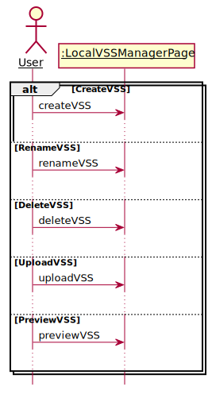
```PlantUML
@startuml
hide footbox
skinparam sequenceParticipant underline

actor User as user
participant ":LocalVSSManagerPage" as boundary

alt CreateVSS
    user -> boundary: createVSS
    ...
else RenameVSS
    user -> boundary: renameVSS
    ...
else DeleteVSS
    user -> boundary: deleteVSS
    ...
else UploadVSS
    user -> boundary: uploadVSS
    ...
else PreviewVSS
    user -> boundary: previewVSS
    ...
end
@enduml
```
## 4.CreateVSS
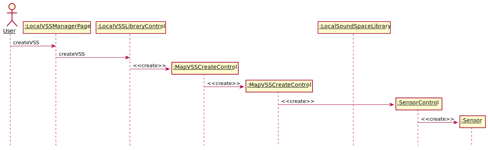
```PlantUML
@startuml
hide footbox
skinparam sequenceParticipant underline


actor User as user
participant ":LocalVSSManagerPage" as boundary
participant ":LocalVSSLibraryControl" as control
participant ":MapVSSCreateControl" as createboundary
participant ":MapVSSCreateControl" as createcontrol
participant ":LocalSoundSpaceLibrary" as library
participant ":SensorControl" as sensorcontrol
participant ":Sensor" as sensor


user -> boundary: createVSS
boundary -> control: createVSS
create createboundary
control -> createboundary: <<create>>
create createcontrol
createboundary -> createcontrol: <<create>>
create sensorcontrol
createcontrol -> sensorcontrol: <<create>>
create sensor
sensorcontrol -> sensor: <<create>>
loop add music

@enduml
```
## 5.CreateMapModeVSS
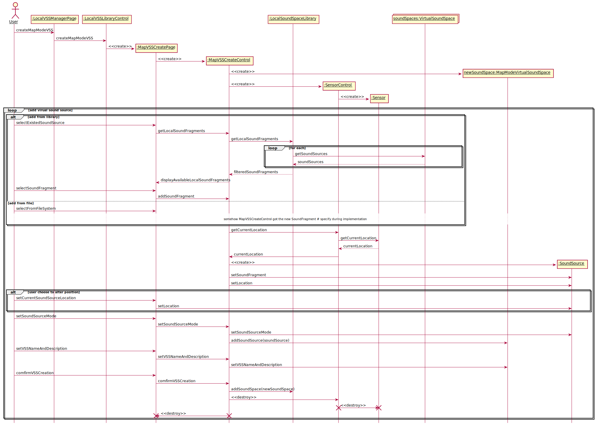
```PlantUML
@startuml
hide footbox
skinparam sequenceParticipant underline


actor User as user
participant ":LocalVSSManagerPage" as boundary
participant ":LocalVSSLibraryControl" as control
participant ":MapVSSCreatePage" as createboundary
participant ":MapVSSCreateControl" as createcontrol
participant ":LocalSoundSpaceLibrary" as library
participant ":SensorControl" as sensorcontrol
participant ":Sensor" as sensor
collections "soundSpaces:VirtualSoundSpace" as vsses
participant "newSoundSpace:MapModeVirtualSoundSpace" as newspace


user -> boundary: createMapModeVSS
boundary -> control: createMapModeVSS
create createboundary
control -> createboundary: <<create>>
create createcontrol
createboundary -> createcontrol: <<create>>
create newspace
createcontrol -> newspace: <<create>>
create sensorcontrol
createcontrol -> sensorcontrol: <<create>>
create sensor
sensorcontrol -> sensor: <<create>>
loop add virual sound source
    alt add from library
        user -> createboundary: selectExistedSoundSource
        createboundary -> createcontrol: getLocalSoundFragments
        createcontrol -> library: getLocalSoundFragments
        loop for each
            library -> vsses: getSoundSources
            vsses --> library: soundSources
        end
        library --> createcontrol: filteredSoundFragments
        createcontrol --> createboundary: displayAvailableLocalSoundFragments
        user -> createboundary: selectSoundFragment
        createboundary -> createcontrol: addSoundFragment
    else add from file
        user -> createboundary: selectFromFileSystem
        ...somehow MapVSSCreateControl got the new SoundFragment # specify during implementation...

    end

    createcontrol -> sensorcontrol: getCurrentLocation
    sensorcontrol -> sensor: getCurrentLocation
    sensor --> sensorcontrol: currentLocation
    sensorcontrol -> createcontrol: currentLocation

    participant ":SoundSource" as source
    create source
    createcontrol -> source: <<create>>
    createcontrol -> source: setSoundFragment
    createcontrol -> source: setLocation

    alt user choose to alter position
        user -> createboundary: setCurrentSoundSourceLocation
        createboundary -> source: setLocation
    end
    user -> createboundary: setSoundSourceMode
    createboundary -> createcontrol: setSoundSourceMode
    createcontrol -> source: setSoundSourceMode
    createcontrol -> newspace: addSoundSource(soundSource)
    user -> createboundary: setVSSNameAndDescription
    createboundary -> createcontrol: setVSSNameAndDescription
    createcontrol -> newspace: setVSSNameAndDescription
    user -> createboundary: comfirmVSSCreation
    createboundary -> createcontrol: comfirmVSSCreation
    createcontrol -> library: addSoundSpace(newSoundSpace)
    createcontrol -> sensorcontrol: <<destroy>>
    sensorcontrol -> sensor: <<destroy>>
    destroy sensorcontrol
    destroy sensor
    createcontrol -> createboundary: <<destroy>>
    destroy createboundary
    destroy createcontrol


end
@enduml
```

## 6.CreateConcertModeVSS

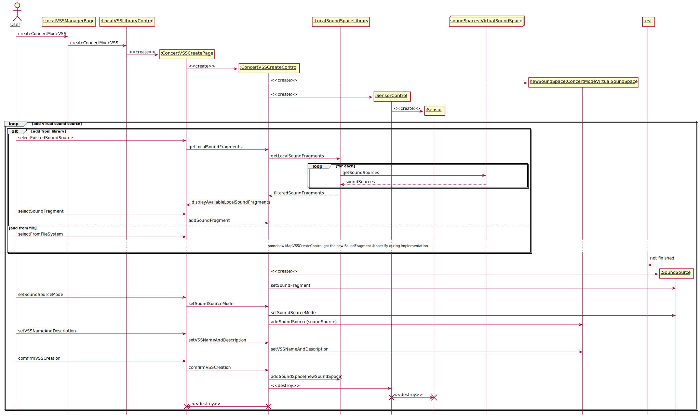

```PlantUML
@startuml
hide footbox
skinparam sequenceParticipant underline


actor User as user
participant ":LocalVSSManagerPage" as boundary
participant ":LocalVSSLibraryControl" as control
participant ":ConcertVSSCreatePage" as createboundary
participant ":ConcertVSSCreateControl" as createcontrol
participant ":LocalSoundSpaceLibrary" as library
participant ":SensorControl" as sensorcontrol
participant ":Sensor" as sensor
collections "soundSpaces:VirtualSoundSpace" as vsses
participant "newSoundSpace:ConcertModeVirtualSoundSpace" as newspace


user -> boundary: createConcertModeVSS
boundary -> control: createConcertModeVSS
create createboundary
control -> createboundary: <<create>>
create createcontrol
createboundary -> createcontrol: <<create>>
create newspace
createcontrol -> newspace: <<create>>
create sensorcontrol
createcontrol -> sensorcontrol: <<create>>
create sensor
sensorcontrol -> sensor: <<create>>
loop add virual sound source
    alt add from library
        user -> createboundary: selectExistedSoundSource
        createboundary -> createcontrol: getLocalSoundFragments
        createcontrol -> library: getLocalSoundFragments
        loop for each
            library -> vsses: getSoundSources
            vsses --> library: soundSources
        end
        library --> createcontrol: filteredSoundFragments
        createcontrol --> createboundary: displayAvailableLocalSoundFragments
        user -> createboundary: selectSoundFragment
        createboundary -> createcontrol: addSoundFragment
    else add from file
        user -> createboundary: selectFromFileSystem
        ...somehow MapVSSCreateControl got the new SoundFragment # specify during implementation...
    end

    test -> test: not finished
    participant ":SoundSource" as source
    create source
    createcontrol -> source: <<create>>
    createcontrol -> source: setSoundFragment
    user -> createboundary: setSoundSourceMode
    createboundary -> createcontrol: setSoundSourceMode
    createcontrol -> source: setSoundSourceMode
    createcontrol -> newspace: addSoundSource(soundSource)
    user -> createboundary: setVSSNameAndDescription
    createboundary -> createcontrol: setVSSNameAndDescription
    createcontrol -> newspace: setVSSNameAndDescription
    user -> createboundary: comfirmVSSCreation
    createboundary -> createcontrol: comfirmVSSCreation
    createcontrol -> library: addSoundSpace(newSoundSpace)
    createcontrol -> sensorcontrol: <<destroy>>
    sensorcontrol -> sensor: <<destroy>>
    destroy sensorcontrol
    destroy sensor
    createcontrol -> createboundary: <<destroy>>
    destroy createboundary
    destroy createcontrol


end
@enduml
```


## 7.RenameVSS
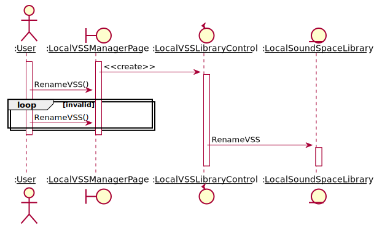
```
@startuml
actor ":__User__" as User
boundary ":__LocalVSSManagerPage__" as LocalVSSManagerPage
control ":__LocalVSSLibraryControl__" as LocalVSSLibraryControl
entity ":__LocalSoundSpaceLibrary__" as LocalSoundSpaceLibrary

activate User
activate LocalVSSManagerPage
LocalVSSManagerPage -> LocalVSSLibraryControl: <<create>>
activate LocalVSSLibraryControl
User -> LocalVSSManagerPage: RenameVSS()
loop invalid
    User -> LocalVSSManagerPage: RenameVSS()
end
deactivate User
deactivate LocalVSSManagerPage
LocalVSSLibraryControl -> LocalSoundSpaceLibrary: RenameVSS
activate LocalSoundSpaceLibrary
deactivate LocalSoundSpaceLibrary
deactivate LocalVSSLibraryControl
@enduml
```
## 8.DeleteVSS
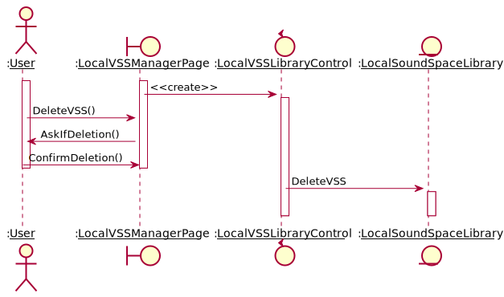
```
@startuml
actor ":__User__" as User
boundary ":__LocalVSSManagerPage__" as LocalVSSManagerPage
control ":__LocalVSSLibraryControl__" as LocalVSSLibraryControl
entity ":__LocalSoundSpaceLibrary__" as LocalSoundSpaceLibrary

activate User
activate LocalVSSManagerPage
LocalVSSManagerPage -> LocalVSSLibraryControl: <<create>>
activate LocalVSSLibraryControl
User -> LocalVSSManagerPage: DeleteVSS()
LocalVSSManagerPage -> User: AskIfDeletion()
User -> LocalVSSManagerPage: ConfirmDeletion()
deactivate User
deactivate LocalVSSManagerPage
LocalVSSLibraryControl -> LocalSoundSpaceLibrary: DeleteVSS
activate LocalSoundSpaceLibrary
deactivate LocalSoundSpaceLibrary
deactivate LocalVSSLibraryControl
@enduml
```
## 9.UploadVSS
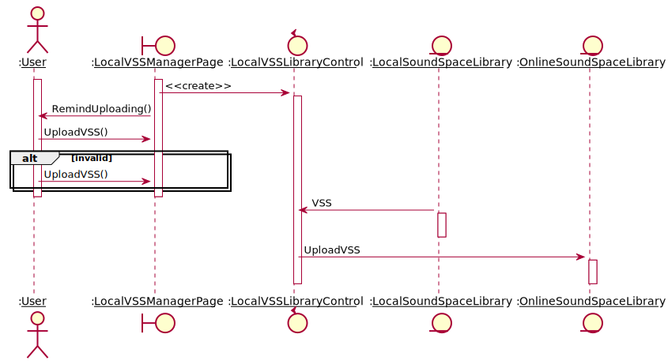
```
@startuml
actor ":__User__" as User
boundary ":__LocalVSSManagerPage__" as LocalVSSManagerPage
control ":__LocalVSSLibraryControl__" as LocalVSSLibraryControl
entity ":__LocalSoundSpaceLibrary__" as LocalSoundSpaceLibrary
entity ":__OnlineSoundSpaceLibrary__" as OnlineSoundSpaceLibrary

activate User
activate LocalVSSManagerPage
LocalVSSManagerPage -> LocalVSSLibraryControl: <<create>>
activate LocalVSSLibraryControl
LocalVSSManagerPage -> User: RemindUploading()
User -> LocalVSSManagerPage: UploadVSS()
alt invalid
    User -> LocalVSSManagerPage: UploadVSS()
end
deactivate User
deactivate LocalVSSManagerPage
LocalSoundSpaceLibrary -> LocalVSSLibraryControl : VSS
activate LocalSoundSpaceLibrary
deactivate LocalSoundSpaceLibrary
LocalVSSLibraryControl -> OnlineSoundSpaceLibrary: UploadVSS
activate OnlineSoundSpaceLibrary
deactivate OnlineSoundSpaceLibrary
deactivate LocalVSSLibraryControl
@enduml
```
## 10. PreviewVSS
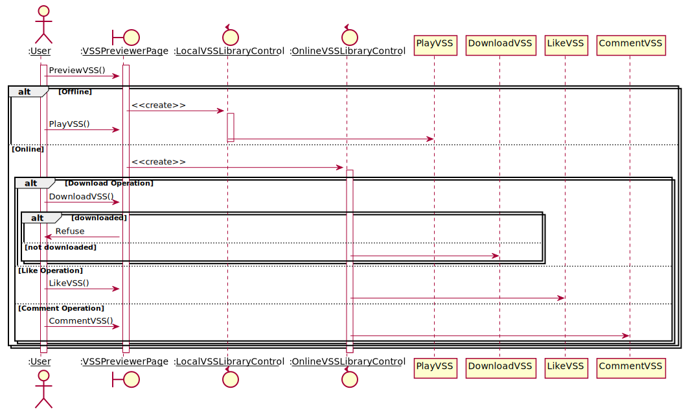
```
@startuml
actor ":__User__" as User
boundary ":__VSSPreviewerPage__" as VSSPreviewerPage
control ":__LocalVSSLibraryControl__" as LocalVSSLibraryControl
control ":__OnlineVSSLibraryControl__" as OnlineVSSLibraryControl

activate User
activate VSSPreviewerPage
User -> VSSPreviewerPage: PreviewVSS()
alt Offline
    VSSPreviewerPage -> LocalVSSLibraryControl: <<create>>
    activate LocalVSSLibraryControl
    User -> VSSPreviewerPage: PlayVSS()
    LocalVSSLibraryControl -> PlayVSS
    deactivate LocalVSSLibraryControl
else Online
    VSSPreviewerPage -> OnlineVSSLibraryControl: <<create>>
    activate OnlineVSSLibraryControl
    alt Download Operation
        User -> VSSPreviewerPage: DownloadVSS()
        alt downloaded
            VSSPreviewerPage -> User: Refuse
        else not downloaded
            OnlineVSSLibraryControl -> DownloadVSS
        end
    else Like Operation
        User -> VSSPreviewerPage: LikeVSS()
        OnlineVSSLibraryControl -> LikeVSS
    else Comment Operation
        User -> VSSPreviewerPage: CommentVSS()
        OnlineVSSLibraryControl -> CommentVSS
    end
end
deactivate OnlineVSSLibraryControl
deactivate VSSPreviewerPage
deactivate User
@enduml
```
## 11. BrowseOnlineVSSLibrary
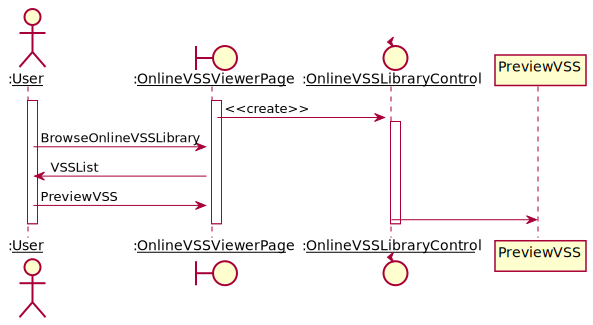
```
@startuml
actor ":__User__" as User
boundary ":__OnlineVSSViewerPage__" as OnlineVSSViewerPage
control ":__OnlineVSSLibraryControl__" as OnlineVSSLibraryControl

activate User
activate OnlineVSSViewerPage
OnlineVSSViewerPage -> OnlineVSSLibraryControl: <<create>>
activate OnlineVSSLibraryControl
User -> OnlineVSSViewerPage: BrowseOnlineVSSLibrary
OnlineVSSViewerPage -> User: VSSList
User -> OnlineVSSViewerPage: PreviewVSS
OnlineVSSLibraryControl -> PreviewVSS
deactivate User
deactivate OnlineVSSViewerPage
deactivate OnlineVSSLibraryControl
@enduml
```
## 12. DownloadVSS
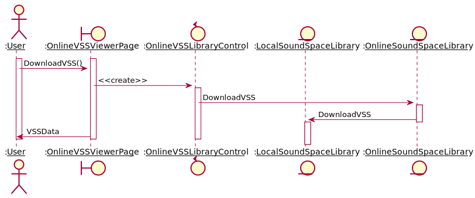
```
@startuml
actor ":__User__" as User
boundary ":__OnlineVSSViewerPage__" as OnlineVSSViewerPage
control ":__OnlineVSSLibraryControl__" as OnlineVSSLibraryControl
entity ":__LocalSoundSpaceLibrary__" as LocalSoundSpaceLibrary
entity ":__OnlineSoundSpaceLibrary__" as OnlineSoundSpaceLibrary

activate User
activate OnlineVSSViewerPage
User -> OnlineVSSViewerPage: DownloadVSS()
OnlineVSSViewerPage -> OnlineVSSLibraryControl: <<create>>
activate OnlineVSSLibraryControl
OnlineVSSLibraryControl -> OnlineSoundSpaceLibrary: DownloadVSS
activate OnlineSoundSpaceLibrary
OnlineSoundSpaceLibrary -> LocalSoundSpaceLibrary: DownloadVSS
deactivate OnlineSoundSpaceLibrary
activate LocalSoundSpaceLibrary
deactivate LocalSoundSpaceLibrary
OnlineVSSViewerPage -> User: VSSData
deactivate OnlineVSSLibraryControl
deactivate OnlineVSSViewerPage
deactivate User
@enduml
```
## 13. LikeVSS
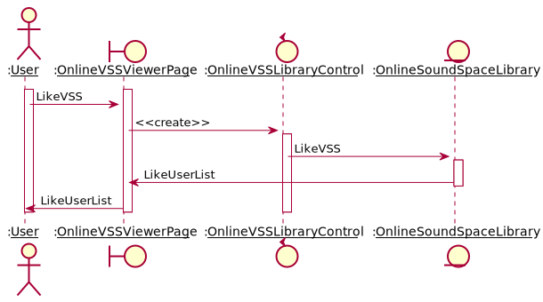
```
@startuml
actor ":__User__" as User
boundary ":__OnlineVSSViewerPage__" as OnlineVSSViewerPage
control ":__OnlineVSSLibraryControl__" as OnlineVSSLibraryControl
entity ":__OnlineSoundSpaceLibrary__" as OnlineSoundSpaceLibrary

activate User
activate OnlineVSSViewerPage
User -> OnlineVSSViewerPage: LikeVSS
OnlineVSSViewerPage -> OnlineVSSLibraryControl: <<create>>
activate OnlineVSSLibraryControl
OnlineVSSLibraryControl -> OnlineSoundSpaceLibrary: LikeVSS
activate OnlineSoundSpaceLibrary
OnlineSoundSpaceLibrary -> OnlineVSSViewerPage: LikeUserList
deactivate OnlineSoundSpaceLibrary
OnlineVSSViewerPage -> User: LikeUserList
deactivate OnlineVSSLibraryControl
deactivate OnlineVSSViewerPage
deactivate User
@enduml
```
## 14. CommentVSS
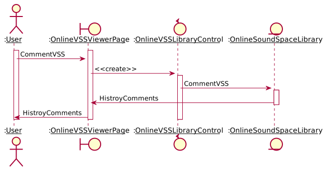
```
@startuml
actor ":__User__" as User
boundary ":__OnlineVSSViewerPage__" as OnlineVSSViewerPage
control ":__OnlineVSSLibraryControl__" as OnlineVSSLibraryControl
entity ":__OnlineSoundSpaceLibrary__" as OnlineSoundSpaceLibrary

activate User
activate OnlineVSSViewerPage
User -> OnlineVSSViewerPage: CommentVSS
OnlineVSSViewerPage -> OnlineVSSLibraryControl: <<create>>
activate OnlineVSSLibraryControl
OnlineVSSLibraryControl -> OnlineSoundSpaceLibrary: CommentVSS
activate OnlineSoundSpaceLibrary
OnlineSoundSpaceLibrary -> OnlineVSSViewerPage: HistroyComments
deactivate OnlineSoundSpaceLibrary
OnlineVSSViewerPage -> User: HistroyComments
deactivate OnlineVSSLibraryControl
deactivate OnlineVSSViewerPage
deactivate User
@enduml
```
## 15. PlayVSS
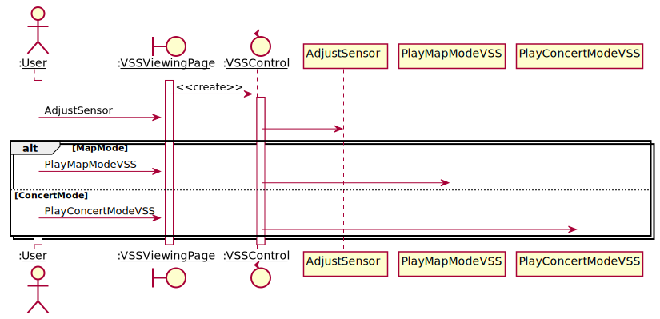
```
@startuml
actor ":__User__" as User
boundary ":__VSSViewingPage__" as VSSViewingPage
control ":__VSSControl__" as VSSControl

activate User
activate VSSViewingPage
VSSViewingPage -> VSSControl: <<create>>
activate VSSControl
User -> VSSViewingPage: AdjustSensor
VSSControl -> AdjustSensor
alt MapMode
  User -> VSSViewingPage: PlayMapModeVSS
  VSSControl -> PlayMapModeVSS
else ConcertMode
  User -> VSSViewingPage: PlayConcertModeVSS
  VSSControl -> PlayConcertModeVSS
end
deactivate VSSControl
deactivate VSSViewingPage
deactivate User
@enduml
```
## 16. PlayMapModeVSS
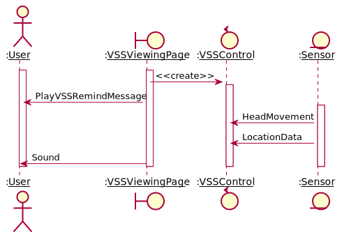
```
@startuml
actor ":__User__" as User
boundary ":__VSSViewingPage__" as VSSViewingPage
control ":__VSSControl__" as VSSControl
entity ":__Sensor__" as Sensor

activate User
activate VSSViewingPage
VSSViewingPage -> VSSControl: <<create>>
activate VSSControl
VSSViewingPage -> User: PlayVSSRemindMessage
activate Sensor
Sensor -> VSSControl: HeadMovement
Sensor -> VSSControl: LocationData
VSSViewingPage -> User: Sound
deactivate Sensor
deactivate VSSControl
deactivate VSSViewingPage
deactivate User
@enduml
```
## 17. PlayConcertModeVSS
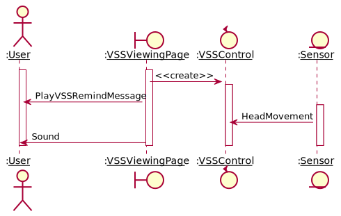
```
@startuml
actor ":__User__" as User
boundary ":__VSSViewingPage__" as VSSViewingPage
control ":__VSSControl__" as VSSControl
entity ":__Sensor__" as Sensor

activate User
activate VSSViewingPage
VSSViewingPage -> VSSControl: <<create>>
activate VSSControl
VSSViewingPage -> User: PlayVSSRemindMessage
activate Sensor
Sensor -> VSSControl: HeadMovement
VSSViewingPage -> User: Sound
deactivate Sensor
deactivate VSSControl
deactivate VSSViewingPage
deactivate User
@enduml
```
## 18. AdjustSensor
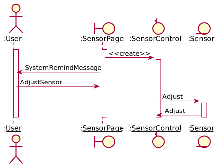
```
@startuml
actor ":__User__" as User
boundary ":__SensorPage__" as SensorPage
control ":__SensorControl__" as SensorControl
entity ":__Sensor__" as Sensor

activate User
activate SensorPage
SensorPage -> SensorControl: <<create>>
activate SensorControl
SensorPage -> User: SystemRemindMessage
User -> SensorPage: AdjustSensor
SensorControl -> Sensor: Adjust
activate Sensor
Sensor -> SensorControl: Adjust
deactivate Sensor
deactivate SensorControl
deactivate SensorPage
deactivate User
@enduml
```
