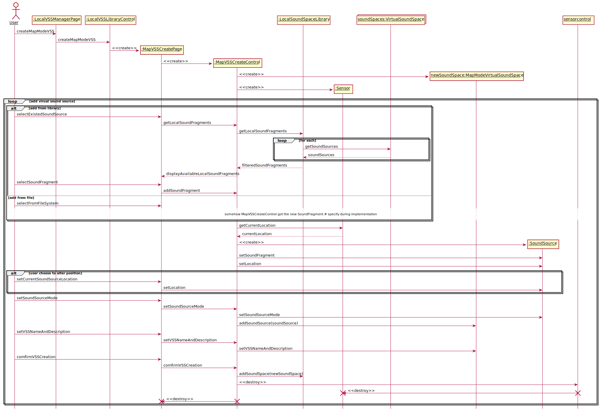

# 系统消息顺序图
## 1.Register

```
@startuml
actor ":__User__" as User
boundary ":__RegisterPage__" as RegisterPage
control ":__UserInfoControl__" as UserInfoControl
entity ":__u__" as User_Object

activate User
User -> RegisterPage: register
activate RegisterPage
RegisterPage -> UserInfoControl: <<create>>
activate UserInfoControl
User -> RegisterPage: submitUserInfo()
loop invalid
    User -> RegisterPage: submitUserInfo()
end
deactivate User
deactivate RegisterPage
UserInfoControl -> User_Object: <<create>>
deactivate UserInfoControl
activate User_Object
deactivate User_Object
@enduml
```
## 2.Login

```
@startuml
actor ":__User__" as User
boundary ":__LoginPage__" as LoginPage
control ":__UserInfoControl__" as UserInfoControl

activate User
User -> LoginPage: Login
activate LoginPage
LoginPage -> UserInfoControl: <<create>>
activate UserInfoControl
loop invalid
    User -> LoginPage: Login
end
deactivate User
deactivate LoginPage
deactivate UserInfoControl
@enduml
```
## 3.ManageLocalVSSLibrary

```
@startuml
actor ":__User__" as User
boundary ":__LocalVSSManagerPage__" as LocalVSSManagerPage
control ":__LocalVSSLibraryControl__" as LocalVSSLibraryControl

activate User
User -> LocalVSSManagerPage: ManageLocalVSSLibrary
activate LocalVSSManagerPage
LocalVSSManagerPage -> LocalVSSLibraryControl: <<create>>
activate LocalVSSLibraryControl

alt Create Operation
    User -> LocalVSSManagerPage: CreateVSS
    LocalVSSLibraryControl -> CreateVSS
else Rename Operation
    User -> LocalVSSManagerPage: RenameVSS
    LocalVSSLibraryControl -> RenameVSS
else Delete Operation
    User -> LocalVSSManagerPage: DeleteVSS
    LocalVSSLibraryControl -> DeleteVSS
else Upload Operation
    User -> LocalVSSManagerPage: UploadVSS
    LocalVSSLibraryControl -> UploadVSS
else Preview Operation
    User -> LocalVSSManagerPage: PreviewVSS
    LocalVSSLibraryControl -> PreviewVSS
end

deactivate LocalVSSManagerPage
deactivate LocalVSSLibraryControl
deactivate User
@enduml
```
## 4.CreateVSS

```
@startuml
actor ":__User__" as User
boundary ":__CreateVSSPage__" as CreateVSSPage
control ":__LocalVSSLibraryControl__" as LocalVSSLibraryControl

activate User
User -> CreateVSSPage: CreateVSS
activate CreateVSSPage
CreateVSSPage -> LocalVSSLibraryControl: <<create>>
activate LocalVSSLibraryControl
alt MapMode
    User -> CreateVSSPage: CreateMapModeVSS
    LocalVSSLibraryControl -> CreateMapModeVSS
else ConcertMode
    User -> CreateVSSPage: CreateConcertModeVSS
    LocalVSSLibraryControl -> CreateConcertModeVSS
end
deactivate CreateVSSPage
deactivate LocalVSSLibraryControl
deactivate User
@enduml
```
## 5.CreateMapModeVSS

```
@startuml
actor ":__User__" as User
boundary ":__LocalVSSManagerPage__" as LocalVSSManagerPage
control ":__LocalVSSLibraryControl__" as LocalVSSLibraryControl
entity ":__MapModeVirtualSoundSpace__" as MapModeVirtualSoundSpace

activate User
activate LocalVSSManagerPage
LocalVSSManagerPage -> LocalVSSLibraryControl: <<create>>
activate LocalVSSLibraryControl
User -> LocalVSSManagerPage: LocationData
User -> LocalVSSManagerPage: CreateMapModeVSS()
LocalVSSLibraryControl -> MapModeVirtualSoundSpace: <<create>>
activate MapModeVirtualSoundSpace
deactivate MapModeVirtualSoundSpace
alt delete
    User -> LocalVSSManagerPage: Delete
    activate MapModeVirtualSoundSpace
    LocalVSSLibraryControl -> MapModeVirtualSoundSpace: <<destroy>>
    deactivate MapModeVirtualSoundSpace
end
deactivate LocalVSSLibraryControl
deactivate LocalVSSManagerPage
deactivate User
@enduml
```
## 6.CreateConcertModeVSS

```@startuml
actor ":__User__" as User
boundary ":__LocalVSSManagerPage__" as LocalVSSManagerPage
control ":__LocalVSSLibraryControl__" as LocalVSSLibraryControl
entity ":__ConcertModeVirtualSoundSpace__" as ConcertModeVirtualSoundSpace

activate User
activate LocalVSSManagerPage
LocalVSSManagerPage -> LocalVSSLibraryControl: <<create>>
activate LocalVSSLibraryControl
User -> LocalVSSManagerPage: CreateMapModeVSS()
LocalVSSLibraryControl -> ConcertModeVirtualSoundSpace: <<create>>
activate ConcertModeVirtualSoundSpace
deactivate ConcertModeVirtualSoundSpace
alt delete
    User -> LocalVSSManagerPage: Delete
    activate ConcertModeVirtualSoundSpace
    LocalVSSLibraryControl -> ConcertModeVirtualSoundSpace: <<destroy>>
    deactivate ConcertModeVirtualSoundSpace
end
deactivate LocalVSSLibraryControl
deactivate LocalVSSManagerPage
deactivate User
@enduml
```
## 7.RenameVSS

```
@startuml
actor ":__User__" as User
boundary ":__LocalVSSManagerPage__" as LocalVSSManagerPage
control ":__LocalVSSLibraryControl__" as LocalVSSLibraryControl
entity ":__LocalSoundSpaceLibrary__" as LocalSoundSpaceLibrary

activate User
activate LocalVSSManagerPage
LocalVSSManagerPage -> LocalVSSLibraryControl: <<create>>
activate LocalVSSLibraryControl
User -> LocalVSSManagerPage: RenameVSS()
loop invalid
    User -> LocalVSSManagerPage: RenameVSS()
end
deactivate User
deactivate LocalVSSManagerPage
LocalVSSLibraryControl -> LocalSoundSpaceLibrary: RenameVSS
activate LocalSoundSpaceLibrary
deactivate LocalSoundSpaceLibrary
deactivate LocalVSSLibraryControl
@enduml
```
## 8.DeleteVSS

```
@startuml
actor ":__User__" as User
boundary ":__LocalVSSManagerPage__" as LocalVSSManagerPage
control ":__LocalVSSLibraryControl__" as LocalVSSLibraryControl
entity ":__LocalSoundSpaceLibrary__" as LocalSoundSpaceLibrary

activate User
activate LocalVSSManagerPage
LocalVSSManagerPage -> LocalVSSLibraryControl: <<create>>
activate LocalVSSLibraryControl
User -> LocalVSSManagerPage: DeleteVSS()
LocalVSSManagerPage -> User: AskIfDeletion()
User -> LocalVSSManagerPage: ConfirmDeletion()
deactivate User
deactivate LocalVSSManagerPage
LocalVSSLibraryControl -> LocalSoundSpaceLibrary: DeleteVSS
activate LocalSoundSpaceLibrary
deactivate LocalSoundSpaceLibrary
deactivate LocalVSSLibraryControl
@enduml
```
## 9.UploadVSS

```
@startuml
actor ":__User__" as User
boundary ":__LocalVSSManagerPage__" as LocalVSSManagerPage
control ":__LocalVSSLibraryControl__" as LocalVSSLibraryControl
entity ":__LocalSoundSpaceLibrary__" as LocalSoundSpaceLibrary
entity ":__OnlineSoundSpaceLibrary__" as OnlineSoundSpaceLibrary

activate User
activate LocalVSSManagerPage
LocalVSSManagerPage -> LocalVSSLibraryControl: <<create>>
activate LocalVSSLibraryControl
LocalVSSManagerPage -> User: RemindUploading()
User -> LocalVSSManagerPage: UploadVSS()
alt invalid
    User -> LocalVSSManagerPage: UploadVSS()
end
deactivate User
deactivate LocalVSSManagerPage
LocalSoundSpaceLibrary -> LocalVSSLibraryControl : VSS
activate LocalSoundSpaceLibrary
deactivate LocalSoundSpaceLibrary
LocalVSSLibraryControl -> OnlineSoundSpaceLibrary: UploadVSS
activate OnlineSoundSpaceLibrary
deactivate OnlineSoundSpaceLibrary
deactivate LocalVSSLibraryControl
@enduml
```
## 10. PreviewVSS

```
@startuml
actor ":__User__" as User
boundary ":__VSSPreviewerPage__" as VSSPreviewerPage
control ":__LocalVSSLibraryControl__" as LocalVSSLibraryControl
control ":__OnlineVSSLibraryControl__" as OnlineVSSLibraryControl

activate User
activate VSSPreviewerPage
User -> VSSPreviewerPage: PreviewVSS()
alt Offline
    VSSPreviewerPage -> LocalVSSLibraryControl: <<create>>
    activate LocalVSSLibraryControl
    User -> VSSPreviewerPage: PlayVSS()
    LocalVSSLibraryControl -> PlayVSS
    deactivate LocalVSSLibraryControl
else Online
    VSSPreviewerPage -> OnlineVSSLibraryControl: <<create>>
    activate OnlineVSSLibraryControl
    alt Download Operation
        User -> VSSPreviewerPage: DownloadVSS()
        alt downloaded
            VSSPreviewerPage -> User: Refuse
        else not downloaded
            OnlineVSSLibraryControl -> DownloadVSS
        end
    else Like Operation
        User -> VSSPreviewerPage: LikeVSS()
        OnlineVSSLibraryControl -> LikeVSS
    else Comment Operation
        User -> VSSPreviewerPage: CommentVSS()
        OnlineVSSLibraryControl -> CommentVSS
    end
end
deactivate OnlineVSSLibraryControl
deactivate VSSPreviewerPage
deactivate User
@enduml
```
## 11. BrowseOnlineVSSLibrary

```
@startuml
actor ":__User__" as User
boundary ":__OnlineVSSViewerPage__" as OnlineVSSViewerPage
control ":__OnlineVSSLibraryControl__" as OnlineVSSLibraryControl

activate User
activate OnlineVSSViewerPage
OnlineVSSViewerPage -> OnlineVSSLibraryControl: <<create>>
activate OnlineVSSLibraryControl
User -> OnlineVSSViewerPage: BrowseOnlineVSSLibrary
OnlineVSSViewerPage -> User: VSSList
User -> OnlineVSSViewerPage: PreviewVSS
OnlineVSSLibraryControl -> PreviewVSS
deactivate User
deactivate OnlineVSSViewerPage
deactivate OnlineVSSLibraryControl
@enduml
```
## 12. DownloadVSS

```
@startuml
actor ":__User__" as User
boundary ":__OnlineVSSViewerPage__" as OnlineVSSViewerPage
control ":__OnlineVSSLibraryControl__" as OnlineVSSLibraryControl
entity ":__LocalSoundSpaceLibrary__" as LocalSoundSpaceLibrary
entity ":__OnlineSoundSpaceLibrary__" as OnlineSoundSpaceLibrary

activate User
activate OnlineVSSViewerPage
User -> OnlineVSSViewerPage: DownloadVSS()
OnlineVSSViewerPage -> OnlineVSSLibraryControl: <<create>>
activate OnlineVSSLibraryControl
OnlineVSSLibraryControl -> OnlineSoundSpaceLibrary: DownloadVSS
activate OnlineSoundSpaceLibrary
OnlineSoundSpaceLibrary -> LocalSoundSpaceLibrary: DownloadVSS
deactivate OnlineSoundSpaceLibrary
activate LocalSoundSpaceLibrary
deactivate LocalSoundSpaceLibrary
OnlineVSSViewerPage -> User: VSSData
deactivate OnlineVSSLibraryControl
deactivate OnlineVSSViewerPage
deactivate User
@enduml
```
## 13. LikeVSS

```
@startuml
actor ":__User__" as User
boundary ":__OnlineVSSViewerPage__" as OnlineVSSViewerPage
control ":__OnlineVSSLibraryControl__" as OnlineVSSLibraryControl
entity ":__OnlineSoundSpaceLibrary__" as OnlineSoundSpaceLibrary

activate User
activate OnlineVSSViewerPage
User -> OnlineVSSViewerPage: LikeVSS
OnlineVSSViewerPage -> OnlineVSSLibraryControl: <<create>>
activate OnlineVSSLibraryControl
OnlineVSSLibraryControl -> OnlineSoundSpaceLibrary: LikeVSS
activate OnlineSoundSpaceLibrary
OnlineSoundSpaceLibrary -> OnlineVSSViewerPage: LikeUserList
deactivate OnlineSoundSpaceLibrary
OnlineVSSViewerPage -> User: LikeUserList
deactivate OnlineVSSLibraryControl
deactivate OnlineVSSViewerPage
deactivate User
@enduml
```
## 14. CommentVSS

```
@startuml
actor ":__User__" as User
boundary ":__OnlineVSSViewerPage__" as OnlineVSSViewerPage
control ":__OnlineVSSLibraryControl__" as OnlineVSSLibraryControl
entity ":__OnlineSoundSpaceLibrary__" as OnlineSoundSpaceLibrary

activate User
activate OnlineVSSViewerPage
User -> OnlineVSSViewerPage: CommentVSS
OnlineVSSViewerPage -> OnlineVSSLibraryControl: <<create>>
activate OnlineVSSLibraryControl
OnlineVSSLibraryControl -> OnlineSoundSpaceLibrary: CommentVSS
activate OnlineSoundSpaceLibrary
OnlineSoundSpaceLibrary -> OnlineVSSViewerPage: HistroyComments
deactivate OnlineSoundSpaceLibrary
OnlineVSSViewerPage -> User: HistroyComments
deactivate OnlineVSSLibraryControl
deactivate OnlineVSSViewerPage
deactivate User
@enduml
```
## 15. PlayVSS

```
@startuml
actor ":__User__" as User
boundary ":__VSSViewingPage__" as VSSViewingPage
control ":__VSSControl__" as VSSControl

activate User
activate VSSViewingPage
VSSViewingPage -> VSSControl: <<create>>
activate VSSControl
User -> VSSViewingPage: AdjustSensor
VSSControl -> AdjustSensor
alt MapMode
  User -> VSSViewingPage: PlayMapModeVSS
  VSSControl -> PlayMapModeVSS
else ConcertMode
  User -> VSSViewingPage: PlayConcertModeVSS
  VSSControl -> PlayConcertModeVSS
end
deactivate VSSControl
deactivate VSSViewingPage
deactivate User
@enduml
```
## 16. PlayMapModeVSS

```
@startuml
actor ":__User__" as User
boundary ":__VSSViewingPage__" as VSSViewingPage
control ":__VSSControl__" as VSSControl
entity ":__Sensor__" as Sensor

activate User
activate VSSViewingPage
VSSViewingPage -> VSSControl: <<create>>
activate VSSControl
VSSViewingPage -> User: PlayVSSRemindMessage
activate Sensor
Sensor -> VSSControl: HeadMovement
Sensor -> VSSControl: LocationData
VSSViewingPage -> User: Sound
deactivate Sensor
deactivate VSSControl
deactivate VSSViewingPage
deactivate User
@enduml
```
## 17. PlayConcertModeVSS

```
@startuml
actor ":__User__" as User
boundary ":__VSSViewingPage__" as VSSViewingPage
control ":__VSSControl__" as VSSControl
entity ":__Sensor__" as Sensor

activate User
activate VSSViewingPage
VSSViewingPage -> VSSControl: <<create>>
activate VSSControl
VSSViewingPage -> User: PlayVSSRemindMessage
activate Sensor
Sensor -> VSSControl: HeadMovement
VSSViewingPage -> User: Sound
deactivate Sensor
deactivate VSSControl
deactivate VSSViewingPage
deactivate User
@enduml
```
## 18. AdjustSensor

```
@startuml
actor ":__User__" as User
boundary ":__SensorPage__" as SensorPage
control ":__SensorControl__" as SensorControl
entity ":__Sensor__" as Sensor

activate User
activate SensorPage
SensorPage -> SensorControl: <<create>>
activate SensorControl
SensorPage -> User: SystemRemindMessage
User -> SensorPage: AdjustSensor
SensorControl -> Sensor: Adjust
activate Sensor
Sensor -> SensorControl: Adjust
deactivate Sensor
deactivate SensorControl
deactivate SensorPage
deactivate User
@enduml
```
