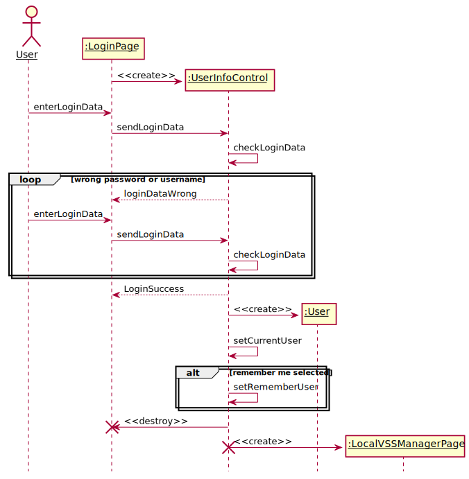
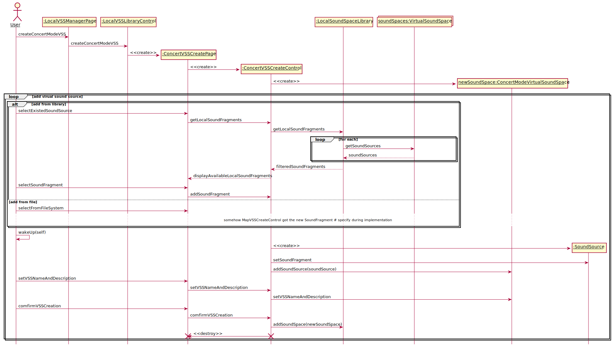

# 系统消息顺序图
## 1.Register

## 2.Login

## 3.ManageLocalVSSLibrary

## 4.CreateVSS

## 5.CreateMapModeVSS

## 6.CreateConcertModeVSS

## 7.RenameVSS

## 8.DeleteVSS

## 9.UploadVSS

## 10. PreviewVSS

## 11. BrowseOnlineVSSLibrary

## 12. DownloadVSS

## 13. LikeVSS

## 14. CommentVSS

## 15. PlayVSS

## 16. PlayMapModeVSS

## 17. PlayConcertModeVSS

## 18. AdjustSensor

