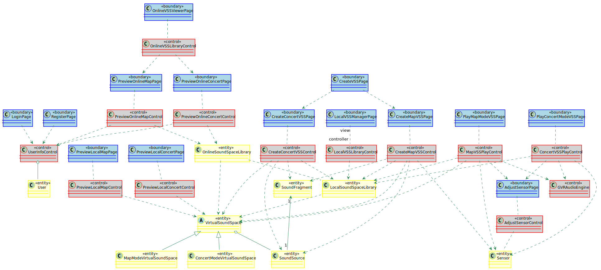

本文档是[软件需求规约]的“3.4.3 对象模型”部分。
[点击此处](./软件需求规约.md#343-对象模型)回到软件需求规约。


##### 实体类列表

Class Name|Description|Attributes
:-|:-|:-
User|User类保存了使用该系统的一个用户的相关信息，包括用户名、密码、邮箱及用户ID。|username<br>id
SoundSource|SoundSource类是用户为创建VSS，从本地VSS库可以访问到的所有VSS中提取出来的SoundSource或本地直接上传到系统上的虚拟声源，保存一个SoundFragment、虚拟声源名称、经纬度、高度、音量、播放模式及虚拟声源ID|position<br>volume<br>playPattern<br>id
VirtualSoundSpace|虚拟声音空间抽象类|name<br>id<br>ownerID<br>comments<br>likes
MapModeVirtualSoundSpace|地图模式虚拟声音空间|-
ConcertModeVirtualSoundSpace|音乐会模式虚拟声音空间|-
LocalSoundSpaceLibrary|本地VSS管理|-
OnlineSoundSpaceLibrary|在线VSS管理库|-
Sensor|传感器接口类|-
SoundFragment|声音片段|filename<br>length

##### 边界类列表

Class Name|Description
:-|:-
RegisterPage|注册界面
LoginPage|登陆界面
LocalVSSManagerPage|本地VSS管理界面
OnlineVSSViewerPage|在线VSS浏览界面
PlayMapModeVSSPage|游览Map模式VSS
PlayConcertModeVSSPage|游览Concert模式VSS
CreateVSSPage|VSS创建入口界面
CreateMapVSSPage|MapVSS创建
CreateConcertVSSPage|ConcertVSS创建
AdjustSensorPage|传感器矫正页面
PreviewLocalMapPage|-
PreviewOnlineMapPage|-
PreviewOnlineConcertPage|-
PreviewLocalMapPage|-

##### 控制类列表

Class Name|Description
:-|:-
UserInfoControl|用户信息管理控制器，同时作为系统控制器和视图控制器
PreviewLocalConcertControl|视图控制器
PreviewOnlineConcertControl|视图控制器
PreviewLocalMapControl|视图控制器
PreviewOnlineMapControl|视图控制器
CreateMapVSSControl|MapVSS创建控制，视图控制器
CreateConcertVSSControl|ConcertVSS创建控制，视图控制器
LocalVSSLibraryControl|本地VSS管理界面控制器，视图控制器
OnlineVSSLibraryControl|在线VSS浏览界面控制器，视图控制器
AdjustSensorControl|传感器校准控制器，视图控制器
ConcertVSSPlayControl|CVSS播放控制器，视图控制器
MapVSSPlayControl|MVSS播放控制器，视图控制器
GVRAudioEngine|GVR虚拟声音播放控制器，系统控制器

##### 类图
## Class Diagram



```PlantUML
@startuml Diagrams/ClassDiagram
skinparam class {
	BackgroundColor PaleGreen
	ArrowColor SeaGreen
	BorderColor SpringGreen
	BackgroundColor<<boundary>> LightBlue
	BorderColor<<boundary>> Blue
    BackgroundColor<<control>> LightGray
    BorderColor<<control>> Red
    BackgroundColor<<entity>> LightYellow
    BorderColor<<entity>> Yellow
}


class RegisterPage <<boundary>> {

}
class UserInfoControl <<control>> {

}
class LocalVSSManagerPage <<boundary>> {

}
class User <<entity>> {

}
class LoginPage <<boundary>> {

}
class LocalVSSLibraryControl <<control>> {

}
class LocalSoundSpaceLibrary <<entity>> {

}
class PreviewLocalMapPage <<boundary>> {

}
class PreviewLocalConcertPage <<boundary>> {

}
class CreateVSSPage <<boundary>> {

}
class CreateMapVSSPage <<boundary>> {

}
class CreateMapVSSControl <<control>> {

}
class Sensor <<entity>> {

}
class MapModeVirtualSoundSpace <<entity>> {

}
class ConcertModeVirtualSoundSpace <<entity>> {

}
abstract VirtualSoundSpace <<entity>> {

}
class SoundSource <<entity>> {

}
class CreateConcertVSSPage <<boundary>> {

}
class CreateConcertVSSControl <<control>> {

}
class PreviewOnlineMapPage <<boundary>> {

}
class PreviewOnlineMapControl <<control>> {

}
class PreviewOnlineConcertPage <<boundary>> {

}
class PreviewOnlineConcertControl <<control>> {

}
class OnlineSoundSpaceLibrary <<entity>> {

}
class PreviewLocalMapControl <<control>> {

}
class PreviewLocalConcertControl <<control>> {

}
class PlayMapModeVSSPage <<boundary>> {

}
class MapVSSPlayControl <<control>> {

}
class LocalSoundSpaceLibrary <<entity>> {

}
class GVRAudioEngine <<control>> {

}
class AdjustSensorPage <<boundary>> {

}
class PlayConcertModeVSSPage <<boundary>> {

}
class ConcertVSSPlayControl <<control>> {

}
class OnlineVSSViewerPage <<boundary>> {

}
class AdjustSensorControl <<control>> {

}
class SoundFragment <<entity>> {

}
class OnlineVSSLibraryControl <<control>> {

}


UserInfoControl o-- User
LocalVSSManagerPage "view" .. "controller" LocalVSSLibraryControl
LocalVSSLibraryControl ..> LocalSoundSpaceLibrary
CreateMapVSSPage .. CreateMapVSSControl
CreateMapVSSControl ..> LocalSoundSpaceLibrary
LocalSoundSpaceLibrary ..> VirtualSoundSpace
VirtualSoundSpace <|-- ConcertModeVirtualSoundSpace
VirtualSoundSpace <|-- MapModeVirtualSoundSpace
LoginPage ..> UserInfoControl
RegisterPage ..> UserInfoControl
CreateMapVSSControl ..> Sensor
CreateMapVSSControl ..> VirtualSoundSpace
CreateMapVSSControl ..> SoundSource
VirtualSoundSpace o-- SoundSource
CreateConcertVSSPage .. CreateConcertVSSControl
CreateConcertVSSControl ..> VirtualSoundSpace
CreateConcertVSSControl ..> LocalSoundSpaceLibrary
CreateConcertVSSControl ..> SoundSource
PreviewOnlineConcertPage .. PreviewOnlineConcertControl
PreviewOnlineMapPage .. PreviewOnlineMapControl
PreviewOnlineMapControl ..> UserInfoControl
PreviewOnlineConcertControl ..> UserInfoControl
PreviewOnlineMapControl ..> OnlineSoundSpaceLibrary
PreviewOnlineConcertControl ..> OnlineSoundSpaceLibrary
OnlineSoundSpaceLibrary ..> VirtualSoundSpace
OnlineSoundSpaceLibrary .. LocalSoundSpaceLibrary
PreviewLocalMapPage .. PreviewLocalMapControl
PreviewLocalConcertPage .. PreviewLocalConcertControl
PreviewLocalConcertControl ..> VirtualSoundSpace
PreviewLocalMapControl ..> VirtualSoundSpace
CreateVSSPage ..> CreateMapVSSPage
CreateVSSPage ..> CreateConcertVSSPage
PlayMapModeVSSPage .. MapVSSPlayControl
MapVSSPlayControl ..> LocalSoundSpaceLibrary
MapVSSPlayControl ..> VirtualSoundSpace
MapVSSPlayControl ..> Sensor
MapVSSPlayControl ..> GVRAudioEngine
MapVSSPlayControl ..> AdjustSensorPage
PlayConcertModeVSSPage .. ConcertVSSPlayControl
ConcertVSSPlayControl ..> LocalSoundSpaceLibrary
ConcertVSSPlayControl ..> Sensor
ConcertVSSPlayControl ..> GVRAudioEngine
ConcertVSSPlayControl ..> AdjustSensorPage
OnlineVSSViewerPage .. OnlineVSSLibraryControl
OnlineVSSLibraryControl ..> PreviewOnlineConcertPage
OnlineVSSLibraryControl ..> PreviewOnlineMapPage
AdjustSensorPage .. AdjustSensorControl
AdjustSensorControl .. Sensor
SoundFragment "1" <-- "1" SoundSource
CreateMapVSSControl ..> SoundFragment
CreateConcertVSSControl ..> SoundFragment

@enduml
```

[点击此处](./软件需求规约.md#343-对象模型)回到软件需求规约。

