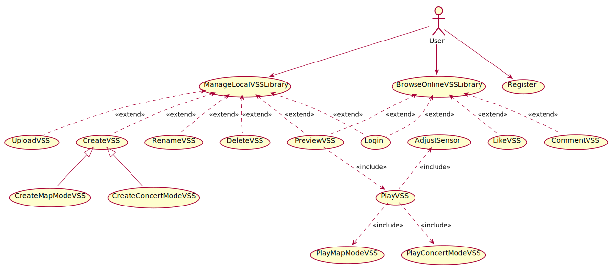
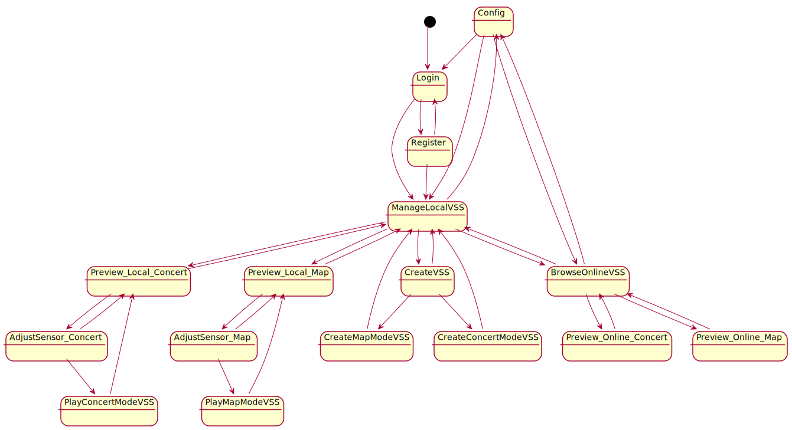

# AudioAR项目 软件需求规约

版本 <7>

修订历史

[@文档commit历史](https://github.com/AudioAR/doc/commits/master/%E9%9C%80%E6%B1%82%E5%AE%9A%E4%B9%89/%E8%BD%AF%E4%BB%B6%E9%9C%80%E6%B1%82%E8%A7%84%E7%BA%A6.md)

|日期|版本|修订说明|作者|
|:-:|:-:|:-|:-|
|2018-04-10|0|建立模版|丁雨晨|
|2018-04-13|1|按照模板填充系统要求|丁雨晨|
|2018-04-15|2|完善3.1-3.3部分|缪本杰|
|2018-04-16|3|完善系统模型|丁雨晨|
|2018-04-16|4|添加了场景|缪本杰|
|2018-04-17|5|添加了用例|缪本杰|
|2018-04-17|6|增加了用例图和UI状态机图|-|
|2018-04-21|7|分析阶段对象模型|罗铨|
|2018-04-21|7|分析阶段动态模型|李东岳|
|2018-04-21|7|分析阶段顺序图|丁雨晨|

[TOC]

## 1引言
### 1.1编写目的
拟定软件需求规约，初步确定软件总体的需求和目标。这是为了确定项目总体实施框架，细化量化用户可能的需求，为软件设计和实现指明方向。本规约同时也限定了软件开发的适用范围和禁区，避免随之而来的不利后果，增强项目开发的针对性和合理性。此文档不仅面向软件开发者，还为项目审核人员及用户提供参考。在设计和实现中如遇到特殊情况，将完全有可能修改此文档，因此仅有本文档的最新版本具有参考价值。

### 1.2适用范围
此文档适用于AudioAR项目的全部软件及系统，将从总体上限定项目的开发目标和框架。

### 1.3定义
相关定义见词汇表[@doc/需求定义/词汇表.md](https://github.com/AudioAR/doc/blob/master/%E9%9C%80%E6%B1%82%E5%AE%9A%E4%B9%89/%E8%AF%8D%E6%B1%87%E8%A1%A8.md)


### 1.4参考资料
|文件标题|文件编号|发表日期|出版单位|来源|
|:-:|:-|:-|:-|:-|
|面向对象软件工程实践指南|ISBN9787313162182|2016年 12月 第1版|上海交通大学出版社|图书资料|
|软件需求规约模版|-|-|-|课程资料|
### 1.5概述
为了满足用户对于现实生活中的声音在虚拟空间中重现的需求，本产品应当完成对用户位置信息的获取、声音资源的输入输出、立体声场的构建和其他和用户的交互功能。
为此，不仅仅需要重现现实固有的声音资源，还有能够任意地产生需要的声场，这将是对软件实用性的综合考验。本文档将从顶层视角大致规定软件的开发需求，将从已有系统的概况、希望完成的改进系统的功能与非功能需求、以及目标系统应当可以实现的应用场景和用例模型这些方面进行介绍。本文档将需要以用户视角为主要视角来叙述，力求满足在将来应用中对用户的友好和对用户需求的友好。

## 2目前系统

[@doc/计划/可行性研究报告.md#行业现有系统分析](https://github.com/AudioAR/doc/blob/master/%E8%AE%A1%E5%88%92/%E5%8F%AF%E8%A1%8C%E6%80%A7%E7%A0%94%E7%A9%B6%E6%8A%A5%E5%91%8A.md#3-%E8%A1%8C%E4%B8%9A%E7%8E%B0%E6%9C%89%E7%B3%BB%E7%BB%9F%E5%88%86%E6%9E%90)

## 3建议的系统
### 3.1概述
[@doc/计划/可行性研究报告.md#所建议的系统](https://github.com/AudioAR/doc/blob/master/%E8%AE%A1%E5%88%92/%E5%8F%AF%E8%A1%8C%E6%80%A7%E7%A0%94%E7%A9%B6%E6%8A%A5%E5%91%8A.md#4-%E6%89%80%E5%BB%BA%E8%AE%AE%E7%9A%84%E7%B3%BB%E7%BB%9F)
### 3.2功能需求
#### 3.2.1用户管理
用户注册、登陆、注销账户与个人信息设置
#### 3.2.2虚拟声音空间管理
允许用户构建、修改在虚拟声音空间，声音具有立体位置、一定的触发条件、一定的播放方式
#### 3.2.3虚拟声音空间游览
进行实时立体声音生成，通过耳机传递给用户，产生逼真的空间声音效果
#### 3.2.4空间音频图像化(可能)
给用户提供一定的图像反馈，形式包括地图、声音定位罗盘等
#### 3.2.5用户的社交功能(可能)
用户可以与其他用户添加好友，分享本地音频库、虚拟声音空间库，相互点赞、评论等
#### 3.2.6基于空间立体音频的二次应用(可能)
用户可以通过空间立体音频来进行单人、多人的游戏

### 3.3非功能需求
#### 3.3.1可用性
-   良好的实时性，实时生成的音频流不具有明显的卡顿
-   声音的真实性，音频流与真实的立体声音难以区分
#### 3.3.2可靠性
-   在软件设计要求的运行环境内可以长时间、无差错、少维护地工作，减少软件框架或主要内容大量修改的可能性
#### 3.3.3性能
-   一般的精度，处理传感器数据生成的位置信息具有水平5m左右，垂直20cm左右的精确度；头部运动捕捉比较准确
-   实时的信息处理交互，使用户可以真实感受声音的播发而无明显卡顿、滞后
#### 3.3.4可支持性
-   可扩展的吞吐量和服务提供能力，服务器能稳定提供几名用户的资源请求和相关通讯
#### 3.3.5设计约束

可参见[@doc/项目开发计划](https://github.com/AudioAR/doc/blob/master/%E8%AE%A1%E5%88%92/%E9%A1%B9%E7%9B%AE%E5%BC%80%E5%8F%91%E8%AE%A1%E5%88%92.md#41-%E6%8A%80%E6%9C%AF%E6%A0%87%E5%87%86)

#### 3.3.6 接口
##### 3.3.6.1用户界面
-  手机应用端的用户界面，主要给用户提供必要的流程提示、可视化场景与、
交互场景。
-  管理端的用户界面主要给系统管理员进行用户和系统的管理。
-  用户界面以简约为风格。用户界面的主要内容见3.4.3系统界面部分。

##### 3.3.6.2 硬件接口

使用维特智能9轴姿态角度传感器或者手机自带的传感器进行开发
[@产品简介](http://www.wit-motion.com/index.php?m=goods&a=details&content_id=43)。
-    传感器测量值转化为蓝牙串口信号传输到上位机
-    具体信号编码规范见传感器说明书

##### 3.3.6.3 软件接口
本项目目前主要用到了以下开发包
-  [Google VR](https://vr.google.com/)
    该开发包主要用来根据传入的位置参数产生空间音源
- [百度地图开放平台](https://lbsyun.baidu.com/)
    该开发包主要完成地图功能
##### 3.3.6.4通信接口
使用HTTP接口来实现本机到服务器端的通信。

#### 3.3.7 法律、版权及其他声明
参见[@可行性研究报告-法律方面的可行性](https://github.com/AudioAR/doc/blob/master/%E8%AE%A1%E5%88%92/%E5%8F%AF%E8%A1%8C%E6%80%A7%E7%A0%94%E7%A9%B6%E6%8A%A5%E5%91%8A.md#71-%E6%B3%95%E5%BE%8B%E6%96%B9%E9%9D%A2%E7%9A%84%E5%8F%AF%E8%A1%8C%E6%80%A7)
#### 3.3.8 适用的标准
参见[@项目开发计划-技术流程计划](https://github.com/AudioAR/doc/blob/master/%E8%AE%A1%E5%88%92/%E9%A1%B9%E7%9B%AE%E5%BC%80%E5%8F%91%E8%AE%A1%E5%88%92.md#4-%E6%8A%80%E6%9C%AF%E6%B5%81%E7%A8%8B%E8%AE%A1%E5%88%92)

### 3.4 系统模型
本节使用UML中的概念、方法和模型图来详细表达需求。
#### 3.4.1场景

| 场景名称 | 用户注册 |
| :---: | :--------- |
| **参与者实例** | 用户小刘 |
| **事件流** |
| 1 | 小刘对进入系统并且选择注册用户，系统出现了注册界面 |
| 2 | 小刘输入了个人信息，包括用户名、密码、邮箱、地理位置等，系统进行验证，发现小刘的输入合法 |
| 3 | 小刘成功注册，系统进入登录界面 |

| 场景名称 | 用户登录 |
| :---: | :--------- |
| **参与者实例** | 用户小刘 |
| **事件流** |
|1|小刘进入了系统登录界面|
|2|小刘输入了用户名和密码，但是不小心输错了密码，系统提示密码错误，并提示重新输入用户名密码|
|3|小刘输入了正确的用户名和密码，系统成功登录，进入本地虚拟声音空间库管理界面|

| 场景名称 | 用户管理本地虚拟声音空间库（制作新的虚拟声音空间、地图模式） |
| :---: | :--------- |
| **参与者实例** | 用户小刘 |
| **事件流** |
|1|小刘进入了用户本地虚拟声音空间库（下面简称本地库），选择制作新的虚拟声音空间（VSS），系统跳转到VSS制作界面，提供了模式选择“地图模式”，“音乐会模式”|
|2|小刘选择了地图模式，系统将自动定位到小刘当前所在的位置|
|3|小刘在本地的音频文件中选择上传的音频片段，并且设置其经纬度、高度等位置参数与音量、循环模式等播放参数|
|4|小刘重复步骤（3），直到所有的本地音频文件已经被上传完成|
|5|小刘发现某一音频文件上传设置错误，删除了该音频片段|
|6|小刘制作VSS完毕，选择制作完成选项，系统提示小刘为VSS命名|
|7|小刘输入名字，确认后完成该VSS制作，返回本地VSS库管理界面|

| 场景名称 | 用户管理本地虚拟声音空间库（制作新的虚拟声音空间、音乐会模式） |
| :---: | :--------- |
| **参与者实例** | 用户小刘 |
| **事件流** |
|1|小刘进入了用户本地虚拟声音空间库（下面简称本地库），选择制作新的虚拟声音空间（VSS），系统跳转到VSS制作界面，提供了模式选择“地图模式”，“音乐会模式”|
|2|小刘选择了音乐会模式，系统将显示一个虚拟空间|
|3|小刘在本地的音频文件中选择上传的音频片段，以播放列表的形式上传|
|4|小刘重复步骤（3），直到所有的本地音频文件已经被上传完成|
|5|小刘删除了播放列表内某音频片段|
|6|小刘改变了播放列表顺序|
|7|小刘制作VSS完毕，选择制作完成选项，系统提示小刘为VSS命名|
|8|小刘输入名字，确认后完成该VSS制作，返回本地VSS库管理界面|

| 场景名称 | 用户管理本地虚拟声音空间库（重命名，删除，上传功能） |
| :---: | :--------- |
| **参与者实例** | 用户小刘 |
| **事件流** |
|1|小刘进入了用户本地虚拟声音空间库（下面简称本地库），系统还提供对虚拟声音空间的重命名、删除、上传功能|
|2|小刘想把名字为B的VSS改名为C，选择相应选项后系统出现了重命名界面，小刘输入了新的音频名字并且确认后该片段命名被改变|
|3|小刘想把名字为D的VSS删除，选择了相应选项后系统出现确认删除界面，小刘确认后该片段被删除|
|5|小刘想把自己制作的名字为E的VSS上传到在线虚拟声音空间库，选择上传选项后系统将该VSS的信息上传到服务器上|
|6|小刘完成了本地库管理，退出了管理界面|

| 场景名称 | 浏览在线虚拟声音空间库 |
| :---: | :--------- |
| **参与者实例** | 用户小刘 |
| **事件流** |
|1|小刘进入了在线虚拟声音空间（VSS）库，界面上显示了由自己和其他用户上传的所有VSS与其简介信息|
|2|小刘看中了某VSS，进入了该VSS的预览界面，界面上显示了其简介、音频信息等基本信息|
|3|小刘决定下载该VSS。小刘选择下载到本地，系统将该VSS的所有内容（包括本地不存在的音频文件）下载到本地|
|4|小刘进入了另一VSS的预览，对这个VSS的游览效果好评有加，对VSS点赞并加以评论|
|5|小刘在自己上传的某VSS中得到了别人的评论，小刘回复了自己的评论|
|5|小刘完成了浏览，回到本地|


| 场景名称 | 传感器校准 |
| :---: | :--------- |
| **参与者实例** | 用户小刘 |
| **事件流** |
|1|小刘在游览虚拟声音空间之前，系统提示小刘进行了传感器校准|
|2|小刘根据屏幕上的提示进行传感器校准|
|3|小刘完成传感器校准，系统进入VSS游览界面|

| 场景名称 | 游览虚拟声音空间（地图模式） |
| :---: | :--------- |
| **参与者实例** | 用户小刘 |
| **事件流** |
|1|小刘在本地虚拟声音空间（VSS）库中选择了某个地图模式下的VSS，系统进入了该VSS的预览界面，显示了其简介、音频信息等基本信息|
|2|小刘选择开始游览，系统进入游览界面，读取该VSS并提示用户带上传感器和耳机|
|3|小刘移动到该VSS所在的位置附近，听到了合成的空间声场，同时，在界面上也显示了用户所在位置及图中空间声源的可视化描述|
|4|小刘移动自己的位置和自己头的方位，空间声场也实时变化|
|5|小刘不想听了，退出了虚拟声音空间体验|

| 场景名称 | 游览虚拟声音空间（音乐会模式）|
| :---: | :--------- |
| **参与者实例** | 用户小刘 |
| **事件流** |
|1|小刘选择了本地虚拟声音空间（VSS）库中的某个音乐会模式下的VSS，系统读取该VSS并提示用户带上传感器和耳机，并进行传感器校准|
|2|小刘找了个舒服的椅子坐下，点击播放，小刘听到了虚拟的立体声效果|
|3|小刘移动自己头的方位，空间声场也实时变化|
|4|小刘又不想听了，退出了虚拟声音空间体验|


#### 3.4.2用例模型
|参与者名称|参与者解释|
|:-:|:-:|
|用户|本系统的最终使用者，拥有用户账号，是本系统主要面向的对象|

|用例|用例级别|用例描述|
|:-:|:-:|:-:|
|Register|用户目标|用户注册身份信息，申请使用该系统|
|Login|子功能|用户提交身份信息，通过核验进入系统主界面|
|ManageLocalVSSLibrary|用户目标|管理本地虚拟声音空间库|
|CreateVSS|抽象子功能|制作虚拟声音空间|
|CreateMapModeVSS|子功能|制作地图模式虚拟声音空间|
|CreateConcertModeVSS|子功能|制作音乐厅模式虚拟声音空间|
|RenameVSS|子功能|重命名虚拟声音空间|
|DeleteVSS|子功能|删除虚拟声音空间|
|UploadVSS|子功能|上传虚拟声音空间|
|LikeVSS|子功能|为虚拟声音空间点赞|
|DownloadVSS|子功能|下载虚拟声音空间|
|CommentVSS|子功能|评论虚拟声音空间|
|PlayVSS|用户目标|用户体验AR声音空间|
|PlayMapModeVSS|子功能|用户体验地图模式AR声音空间|
|PlayConcertModeVSS|子功能|用户体验音乐厅模式AR声音空间|
|BrowseOnlineVSSLibrary|用户目标|浏览在线虚拟声音空间库|
|AdjustSensor|子功能|校准传感器|
|Preview|子功能|查看虚拟声音空间、音频片段的详细信息|

##### 用例图


```PlantUML
@startuml
(ManageLocalVSSLibrary) <.. (Login): <<extend>>
(BrowseOnlineVSSLibrary) <.. (Login): <<extend>>

User --> (Register)
User --> (ManageLocalVSSLibrary)
User --> (BrowseOnlineVSSLibrary)

(ManageLocalVSSLibrary) <.. (CreateVSS): <<extend>>
(CreateVSS) <|-- (CreateMapModeVSS)
(CreateVSS) <|-- (CreateConcertModeVSS)
(ManageLocalVSSLibrary) <.. (RenameVSS): <<extend>>
(ManageLocalVSSLibrary) <.. (DeleteVSS): <<extend>>
(ManageLocalVSSLibrary) <.. (UploadVSS): <<extend>>
(BrowseOnlineVSSLibrary) <.. (LikeVSS): <<extend>>
(PlayVSS) ..> (PlayMapModeVSS): <<include>>
(PlayVSS) ..> (PlayConcertModeVSS): <<include>>
(BrowseOnlineVSSLibrary) <.. (CommentVSS): <<extend>>

(AdjustSensor) <.. (PlayVSS): <<include>>

(ManageLocalVSSLibrary) <.. (PreviewVSS): <<extend>>
(BrowseOnlineVSSLibrary) <.. (PreviewVSS): <<extend>>

(PreviewVSS) ..> (PlayVSS): <<include>>

@enduml
```

##### 用例详细

###### 1. Register

| 用例名称 | Register |
| :---: | :--------- |
| **参与者** | 用户 |
| **范围** | 系统用例 |
| **前置条件** | 无 |
| **后置条件** | 用户完成注册 |
|| **主流程** |
|1|用户在界面上请求注册|
|2|系统收到用户的请求，跳转到注册页面，展示注册表单|
|3|⽤户填写注册表单的⽤户名、登录密码、确认登录密码、电⼦邮箱，填写完成后请求确认注册|
|4|系统判别表单信息是否有效，若有效系统提示注册成功，用户自动登陆，并跳转⾄本地VSS管理界⾯|
|| **扩展流程** |
||注册表单信息⽆效|
|1|在第3步，⽤户填写的登录密码不合法。系统提示⽤户填写的登录密码过短、过⻓或过于筒单，请⽤户修改⼀个合法的密码后重新提交|
|2|在第3步，⽤户填写的确认登录密码和登录密码不⼀致。系统提示⽤户两次填写的登录密码不⼀致，请⽤户检查修改后重新提交|
|3|在第3步，⽤户填写的⽤户名已被注册，系统提示⽤户该⽤户名已被注册，请⽤户修改后重新提交再试|
|4|在第3步，⽤户填写的电⼦邮箱已被注册。系统提示⽤户该电⼦邮箱已被注册，请⽤户检查修改后重新提交|
| **特殊需求** |无|
| **发生频率** |一般，每个用户会发生一次|

###### 2. Login

| 用例名称 | Login |
| :---: | :--------- |
| **参与者** | 用户 |
| **范围** | 子功能 |
| **前置条件** | 用户进入登录界面 |
| **后置条件** | 用户成功进入系统 |
|| **主流程** |
|1|用户请求登录系统|
|2|系统收到⽤户的请求，跳转到登录页面，展示登录表单供填写|
|3|⽤户填写登录表单的⽤户名和登录密码。填写完成后请求登录，系统判别表单信息是否有效，若有效系统提示登陆成功，并跳转到本地VSS管理界面|
|| **扩展流程** |
||登录信息⽆效|
|1|在第3步，⽤户填写的⽤户名和密码不合法|
|2|在第3步，⽤户填写的⽤户名不存在。系统提示⽤户该⽤户名不存在，请⽤户检查修改后重新提交|
|3|在第3步，⽤户填写的登录密码不正确。系统提示⽤户填写的⽤户名或登录密码有误。请⽤户检查修改后重新提交|
| **特殊需求** |无|
| **发生频率** |经常|

###### 3. ManageLocalVSSLibrary

| 用例名称 | ManageLocalVSSLibrary |
| :---: | :--------- |
| **参与者** | 用户 |
| **范围** | 系统用例 |
| **前置条件** | 用户已登录，进入本地虚拟声音空间（VSS）库管理界面 |
| **后置条件** | 用户游览某VSS、进入“浏览在线虚拟声音空间库”或者退出系统 |
|| **主流程** |
|1|用户进入VSS库管理界面|
|2|用户进行一系列操作，包括制作新的VSS，重命名VSS，删除VSS，上传VSS，预览本地VSS|
|3|用户完成本地VSS库管理|
|| **扩展流程** |
|1|若用户选择制作新的VSS，进入用例CreateVSS|
|2|若用户选择删除VSS，进入用例DeleteVSS|
|3|若用户选择重命名VSS，进入用例RenameVSS|
|4|若用户选择上传VSS，进入用例UploadVSS|
|5|若用户选择预览VSS，进入用例PreviewVSS|
| **特殊需求** |无|
| **发生频率** |经常|


###### 4. CreateVSS

| 用例名称 | CreateVSS |
| :---: | :--------- |
| **参与者** | 用户 |
| **范围** | 子功能 |
| **前置条件** | 用户已登录，通过本地虚拟声音空间（VSS）库管理界面进入该用例 |
| **后置条件** | 用户完成制作VSS |
|| **主流程** |
|1|系统提示用户选择模式，包括地图模式和音乐会模式|
|2|若用户选择“地图模式”，进入用例CreateMapModeVSS；若用户选择“音乐会模式”，进入用例CreateConcertModeVSS|
|3|用户完成VSS创建，该VSS被保存在本地VSS库，同时系统回到用例ManageLocalVSSLibrary|
|| **扩展流程** |
||用户取消操作|
|1|在用例任何步骤中，用户可以取消该操作；若取消，则回到用例ManageLocalVSSLibrary，不进行任何修改|
| **特殊需求** |不允许用户重用虚拟声源以上的任何信息，只允许用户重用音频文件对象。当用户创建虚拟声源的时候，他既可以添加一个新的本地音频文件创建新的音频文件对象，也可以从本地VSS库可以访问到的所有VSS中提取出来的音频文件对象中选择一个现有的。|
| **发生频率** |经常|


###### 5. CreateMapModeVSS

| 用例名称 | CreateMapModeVSS |
| :---: | :--------- |
| **参与者** | 用户 |
| **范围** | 子功能 |
| **前置条件** | 用户由用例CreateVSS进入，用户选择制作地图模式的VSS |
| **后置条件** | 用户完成制作地图模式的VSS，返回用例CreateVSS |
|| **主流程** |
|1|根据用户的地理位置，系统定位至用户当前位置|
|2|用户在本地音频库中不断选择音频上传，并设置其经纬度、高度等位置信息和音量、循环模式等播放信息。系统默认将用户头部所在的位置作为虚拟音源的位置|
|3|用户完成所有音频上传，回到用例CreateVSS|
|| **扩展流程** |
||用户希望删除已上传的音频|
|1|在第2步时，如果用户上传音频或者设置参数有误，可以选择删除该音频|
| **特殊需求** |无|
| **发生频率** |经常|


###### 6. CreateConcertModeVSS

| 用例名称 | CreateConcertModeVSS |
| :---: | :--------- |
| **参与者** | 用户 |
| **范围** | 子功能 |
| **前置条件** | 用户由用例CreateVSS进入，选择制作音乐会模式的VSS |
| **后置条件** | 用户完成制作音乐会模式的VSS，返回用例CreateVSS |
|| **主流程** |
|1|用户在本地音频库中不断选择音频上传至播放列表|
|2|用户调整播放列表的播放顺序|
|3|用户输入VSS的名称和简介（默认为空），并确认输入。系统检查VSS名称和简介的合法性。|
|4|用户完成所有音频上传，回到用例CreateVSS|
|| **扩展流程** |
||用户希望删除已上传的音频|
|1|在第2步时，如果用户上传音频有误，可以选择删除该音频|
||用户输入不合法|
|2|在第3步时，用户重新输入相关信息|
| **发生频率** |经常|

###### 7. RenameVSS

| 用例名称 | RenameVSS |
| :---: | :--------- |
| **参与者** | 用户 |
| **范围** | 子功能 |
| **前置条件** | 用户已登录，通过本地虚拟声音空间（VSS）库管理界面进入该用例 |
| **后置条件** | 用户完成重命名VSS |
|| **主流程** |
|1|系统提示用户输入某VSS的新的名字和简介|
|2|用户输入VSS的新的名字，系统检测其合法性|
|3|若合法，系统完成重命名，在本地库中该VSS的名字改变，同时回到用例ManageLocalVSSLibrary|
|| **扩展流程** |
||用户输入名字不合法|
|1|在第2步时，如果与现有VSS重名，则提示重名并要求用户重新输入|
|2|在第2步时，如果输入名字和简介带有非法字符，则提示用户重新输入|
||用户取消操作|
|1|在用例任何步骤中，用户可以取消该操作；若取消，则回到用例ManageLocalVSSLibrary，不进行任何修改|
| **特殊需求** |无|
| **发生频率** |经常|

###### 8. DeleteVSS

| 用例名称 | DeleteVSS |
| :---: | :--------- |
| **参与者** | 用户 |
| **范围** | 子功能 |
| **前置条件** | 用户已登录，通过本地虚拟声音空间（VSS）库管理界面进入该用例 |
| **后置条件** | 用户完成删除VSS |
|| **主流程** |
|1|系统询问用户是否确认删除该VSS|
|2|用户确认删除操作，在本地库中该VSS被删除改变，同时回到用例ManageLocalVSSLibrary|
|| **扩展流程** |
||用户取消操作|
|1|在用例任何步骤中，用户可以取消该操作；若取消，则回到用例ManageLocalVSSLibrary，不进行任何修改|
| **特殊需求** |无|
| **发生频率** |经常|

###### 9. UploadVSS

| 用例名称 | UploadVSS |
| :---: | :--------- |
| **参与者** | 用户 |
| **范围** | 子功能 |
| **前置条件** | 用户已登录，通过本地VSS库管理界面进入该用例 |
| **后置条件** | 用户完成上传VSS |
|| **主流程** |
|1|系统提示用户是否确认上传该VSS|
|2|用户确认上传操作，系统提示用户输入该VSS在在线虚拟声音空间库中的名字（默认为本地库中的名字）和简介（默认为空）|
|3|用户完成名字和简介输入，系统将该VSS保存在服务器，同时也保存在在线虚拟声音空间库中。同时回到用例ManageLocalVSSLibrary|
|4|在线虚拟声音库中出现了上传的VSS，同时本地的VSS保持不变，上传的VSS被永久归档，不可更改。|
|| **扩展流程** |
||用户输入名字不合法|
|1|在第2步时，如果与现有VSS重名，则提示重名并要求用户重新输入|
|2|在第2步时，如果输入名字带有非法字符，则提示用户重新输入|
||用户取消操作|
|1|在用例任何步骤中，用户可以取消该操作；若取消，则回到用例ManageLocalVSSLibrary，不进行任何修改|
| **特殊需求** |禁止上传者删除已经上传的VSS，上传者一旦上传VSS，该VSS脱离其控制，成为公共资源。|
| **发生频率** |经常|


###### 10. PreviewVSS

| 用例名称 | PreviewVSS |
| :---: | :--------- |
| **参与者** | 用户 |
| **范围** | 子功能 |
| **前置条件** | 用户已登录，通过本地VSS库管理或者在线VSS浏览界面进入该用例 |
| **后置条件** | 用户完成预览VSS，返回之前界面；或者开始游览，进入用例PlayVSS |
|| **主流程** |
|1|用户预览VSS，系统显示预览的界面，进入Preview用例 |
|2|如果是本地VSS，用户可以进入用例PlayVSS；如果是在线VSS，用户可以进入用例DownloadVSS，LikeVSS和CommentVSS。如果系统发现某一个在线音频库有一个本地副本，系统将拒绝重复下载|
|3|用户完成预览，退出PreviewVSS，返回父用例|
|| **扩展流程** |
||无|
| **特殊需求** |无|
| **发生频率** |经常|

###### 11. BrowseOnlineVSSLibrary

**简洁起见，禁止该用例进行任何评论，Like和下载操作，用户只能够进入Preview进行相关操作。**

| 用例名称 | BrowseOnlineVSSLibrary |
| :---: | :--------- |
| **参与者** | 用户 |
| **范围** | 系统用例 |
| **前置条件** | 用户已登录，浏览在线虚拟声音空间（VSS）库 |
| **后置条件** | 用户完成浏览在线VSS库，返回本地库；或者退出系统 |
|| **主流程** |
|1|用户浏览在线库，界面上出现所有用户上传的VSS，用户可以阅读各个VSS的简介|
|2|用户选择某个VSS进行预览，进入用例PreviewVSS。浏览结束后回到浏览界面。|
|3|用户完成浏览|
|| **扩展流程** |
||无|
| **特殊需求** |无|
| **发生频率** |经常|


###### 12. DownloadVSS

**这里的进度利用Android系统提供的通知功能完成。**

| 用例名称 | DownloadVSS |
| :---: | :--------- |
| **参与者** | 用户 |
| **范围** | 子功能 |
| **前置条件** | 用户在预览在线虚拟声音空间（VSS），想要下载该VSS |
| **后置条件** | 用户完成下载或放弃下载 |
|| **主流程** |
|1|系统提示是否确认下载该在线VSS|
|2|用户确认下载，之后系统将在线VSS下载到本地，并保存在本地VSS中。系统实时通知用户下载的进度。|
|3|用户完成下载，返回BrowseOnlineVSSLibrary|
|| **扩展流程** |
||用户取消操作|
|1|在用例任何步骤中，用户可以取消该操作；若取消，则回到用例PreviewVSS，不进行任何修改|
| **特殊需求** |不维护本地缓存的VSS和在线VSS之间的同步性，两个VSS是完全不想干的对象。|
| **发生频率** |经常|

###### 13. LikeVSS

| 用例名称 | LikeVSS |
| :---: | :--------- |
| **参与者** | 用户 |
| **范围** | 子功能 |
| **前置条件** | 用户在预览在线虚拟声音空间（VSS），想要点赞该VSS |
| **后置条件** | 用户完成点赞 |
|| **主流程** |
|1|用户选择点赞，系统显示用户点赞成功，并且显示对该VSS点赞的用户列表|
|2|完成点赞|
|| **扩展流程** |
||无|
| **特殊需求** |无|
| **发生频率** |经常|


###### 14. CommentVSS

| 用例名称 | CommentVSS |
| :---: | :--------- |
| **参与者** | 用户 |
| **范围** | 子功能 |
| **前置条件** | 用户在预览在线虚拟声音空间（VSS），想要评论该VSS |
| **后置条件** | 用户完成评论或放弃评论 |
|| **主流程** |
|1|用户在预览界面的评论输入框|
|2|用户编辑评论，完成后选择确定评论|
|3|系统在历史评论列表的最下方显示新增加的评论|
|| **扩展流程** |
||用户取消操作|
|1|在用例任何步骤中，用户可以取消该操作；若取消，则回到用例PreviewVSS，不进行任何修改|
| **特殊需求** |无|
| **发生频率** |经常|


###### 15. PlayVSS

| 用例名称 | PlayVSS |
| :---: | :--------- |
| **参与者** | 用户 |
| **范围** | 抽象子功能 |
| **前置条件** | 用户在预览本地虚拟声音空间（VSS），想要游览该VSS|
| **后置条件** | 用户完成游览，返回用例PreviewVSS |
|| **主流程** |
|1|系统提示用户进行传感器校准，进入用例AdjustSensor，AdjustSensor自动进行相应模式的传感器匹配过程，之后用户正确佩戴传感器|
|2|用户开始该VSS的预览。若该VSS是地图模式的，进入用例PlayMapModeVSS；若该VSS是音乐会模式的，进入用例PlayConcertModeVSS|
|3|用户终止游览，返回用例PreviewVSS|
|| **扩展流程** |
||用户取消操作|
|1|在用例任何步骤中，用户可以取消该操作；若取消，则回到用例PreviewVSS，不进行任何修改|
| **特殊需求** |无|
| **发生频率** |经常|


###### 16. PlayMapModeVSS

| 用例名称 | PlayMapModeVSS |
| :---: | :--------- |
| **参与者** | 用户 |
| **范围** | 子功能 |
| **前置条件** | 在用例PlayVSS中用户游览地图模式下的VSS |
| **后置条件** | 无 |
|| **主流程** |
|1|系统读取该VSS的音频信息，并读取用户位置，进入游览界面|
|2|系统根据用户的地理位置和头部方位不断生成模拟的空间声场，让用户进行欣赏|
|| **扩展流程** |
||无|
| **特殊需求** |无|
| **发生频率** |经常|

###### 17. PlayConcertModeVSS

| 用例名称 | PlayConcertModeVSS |
| :---: | :--------- |
| **参与者** | 用户 |
| **范围** | 子功能 |
| **前置条件** | 在用例PlayVSS中用户游览音乐会模式下的VSS |
| **后置条件** | 无 |
|| **主流程** |
|1|系统读取该VSS的音频信息，进入虚拟音乐会收听界面，提示用户佩戴传感器和耳机|
|2|系统根据用户的头部方位不断生成模拟的空间声场，让用户进行欣赏|
|| **扩展流程** |
||无|
| **特殊需求** |无|
| **发生频率** |经常|

###### 18. AdjustSensor

| 用例名称 | AdjustSensor |
| :---: | :--------- |
| **参与者** | 用户 |
| **范围** | 子功能 |
| **前置条件** | 在用例PlayVSS中，用于用户调整传感器 |
| **后置条件** | 用户取消操作，直接进入PreviewVSS用例；或者用户完成传感器校准，进入用例PlayVSS |
|| **主流程** |
|1|系统提示用户根据要求佩戴好传感器。系统根据VSS模式不同进行不同的流程。|
|2|用户根据系统的提示进行传感器的校准|
|| **扩展流程** |
||无|
| **特殊需求** |无|
| **发生频率** |经常|

#### 3.4.3对象模型
##### 实体类定义表
|实体类名称|属性|关联类|定义|
|:-:|:-:|:-:|:-:|
| User | UserID: int<br />Username: String<br />Password: String<br />E-mail: String<br />UserProfile: Imageformat | VirtualSoundSpace<br />SoundSource<br />Sensor<br />SoundSpaceLibrary | 用户信息类，保存用户名、密码、邮箱及用户ID |
| SoundSource | SoundSourceID: int<br />SoundFragment: Soundformat<br />SoundName: String<br />SoundLatitude: double<br />SoundLongitude: double<br />SoundAltitude: double<br />SoundVolume: int<br />SoundPattern: String | VirtualSoundSpace<br />User | 虚拟声源类，保存虚拟声源文件、虚拟声源名称、经纬度、高度、音量、播放模式及虚拟声源ID |
| VirtualSoundSpace | SoundSources: List<br />VSSName: String<br />VSS_ID: int<br />OwnerID: int<br />VSSDescription: String<br />Comments: List<br />Likes: List | User<br />SoundSource<br />CommentList<br />Like<br />SoundSpaceLibrary | 保存该用户上传的所有虚拟声源的列表，保存虚拟声源空间的名称、所有者ID、虚拟声源空间ID、用户评论及用户点赞列表 |
| Comment | CommenterID: int<br />Comments: String | CommentList | 保存评论者ID以及其评论 |
| CommentList | Comments: List | Comment<br />VirtualSoundSpace | 保存VSS的评论列表 |
| Like | LikerIDs: List<br />LikeCount: int | VirtualSoundSpace | 保存点赞用户列表以及点赞数目 |
| SoundSpaceLibrary | VirtualSoundSpaces: List<br />LibraryID: int<br />LibraryName: String | VirtualSoundSpace<br />User | 保存用户制作的所有VSS的列表、库ID、库名称 |
| Sensor | Status: String<br />SensorID: int | User | 保存与软件适配的传感器状态及传感器ID |
##### 边界类定义表
|边界类名称|定义|
|:-:|:-:|
| RegisterPage | 注册页面 |
| PersonalInfoPage | 用户信息表单 |
| LoginPage | 登陆页面 |
| VSSManagerPage | 本地VSS库管理界面 |
| CreateVSSPage | 创建虚拟声源空间界面 |
| OnlineVSSPage | 在线VSS浏览界面 |
| VSSPreviewerPage | VSS预览界面 |
| VSSViewingPage | VSS浏览界面 |
| LikeListPage | 展示点赞用户列表 |
| CommentPage | 展开评论框供用户编辑 |
| CommentListPage | 显示评论列表 |
| SensorPage | 传感器调整界面 |
##### 控制类定义表
|控制类名称|定义|
|:-:|:-:|
| UserInfoControl | 控制用户注册、登陆和查看个人本地VSS的过程 |
| VSSControl | 控制用户导入音频生成VSS、游览和预览VSS、修改VSS信息的过程 |
| VSSLibraryControl | 控制用户对VSS库的添加、删除、上传、下载的过程 |
| SocialControl | 控制用户在在线VSS库中评论、点赞的过程 |
| SensorControl | 控制用户调整传感器的过程 |


所有实体对象类类图如下所示

Alert("Please use relative link instead of http links from github.")

所有类的类图如下所示

TODO("Class diagrams are under construction.")

#### 3.4.4动态模型
##### 1）系统顺序图与操作契约

[@./系统顺序图与操作契约/动态模型_系统顺序图和操作契约.md](./系统顺序图与操作契约/动态模型_系统顺序图和操作契约.md)

##### 2）顺序图

TODO("Sequense diagrams should be redone.")

##### 3）状态图

#### 3.4.5用户界面

##### 主要用户界面列表和说明

##### 基本用户界面示意图:

[@下载用户界面 Mockup PDF](https://jbox.sjtu.edu.cn/l/MoZdW3)

暂时没绘制传感器校准和PlayVSS部分的界面示意图

##### 用户界面流程图



**Config 应该支持注销功能，注销之后应该回到主页面，在之后的文档编辑中会加入这个内容。**

**Preview 和 AdjustSensor 根据内容的类型进行判断，显示不同的内容，这里通过下划线进行不同显示内容的区分。**

```PlantUML
@startuml
Config --> Login

[*] --> Login
Login --> Register
Register --> Login
Register --> ManageLocalVSS
Login --> ManageLocalVSS
ManageLocalVSS --> Preview_Local_Map
ManageLocalVSS --> Preview_Local_Concert
Preview_Local_Map --> ManageLocalVSS
Preview_Local_Concert --> ManageLocalVSS
Preview_Local_Map --> AdjustSensor_Map
Preview_Local_Concert --> AdjustSensor_Concert
AdjustSensor_Map --> Preview_Local_Map
AdjustSensor_Concert --> Preview_Local_Concert
AdjustSensor_Map --> PlayMapModeVSS
AdjustSensor_Concert --> PlayConcertModeVSS
PlayMapModeVSS --> Preview_Local_Map
PlayConcertModeVSS --> Preview_Local_Concert
ManageLocalVSS --> BrowseOnlineVSS
BrowseOnlineVSS --> ManageLocalVSS
BrowseOnlineVSS --> Config
Config --> BrowseOnlineVSS
ManageLocalVSS --> Config
Config --> ManageLocalVSS
BrowseOnlineVSS --> Preview_Online_Concert
Preview_Online_Concert --> BrowseOnlineVSS
BrowseOnlineVSS --> Preview_Online_Map
Preview_Online_Map --> BrowseOnlineVSS
ManageLocalVSS --> CreateVSS
CreateVSS --> ManageLocalVSS
CreateVSS --> CreateMapModeVSS
CreateMapModeVSS --> ManageLocalVSS
CreateVSS --> CreateConcertModeVSS
CreateConcertModeVSS --> ManageLocalVSS


@enduml
```
