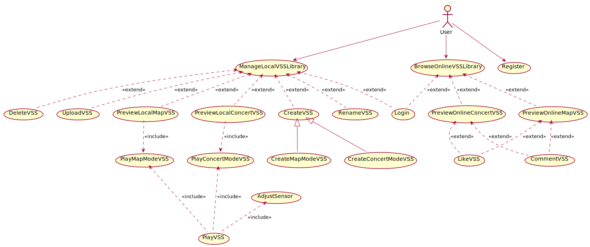
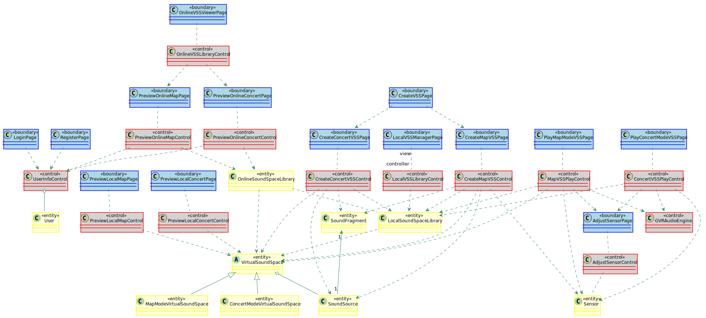
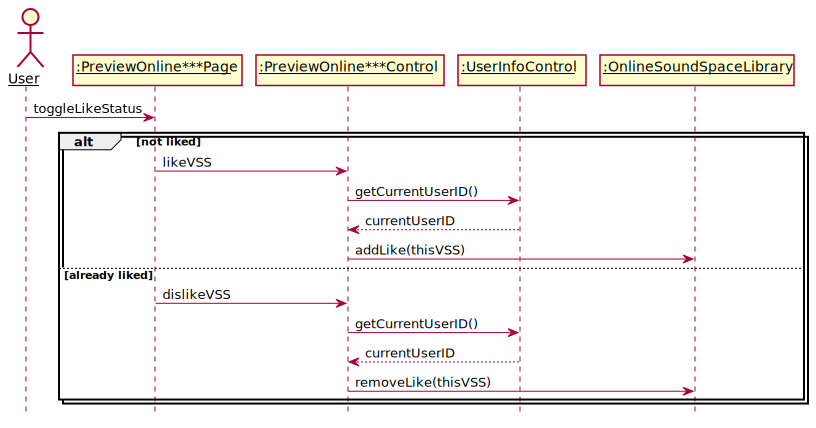
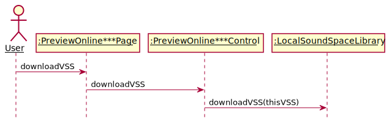

# AudioAR项目 软件需求规约

版本 <7>

修订历史

[@文档commit历史](https://github.com/AudioAR/doc/commits/master/%E9%9C%80%E6%B1%82%E5%AE%9A%E4%B9%89/%E8%BD%AF%E4%BB%B6%E9%9C%80%E6%B1%82%E8%A7%84%E7%BA%A6.md)

|日期|版本|修订说明|作者|
|:-:|:-:|:-|:-|
|2018-04-10|0|建立模版|丁雨晨|
|2018-04-13|1|按照模板填充系统要求|丁雨晨|
|2018-04-15|2|完善3.1-3.3部分|缪本杰|
|2018-04-16|3|完善系统模型|丁雨晨|
|2018-04-16|4|添加了场景|缪本杰|
|2018-04-17|5|添加了用例|缪本杰|
|2018-04-17|6|增加了用例图和UI状态机图|-|
|2018-04-21|7|分析阶段对象模型|罗铨|
|2018-04-21|7|分析阶段动态模型|李东岳|
|2018-04-21|7|分析阶段顺序图|丁雨晨|
|2018-04-24|8|修改了一些部分（主要是把PreviewVSS分成了四块）|缪本杰|
|2018-04-25|9|分析阶段顺序图，分析阶段对象模型更新|刘知峻|
|2018-04-26|10|重构分析模型|刘知峻|
[TOC]

## 0
## 1. 引言
### 1.1 编写目的
拟定软件需求规约，初步确定软件总体的需求和目标。这是为了确定项目总体实施框架，细化量化用户可能的需求，为软件设计和实现指明方向。本规约同时也限定了软件开发的适用范围和禁区，避免随之而来的不利后果，增强项目开发的针对性和合理性。此文档不仅面向软件开发者，还为项目审核人员及用户提供参考。在设计和实现中如遇到特殊情况，将完全有可能修改此文档，因此仅有本文档的最新版本具有参考价值。

### 1.2 适用范围
此文档适用于AudioAR项目的全部软件及系统，将从总体上限定项目的开发目标和框架。

### 1.3 定义
相关定义见词汇表[@doc/需求定义/词汇表.md](https://github.com/AudioAR/doc/blob/master/%E9%9C%80%E6%B1%82%E5%AE%9A%E4%B9%89/%E8%AF%8D%E6%B1%87%E8%A1%A8.md)


### 1.4 参考资料
|文件标题|文件编号|发表日期|出版单位|来源|
|:-:|:-|:-|:-|:-|
|面向对象软件工程实践指南|ISBN9787313162182|2016年 12月 第1版|上海交通大学出版社|图书资料|
|软件需求规约模版|-|-|-|课程资料|
### 1.5 概述
为了满足用户对于现实生活中的声音在虚拟空间中重现的需求，本产品应当完成对用户位置信息的获取、声音资源的输入输出、立体声场的构建和其他和用户的交互功能。
为此，不仅仅需要重现现实固有的声音资源，还有能够任意地产生需要的声场，这将是对软件实用性的综合考验。本文档将从顶层视角大致规定软件的开发需求，将从已有系统的概况、希望完成的改进系统的功能与非功能需求、以及目标系统应当可以实现的应用场景和用例模型这些方面进行介绍。本文档将需要以用户视角为主要视角来叙述，力求满足在将来应用中对用户的友好和对用户需求的友好。

## 2. 目前系统

[@doc/计划/可行性研究报告.md#行业现有系统分析](https://github.com/AudioAR/doc/blob/master/%E8%AE%A1%E5%88%92/%E5%8F%AF%E8%A1%8C%E6%80%A7%E7%A0%94%E7%A9%B6%E6%8A%A5%E5%91%8A.md#3-%E8%A1%8C%E4%B8%9A%E7%8E%B0%E6%9C%89%E7%B3%BB%E7%BB%9F%E5%88%86%E6%9E%90)

## 3. 建议的系统
### 3.1 概述
[@doc/计划/可行性研究报告.md#所建议的系统](https://github.com/AudioAR/doc/blob/master/%E8%AE%A1%E5%88%92/%E5%8F%AF%E8%A1%8C%E6%80%A7%E7%A0%94%E7%A9%B6%E6%8A%A5%E5%91%8A.md#4-%E6%89%80%E5%BB%BA%E8%AE%AE%E7%9A%84%E7%B3%BB%E7%BB%9F)
### 3.2 功能需求
#### 3.2.1 用户管理
用户注册、登陆、注销账户与个人信息设置
#### 3.2.2 虚拟声音空间管理
允许用户构建、修改在虚拟声音空间，声音具有立体位置、一定的触发条件、一定的播放方式
#### 3.2.3 虚拟声音空间游览
进行实时立体声音生成，通过耳机传递给用户，产生逼真的空间声音效果
#### 3.2.4 空间音频图像化
给用户提供一定的图像反馈，形式包括地图、声音定位罗盘等
#### 3.2.5 用户的社交功能
用户可以与其他用户添加好友，分享本地音频库、虚拟声音空间库，相互点赞、评论等
#### 3.2.6 基于空间立体音频的二次应用(可能)
用户可以通过空间立体音频来进行单人、多人的游戏

### 3.3 非功能需求
#### 3.3.1 可用性
-   良好的实时性，实时生成的音频流不具有明显的卡顿
-   声音的真实性，音频流与真实的立体声音难以区分
#### 3.3.2 可靠性
-   在软件设计要求的运行环境内可以长时间、无差错、少维护地工作，减少软件框架或主要内容大量修改的可能性
#### 3.3.3 性能
-   一般的精度，处理传感器数据生成的位置信息具有水平5m左右，垂直20cm左右的精确度；头部运动捕捉比较准确
-   实时的信息处理交互，使用户可以真实感受声音的播发而无明显卡顿、滞后
#### 3.3.4 可支持性
-   可扩展的吞吐量和服务提供能力，服务器能稳定提供几名用户的资源请求和相关通讯
#### 3.3.5 设计约束

可参见[@doc/项目开发计划](https://github.com/AudioAR/doc/blob/master/%E8%AE%A1%E5%88%92/%E9%A1%B9%E7%9B%AE%E5%BC%80%E5%8F%91%E8%AE%A1%E5%88%92.md#41-%E6%8A%80%E6%9C%AF%E6%A0%87%E5%87%86)

#### 3.3.6 接口
##### 3.3.6.1 用户界面
-  手机应用端的用户界面，主要给用户提供必要的流程提示、可视化场景与、
交互场景。
-  管理端的用户界面主要给系统管理员进行用户和系统的管理。
-  用户界面以简约为风格。用户界面的主要内容见3.4.3系统界面部分。

##### 3.3.6.2 硬件接口

使用维特智能9轴姿态角度传感器或者手机自带的传感器进行开发
[@产品简介](http://www.wit-motion.com/index.php?m=goods&a=details&content_id=43)。
-    传感器测量值转化为蓝牙串口信号传输到上位机
-    具体信号编码规范见传感器说明书

##### 3.3.6.3 软件接口
本项目目前主要用到了以下开发包
-  [Google VR](https://vr.google.com/)
    该开发包主要用来根据传入的位置参数产生空间音源
- [百度地图开放平台](https://lbsyun.baidu.com/)
    该开发包主要完成地图功能
##### 3.3.6.4 通信接口
使用HTTP接口来实现本机到服务器端的通信。

#### 3.3.7 法律、版权及其他声明
参见[@可行性研究报告-法律方面的可行性](https://github.com/AudioAR/doc/blob/master/%E8%AE%A1%E5%88%92/%E5%8F%AF%E8%A1%8C%E6%80%A7%E7%A0%94%E7%A9%B6%E6%8A%A5%E5%91%8A.md#71-%E6%B3%95%E5%BE%8B%E6%96%B9%E9%9D%A2%E7%9A%84%E5%8F%AF%E8%A1%8C%E6%80%A7)
#### 3.3.8 适用的标准
参见[@项目开发计划-技术流程计划](https://github.com/AudioAR/doc/blob/master/%E8%AE%A1%E5%88%92/%E9%A1%B9%E7%9B%AE%E5%BC%80%E5%8F%91%E8%AE%A1%E5%88%92.md#4-%E6%8A%80%E6%9C%AF%E6%B5%81%E7%A8%8B%E8%AE%A1%E5%88%92)

### 3.4 系统模型
本节使用UML中的概念、方法和模型图来详细表达需求。
#### 3.4.1 场景

| 场景名称 | 用户注册 |
| :---: | :--------- |
| **参与者实例** | 用户小刘 |
| **事件流** |
| 1 | 小刘对进入系统并且选择注册用户，系统出现了注册界面 |
| 2 | 小刘输入了个人信息，包括用户名、密码、邮箱、地理位置等，系统进行验证，发现小刘的输入合法 |
| 3 | 小刘成功注册，系统进入登录界面 |

| 场景名称 | 用户登录 |
| :---: | :--------- |
| **参与者实例** | 用户小刘 |
| **事件流** |
|1|小刘进入了系统登录界面|
|2|小刘输入了用户名和密码，但是不小心输错了密码，系统提示密码错误，并提示重新输入用户名密码|
|3|小刘输入了正确的用户名和密码，系统成功登录，进入本地虚拟声音空间库管理界面|

| 场景名称 | 用户管理本地虚拟声音空间库（制作新的虚拟声音空间、地图模式） |
| :---: | :--------- |
| **参与者实例** | 用户小刘 |
| **事件流** |
|1|小刘进入了用户本地虚拟声音空间库（下面简称本地库），选择制作新的虚拟声音空间（VSS），系统跳转到VSS制作界面，提供了模式选择“地图模式”，“音乐会模式”|
|2|小刘选择了地图模式，系统将自动定位到小刘当前所在的位置|
|3|小刘在本地的音频文件中选择上传的音频片段，并且设置其经纬度、高度等位置参数与音量、循环模式等播放参数|
|4|小刘重复步骤（3），直到所有的本地音频文件已经被上传完成|
|5|小刘发现某一音频文件上传设置错误，删除了该音频片段|
|6|小刘制作VSS完毕，选择制作完成选项，系统提示小刘为VSS命名|
|7|小刘输入名字，确认后完成该VSS制作，返回本地VSS库管理界面|

| 场景名称 | 用户管理本地虚拟声音空间库（制作新的虚拟声音空间、音乐会模式） |
| :---: | :--------- |
| **参与者实例** | 用户小刘 |
| **事件流** |
|1|小刘进入了用户本地虚拟声音空间库（下面简称本地库），选择制作新的虚拟声音空间（VSS），系统跳转到VSS制作界面，提供了模式选择“地图模式”，“音乐会模式”|
|2|小刘选择了音乐会模式，系统将显示一个虚拟空间|
|3|小刘在本地的音频文件中选择上传的音频片段，以播放列表的形式上传|
|4|小刘重复步骤（3），直到所有的本地音频文件已经被上传完成|
|5|小刘删除了播放列表内某音频片段|
|6|小刘改变了播放列表顺序|
|7|小刘制作VSS完毕，选择制作完成选项，系统提示小刘为VSS命名|
|8|小刘输入名字，确认后完成该VSS制作，返回本地VSS库管理界面|

| 场景名称 | 用户管理本地虚拟声音空间库（重命名，删除，上传功能） |
| :---: | :--------- |
| **参与者实例** | 用户小刘 |
| **事件流** |
|1|小刘进入了用户本地虚拟声音空间库（下面简称本地库），系统还提供对虚拟声音空间的重命名、删除、上传功能|
|2|小刘想把名字为B的VSS改名为C，选择相应选项后系统出现了重命名界面，小刘输入了新的音频名字并且确认后该片段命名被改变|
|3|小刘想把名字为D的VSS删除，选择了相应选项后系统出现确认删除界面，小刘确认后该片段被删除|
|5|小刘想把自己制作的名字为E的VSS上传到在线虚拟声音空间库，选择上传选项后系统将该VSS的信息上传到服务器上|
|6|小刘完成了本地库管理，退出了管理界面|

| 场景名称 | 浏览在线虚拟声音空间库 |
| :---: | :--------- |
| **参与者实例** | 用户小刘 |
| **事件流** |
|1|小刘进入了在线虚拟声音空间（VSS）库，界面上显示了由自己和其他用户上传的所有VSS与其简介信息|
|2|小刘看中了某VSS，进入了该VSS的预览界面，界面上显示了其简介、音频信息等基本信息|
|3|小刘决定下载该VSS。小刘选择下载到本地，系统将该VSS的所有内容（包括本地不存在的音频文件）下载到本地|
|4|小刘进入了另一VSS的预览，对这个VSS的游览效果好评有加，对VSS点赞并加以评论|
|5|小刘在自己上传的某VSS中得到了别人的评论，小刘回复了自己的评论|
|5|小刘完成了浏览，回到本地|


| 场景名称 | 传感器校准 |
| :---: | :--------- |
| **参与者实例** | 用户小刘 |
| **事件流** |
|1|小刘在游览虚拟声音空间之前，系统提示小刘进行了传感器校准|
|2|小刘根据屏幕上的提示进行传感器校准|
|3|小刘完成传感器校准，系统进入VSS游览界面|

| 场景名称 | 游览虚拟声音空间（地图模式） |
| :---: | :--------- |
| **参与者实例** | 用户小刘 |
| **事件流** |
|1|小刘在本地虚拟声音空间（VSS）库中选择了某个地图模式下的VSS，系统进入了该VSS的预览界面，显示了其简介、音频信息等基本信息|
|2|小刘选择开始游览，系统进入游览界面，读取该VSS并提示用户带上传感器和耳机|
|3|小刘移动到该VSS所在的位置附近，听到了合成的空间声场，同时，在界面上也显示了用户所在位置及图中空间声源的可视化描述|
|4|小刘移动自己的位置和自己头的方位，空间声场也实时变化|
|5|小刘不想听了，退出了虚拟声音空间体验|

| 场景名称 | 游览虚拟声音空间（音乐会模式）|
| :---: | :--------- |
| **参与者实例** | 用户小刘 |
| **事件流** |
|1|小刘选择了本地虚拟声音空间（VSS）库中的某个音乐会模式下的VSS，系统读取该VSS并提示用户带上传感器和耳机，并进行传感器校准|
|2|小刘找了个舒服的椅子坐下，点击播放，小刘听到了虚拟的立体声效果|
|3|小刘移动自己头的方位，空间声场也实时变化|
|4|小刘又不想听了，退出了虚拟声音空间体验|


#### 3.4.2 用例模型
|参与者名称|参与者解释|
|:-:|:-:|
|用户|本系统的最终使用者，拥有用户账号，是本系统主要面向的对象|

|用例|用例级别|用例描述|
|:-:|:-:|:-:|
|Register|用户目标|用户注册身份信息，申请使用该系统|
|Login|子功能|用户提交身份信息，通过核验进入系统主界面|
|ManageLocalVSSLibrary|用户目标|管理本地虚拟声音空间库|
|CreateVSS|用户目标|制作虚拟声音空间|
|CreateMapModeVSS|子功能|制作地图模式虚拟声音空间|
|CreateConcertModeVSS|子功能|制作音乐厅模式虚拟声音空间|
|RenameVSS|子功能|重命名虚拟声音空间|
|DeleteVSS|子功能|删除虚拟声音空间|
|UploadVSS|子功能|上传虚拟声音空间|
|LikeVSS|子功能|为虚拟声音空间点赞|
|DownloadVSS|子功能|下载虚拟声音空间|
|CommentVSS|子功能|评论虚拟声音空间|
|PlayVSS|抽象用例|用户体验AR声音空间|
|PreviewVSS|抽象用例|预览虚拟声音空间，查看空间信息与其中音频片段的详细信息|
|PreviewLocalMapVSS|子功能|预览地图模式下的声音空间|
|PreviewOnlineMapVSS|子功能|预览音乐会模式下的声音空间|
|PreviewLocalConcertVSS|子功能|预览地图模式下的声音空间|
|PreviewOnlineConcertVSS|子功能|预览音乐会模式下的声音空间|
|PlayMapModeVSS|子功能|用户体验地图模式AR声音空间|
|PlayConcertModeVSS|子功能|用户体验音乐厅模式AR声音空间|
|BrowseOnlineVSSLibrary|用户目标|浏览在线虚拟声音空间库|
|AdjustSensor|子功能|校准传感器|


##### 用例图


```PlantUML
@startuml Diagrams/UseCaseDiagram
(ManageLocalVSSLibrary) <.. (Login): <<extend>>
(BrowseOnlineVSSLibrary) <.. (Login): <<extend>>

User --> (Register)
User --> (ManageLocalVSSLibrary)
User --> (BrowseOnlineVSSLibrary)

(ManageLocalVSSLibrary) <.. (CreateVSS): <<extend>>
(CreateVSS) <|-- (CreateMapModeVSS)
(CreateVSS) <|-- (CreateConcertModeVSS)
(ManageLocalVSSLibrary) <.. (RenameVSS): <<extend>>
(ManageLocalVSSLibrary) <.. (DeleteVSS): <<extend>>
(ManageLocalVSSLibrary) <.. (UploadVSS): <<extend>>

(PreviewOnlineMapVSS) <.. (LikeVSS): <<extend>>
(PreviewOnlineMapVSS) <.. (CommentVSS): <<extend>>

(PreviewOnlineConcertVSS) <.. (LikeVSS): <<extend>>
(PreviewOnlineConcertVSS) <.. (CommentVSS): <<extend>>

(PlayVSS) .-up.> (PlayMapModeVSS): <<include>>
(PlayVSS) .-up.> (PlayConcertModeVSS): <<include>>

(AdjustSensor) <.. (PlayVSS): <<include>>

(ManageLocalVSSLibrary) <.. (PreviewLocalMapVSS): <<extend>>
(ManageLocalVSSLibrary) <.. (PreviewLocalConcertVSS): <<extend>>

(BrowseOnlineVSSLibrary) <.. (PreviewOnlineMapVSS): <<extend>>
(BrowseOnlineVSSLibrary) <.. (PreviewOnlineConcertVSS): <<extend>>

(PreviewLocalMapVSS) ..> (PlayMapModeVSS): <<include>>
(PreviewLocalConcertVSS) ..> (PlayConcertModeVSS): <<include>>

@enduml
```

##### 用例详细

###### 1. Register

| 用例名称 | Register |
| :---: | :--------- |
| **参与者** | 用户 |
| **范围** | 系统用例 |
| **前置条件** | 无 |
| **后置条件** | 用户完成注册 |
|| **主流程** |
|1|用户在界面上请求注册|
|2|系统收到用户的请求，跳转到注册页面，展示注册表单|
|3|⽤户填写注册表单的⽤户名、登录密码、确认登录密码、电⼦邮箱，填写完成后请求确认注册|
|4|系统判别表单信息是否有效，若有效系统提示注册成功，用户自动登陆，并跳转⾄本地VSS管理界⾯|
|| **扩展流程** |
||注册表单信息⽆效|
|1|在第3步，⽤户填写的登录密码不合法。系统提示⽤户填写的登录密码过短、过⻓或过于筒单，请⽤户修改⼀个合法的密码后重新提交|
|2|在第3步，⽤户填写的确认登录密码和登录密码不⼀致。系统提示⽤户两次填写的登录密码不⼀致，请⽤户检查修改后重新提交|
|3|在第3步，⽤户填写的⽤户名已被注册，系统提示⽤户该⽤户名已被注册，请⽤户修改后重新提交再试|
|4|在第3步，⽤户填写的电⼦邮箱已被注册。系统提示⽤户该电⼦邮箱已被注册，请⽤户检查修改后重新提交|
| **特殊需求** |无|
| **发生频率** |一般，每个用户会发生一次|

###### 2. Login

| 用例名称 | Login |
| :---: | :--------- |
| **参与者** | 用户 |
| **范围** | 子功能 |
| **前置条件** | 用户进入登录界面 |
| **后置条件** | 用户成功进入系统 |
|| **主流程** |
|1|用户请求登录系统|
|2|系统收到⽤户的请求，跳转到登录页面，展示登录表单供填写|
|3|⽤户填写登录表单的⽤户名和登录密码。填写完成后请求登录，系统判别表单信息是否有效，若有效系统提示登陆成功，并跳转到本地VSS管理界面|
|| **扩展流程** |
||登录信息⽆效|
|1|在第3步，⽤户填写的⽤户名和密码不合法|
|2|在第3步，⽤户填写的⽤户名不存在。系统提示⽤户该⽤户名不存在，请⽤户检查修改后重新提交|
|3|在第3步，⽤户填写的登录密码不正确。系统提示⽤户填写的⽤户名或登录密码有误。请⽤户检查修改后重新提交|
||用户选择记住自己|
|1|最后一步请求登陆时可以选择记住自己。|
| **特殊需求** |无|
| **发生频率** |经常|

###### 3. ManageLocalVSSLibrary

| 用例名称 | ManageLocalVSSLibrary |
| :---: | :--------- |
| **参与者** | 用户 |
| **范围** | 系统用例 |
| **前置条件** | 用户已登录，进入本地虚拟声音空间（VSS）库管理界面 |
| **后置条件** | 用户游览某VSS、进入“浏览在线虚拟声音空间库”或者退出系统 |
|| **主流程** |
|1|用户进入VSS库管理界面|
|2|用户进行一系列操作，包括制作新的VSS，重命名VSS，删除VSS，上传VSS，预览本地VSS|
|3|用户完成本地VSS库管理|
|| **扩展流程** |
|1|若用户选择制作新的VSS，进入用例CreateVSS|
|2|若用户选择删除VSS，进入用例DeleteVSS|
|3|若用户选择重命名VSS，进入用例RenameVSS|
|4|若用户选择上传VSS，进入用例UploadVSS|
|5|若用户选择预览VSS，进入用例PreviewVSS|
| **特殊需求** |无|
| **发生频率** |经常|


###### 4. CreateVSS

| 用例名称 | CreateVSS |
| :---: | :--------- |
| **参与者** | 用户 |
| **范围** | 子功能 |
| **前置条件** | 用户已登录，通过本地虚拟声音空间（VSS）库管理界面进入该用例 |
| **后置条件** | 用户完成制作VSS |
|| **主流程** |
|1|系统提示用户选择模式，包括地图模式和音乐会模式|
|2|若用户选择“地图模式”，进入用例CreateMapModeVSS；若用户选择“音乐会模式”，进入用例CreateConcertModeVSS|
|3|用户完成VSS创建，该VSS被保存在本地VSS库，同时系统回到用例ManageLocalVSSLibrary|
|| **扩展流程** |
||None|
| **特殊需求** |不允许用户重用虚拟声源以上的任何信息，只允许用户重用音频文件对象。当用户创建虚拟声源的时候，他既可以添加一个新的本地音频文件创建新的音频文件对象，也可以从本地VSS库可以访问到的所有VSS中提取出来的音频文件对象中选择一个现有的。|
| **发生频率** |经常|


###### 5. CreateMapModeVSS

| 用例名称 | CreateMapModeVSS |
| :---: | :--------- |
| **参与者** | 用户 |
| **范围** | 子功能 |
| **前置条件** | 用户由用例CreateVSS进入，用户选择制作地图模式的VSS |
| **后置条件** | 用户完成制作地图模式的VSS，返回用例CreateVSS |
|| **主流程** |
|1|根据用户的地理位置，系统定位至用户当前位置|
|2|用户在本地音频库中不断选择音频绑定，并设置其经纬度、高度等位置信息和音量、循环模式等播放信息。系统默认将用户头部所在的位置作为虚拟音源的位置|
|3|用户完成所有音频绑定，回到用例CreateVSS|
|| **扩展流程** |
||用户在进行完新增虚拟声源的设定之后可以选择取消操作|
| **特殊需求** |不提供中途删除已经上传音频的支持，一旦操作错误，用户只能在添加该音频的最后选择取消。|
| **发生频率** |经常|


###### 6. CreateConcertModeVSS

| 用例名称 | CreateConcertModeVSS |
| :---: | :--------- |
| **参与者** | 用户 |
| **范围** | 子功能 |
| **前置条件** | 用户由用例CreateVSS进入，选择制作音乐会模式的VSS |
| **后置条件** | 用户完成制作音乐会模式的VSS，返回用例CreateVSS |
|| **主流程** |
|1|用户在本地音频库中不断选择音频上传至播放列表|
|2|用户调整播放列表的播放顺序|
|3|用户输入VSS的名称和简介（默认为空），并确认输入。系统检查VSS名称和简介的合法性。|
|4|用户完成所有音频上传，回到用例CreateVSS|
|| **扩展流程** |
||用户希望删除已上传的音频|
|1|在第2步时，如果用户上传音频有误，可以选择取消该音频源配置|
||用户输入不合法|
|2|在第3步时，用户重新输入相关信息|
||用户尝试添加包含已经添加的音频文件的音频源，系统要求用户重新选择|
| **发生频率** |经常|

###### 7. RenameVSS

| 用例名称 | RenameVSS |
| :---: | :--------- |
| **参与者** | 用户 |
| **范围** | 子功能 |
| **前置条件** | 用户已登录，通过本地虚拟声音空间（VSS）库管理界面进入该用例 |
| **后置条件** | 用户完成重命名VSS |
|| **主流程** |
|1|系统提示用户输入某VSS的新的名字和简介，默认和原来的值相同|
|2|用户输入VSS的新的名字，系统检测其合法性|
|3|若合法，系统完成重命名，在本地库中该VSS的名字改变，同时回到用例ManageLocalVSSLibrary|
|| **扩展流程** |
||用户输入名字不合法|
|1|在第2步时，如果输入名字和简介带有非法字符，则提示用户重新输入|
||用户取消操作|
|1|用户通过提交默认值进行操作取消|
| **特殊需求** |允许VSS命名相同|
| **发生频率** |经常|

###### 8. DeleteVSS

| 用例名称 | DeleteVSS |
| :---: | :--------- |
| **参与者** | 用户 |
| **范围** | 子功能 |
| **前置条件** | 用户已登录，通过本地虚拟声音空间（VSS）库管理界面进入该用例 |
| **后置条件** | 用户完成删除VSS |
|| **主流程** |
|1|系统询问用户是否确认删除该VSS|
|2|用户确认删除操作，在本地库中该VSS被删除改变，同时回到用例ManageLocalVSSLibrary|
|| **扩展流程** |
| **特殊需求** |无|
| **发生频率** |经常|

###### 9. UploadVSS

| 用例名称 | UploadVSS |
| :---: | :--------- |
| **参与者** | 用户 |
| **范围** | 子功能 |
| **前置条件** | 用户已登录，通过本地VSS库管理界面进入该用例 |
| **后置条件** | 用户完成上传VSS |
|| **主流程** |
|0|用户点击页面VSS的上传按钮|
|1|系统在通知栏显示上传进度|
|2|系统在后台将该VSS保存在服务器，同时也保存在在线虚拟声音空间库中。同时回到用例ManageLocalVSSLibrary|
|3|在线虚拟声音库中出现了上传的VSS，同时本地的VSS保持不变，上传的VSS被永久归档，不可更改。|
|| **扩展流程** |
||无|
| **特殊需求** |禁止上传者删除已经上传的VSS，上传者一旦上传VSS，该VSS脱离其控制，成为公共资源。|
| **发生频率** |经常|


###### 10. PreviewVSS

| 用例名称 | PreviewVSS |
| :---: | :--------- |
| **参与者** | 用户 |
| **范围** | 抽象用例 |
| **前置条件** | 用户已登录，通过本地VSS库管理或者在线VSS浏览界面进入该用例 |
| **后置条件** | 用户完成预览VSS，返回之前界面；或者开始游览，进入用例PlayVSS |
|| **主流程** |
|1|用户预览VSS，系统显示预览的界面，进入本用例 |
|2a|如果是本地地图模式VSS，进入用例PreviewLocalMapVSS|
|2b|如果是在线地图模式VSS，进入用例PreviewOnlineMapVSS|
|2c|如果是本地音乐会模式VSS，进入用例PreviewLocalConcertVSS|
|2d|如果是在线音乐会模式VSS，进入用例PreviewOnlineConcertVSS|
|3|用户完成预览，退出PreviewVSS，返回父用例|
|| **扩展流程** |
||无|
| **特殊需求** |无|
| **发生频率** |经常|

###### 11. PreviewLocalMapVSS

| 用例名称 | PreviewLocalMapVSS |
| :---: | :--------- |
| **参与者** | 用户 |
| **范围** | 子功能 |
| **前置条件** | 用户进入了LocalMapVSS的预览 |
| **后置条件** | 用户结束了预览，选择一种操作，或者返回本地管理，或者进入PlayVSS用例 |
|| **主流程** |
|1|用户预览VSS，系统显示预览的界面，包括名称，简介，VSS信息 |
|2|如果用户想游览该VSS，用户可以选择游览该VSS，进入用例PlayMapVSS|
|3|回到用例PreviewVSS|
|| **扩展流程** |
||无|
| **特殊需求** |无|
| **发生频率** |经常|

###### 12. PreviewOnlineMapVSS

| 用例名称 | PreviewOnlineMapVSS |
| :---: | :--------- |
| **参与者** | 用户 |
| **范围** | 子功能 |
| **前置条件** | 用户选择OnlineMapVSS的预览 |
| **后置条件** | 用户结束了预览，选择一种操作，或者返回在线管理 |
|| **主流程** |
|1|用户预览VSS，系统显示预览的界面，包括名称，简介，VSS信息 |
|2a|若用户想下载该VSS，进入用例DownloadVSS|
|2b|若用户对该VSS点赞，进入LikeVSS|
|2c|若用户想对该VSS进行评论，进入CommentVSS|
|3|回到用例PreviewVSS|
|| **扩展流程** |
||防止重复下载|
|1|在步骤2a，如果系统发现某一个在线音频库有一个本地副本，系统将拒绝重复下载|
| **特殊需求** |无|
| **发生频率** |经常|

###### 13. PreviewLocalConcertVSS

| 用例名称 | PreviewLocalConcertVSS |
| :---: | :--------- |
| **参与者** | 用户 |
| **范围** | 子功能 |
| **前置条件** | 用户进入LocalConcertVSS预览 |
| **后置条件** | 用户结束了预览，选择一种操作，或者返回本地管理，或者进入PlayVSS用例 |
|| **主流程** |
|1|用户预览VSS，系统显示预览的界面，包括名称，简介，VSS信息 |
|2|如果用户想游览该VSS，用户可以选择游览该VSS，进入用例PlayConcertVSS|
|3|回到用例PreviewVSS|
|| **扩展流程** |
||无|
| **特殊需求** |无|
| **发生频率** |经常|

###### 14. PreviewOnlineConcertVSS

| 用例名称 | PreviewOnlineConcertVSS |
| :---: | :--------- |
| **参与者** | 用户 |
| **范围** | 子功能 |
| **前置条件** | 用户选择OnlineMapVSS的预览 |
| **后置条件** | 用户结束了预览，返回在线浏览 |
|| **主流程** |
|1|用户预览VSS，系统显示预览的界面，包括名称，简介，VSS信息 |
|2a|若用户想下载该VSS，进入用例DownloadVSS|
|2b|若用户对该VSS点赞，进入LikeVSS|
|2c|若用户想对该VSS进行评论，进入CommentVSS|
|3|回到用例PreviewVSS|
|| **扩展流程** |
||防止重复下载|
|1|在步骤2a，如果系统发现某一个在线音频库有一个本地副本，系统将拒绝重复下载|
| **特殊需求** |无|
| **发生频率** |经常|


###### 15. BrowseOnlineVSSLibrary

**简洁起见，禁止该用例进行任何评论，Like和下载操作，用户只能够进入Preview进行相关操作。**

| 用例名称 | BrowseOnlineVSSLibrary |
| :---: | :--------- |
| **参与者** | 用户 |
| **范围** | 系统用例 |
| **前置条件** | 用户已登录，浏览在线虚拟声音空间（VSS）库 |
| **后置条件** | 用户完成浏览在线VSS库，返回本地库；或者退出系统 |
|| **主流程** |
|1|用户浏览在线库，界面上出现所有用户上传的VSS，用户可以阅读各个VSS的简介|
|2|用户选择某个VSS进行预览，进入用例PreviewVSS。浏览结束后回到浏览界面。|
|3|用户完成浏览|
|| **扩展流程** |
||无|
| **特殊需求** |无|
| **发生频率** |经常|


###### 16. DownloadVSS

**这里的进度利用Android系统提供的通知功能完成。**

| 用例名称 | DownloadVSS |
| :---: | :--------- |
| **参与者** | 用户 |
| **范围** | 子功能 |
| **前置条件** | 用户在预览在线虚拟声音空间（VSS），想要下载该VSS |
| **后置条件** | 用户完成下载或放弃下载 |
|| **主流程** |
|1|系统提示是否确认下载该在线VSS|
|2|用户确认下载，之后系统将在线VSS下载到本地，并保存在本地VSS中。系统实时通知用户下载的进度。|
|3|用户完成下载，返回BrowseOnlineVSSLibrary|
|| **扩展流程** |
||用户取消操作|
|1|在用例任何步骤中，用户可以取消该操作；若取消，则回到用例PreviewVSS，不进行任何修改|
| **特殊需求** |不维护本地缓存的VSS和在线VSS之间的同步性，两个VSS是完全不相干的对象。|
| **发生频率** |经常|

###### 17. LikeVSS

| 用例名称 | LikeVSS |
| :---: | :--------- |
| **参与者** | 用户 |
| **范围** | 子功能 |
| **前置条件** | 用户在预览在线虚拟声音空间（VSS），想要点赞该VSS |
| **后置条件** | 用户完成点赞 |
|| **主流程** |
|1|用户选择点赞，系统显示用户点赞成功，并且显示对该VSS点赞的用户列表|
|2|完成点赞|
|| **扩展流程** |
||无|
| **特殊需求** |无|
| **发生频率** |经常|


###### 18. CommentVSS

| 用例名称 | CommentVSS |
| :---: | :--------- |
| **参与者** | 用户 |
| **范围** | 子功能 |
| **前置条件** | 用户在预览在线虚拟声音空间（VSS），想要评论该VSS |
| **后置条件** | 用户完成评论或放弃评论 |
|| **主流程** |
|1|用户在预览界面的评论输入框|
|2|用户编辑评论，完成后选择确定评论|
|3|系统在历史评论列表的最下方显示新增加的评论|
|| **扩展流程** |
||用户取消操作|
|1|在用例任何步骤中，用户可以取消该操作；若取消，则回到用例PreviewVSS，不进行任何修改|
| **特殊需求** |无|
| **发生频率** |经常|


###### 19. PlayVSS

| 用例名称 | PlayVSS |
| :---: | :--------- |
| **参与者** | 用户 |
| **范围** | 抽象子功能 |
| **前置条件** | 用户在预览本地虚拟声音空间（VSS），想要游览该VSS|
| **后置条件** | 用户完成游览，返回在线浏览界面 |
|| **主流程** |
|1|系统提示用户进行传感器校准，进入用例AdjustSensor，AdjustSensor自动进行传感器匹配过程，之后用户正确佩戴传感器|
|2|用户开始该VSS的预览|
|3|用户终止游览，返回用例PreviewVSS|
|| **扩展流程** |
||用户取消操作|
|1|在用例任何步骤中，用户可以取消该操作；若取消，则回到用例PreviewVSS，不进行任何修改|
| **特殊需求** |无|
| **发生频率** |经常|


###### 20. PlayMapModeVSS

| 用例名称 | PlayMapModeVSS |
| :---: | :--------- |
| **参与者** | 用户 |
| **范围** | 子功能 |
| **前置条件** | 用户开始游览地图模式下的VSS |
| **后置条件** | 用户终止游览，返回 |
|| **主流程** |
|1|系统提示用户进行传感器校准，进入用例AdjustSensor，AdjustSensor自动进行传感器匹配过程，之后用户正确佩戴传感器|
|2|系统读取该VSS的音频信息，并读取用户位置，进入游览界面|
|3|系统根据用户的地理位置和头部方位不断生成模拟的空间声场，让用户进行欣赏|
|| **扩展流程** |
||无|
| **特殊需求** |无|
| **发生频率** |经常|

###### 21. PlayConcertModeVSS

| 用例名称 | PlayConcertModeVSS |
| :---: | :--------- |
| **参与者** | 用户 |
| **范围** | 子功能 |
| **前置条件** | 用户开始游览音乐会模式下的VSS |
| **后置条件** | 用户终止游览，返回 |
|| **主流程** |
|1|系统读取该VSS的音频信息，进入虚拟音乐会收听界面，系统提示用户进行传感器校准，进入用例AdjustSensor，AdjustSensor自动进行传感器匹配过程。系统提示用户正确佩戴耳机|
|2|系统给出虚拟声音空间的播放列表，用户点击开始播放按钮|
|3|系统根据用户的头部方位不断生成模拟的空间声场，让用户进行欣赏|
|| **扩展流程** |
|1|用户在播放过程中点击暂停，下一首，上一首，系统做出相对应的响应|
| **特殊需求** |无|
| **发生频率** |经常|

###### 22. AdjustSensor

| 用例名称 | AdjustSensor |
| :---: | :--------- |
| **参与者** | 用户 |
| **范围** | 子功能 |
| **前置条件** | 在用例PlayVSS中，用于用户调整传感器 |
| **后置条件** | 用户取消操作，直接进入PreviewVSS用例；或者用户完成传感器校准，进入用例PlayVSS |
|| **主流程** |
|1|系统提示用户根据要求佩戴好传感器。系统根据VSS模式不同进行不同的流程。|
|2|用户根据系统的提示进行传感器的校准|
|| **扩展流程** |
||无|
| **特殊需求** |无|
| **发生频率** |经常|

#### 3.4.3 对象模型


##### 实体类列表

Class Name|Description|Attributes
:-|:-|:-
User|User类保存了使用该系统的一个用户的相关信息，包括用户名、密码、邮箱及用户ID。|username<br>id
SoundSource|SoundSource类是用户为创建VSS，从本地VSS库可以访问到的所有VSS中提取出来的SoundSource或本地直接上传到系统上的虚拟声源，保存一个SoundFragment、虚拟声源名称、经纬度、高度、音量、播放模式及虚拟声源ID|position<br>volume<br>playPattern<br>id
VirtualSoundSpace|虚拟声音空间抽象类|name<br>id<br>ownerID<br>comments<br>likes
MapModeVirtualSoundSpace|地图模式虚拟声音空间|-
ConcertModeVirtualSoundSpace|音乐会模式虚拟声音空间|-
LocalSoundSpaceLibrary|本地VSS管理|-
OnlineSoundSpaceLibrary|在线VSS管理库|-
Sensor|传感器接口类|-
SoundFragment|声音片段|filename<br>length

##### 边界类列表

Class Name|Description
:-|:-
RegisterPage|注册界面
LoginPage|登陆界面
LocalVSSManagerPage|本地VSS管理界面
OnlineVSSViewerPage|在线VSS浏览界面
PlayMapModeVSSPage|游览Map模式VSS
PlayConcertModeVSSPage|游览Concert模式VSS
CreateVSSPage|VSS创建入口界面
CreateMapVSSPage|MapVSS创建
CreateConcertVSSPage|ConcertVSS创建
AdjustSensorPage|传感器矫正页面
PreviewLocalMapPage|-
PreviewOnlineMapPage|-
PreviewOnlineConcertPage|-
PreviewLocalMapPage|-

##### 控制类列表

Class Name|Description
:-|:-
UserInfoControl|用户信息管理控制器，同时作为系统控制器和视图控制器
PreviewLocalConcertControl|视图控制器
PreviewOnlineConcertControl|视图控制器
PreviewLocalMapControl|视图控制器
PreviewOnlineMapControl|视图控制器
CreateMapVSSControl|MapVSS创建控制，视图控制器
CreateConcertVSSControl|ConcertVSS创建控制，视图控制器
LocalVSSLibraryControl|本地VSS管理界面控制器，视图控制器
OnlineVSSLibraryControl|在线VSS浏览界面控制器，视图控制器
AdjustSensorControl|传感器校准控制器，视图控制器
ConcertVSSPlayControl|CVSS播放控制器，视图控制器
MapVSSPlayControl|MVSS播放控制器，视图控制器
GVRAudioEngine|GVR虚拟声音播放控制器，系统控制器

##### 类图
## Class Diagram



```PlantUML
@startuml Diagrams/ClassDiagram
skinparam class {
	BackgroundColor PaleGreen
	ArrowColor SeaGreen
	BorderColor SpringGreen
	BackgroundColor<<boundary>> LightBlue
	BorderColor<<boundary>> Blue
    BackgroundColor<<control>> LightGray
    BorderColor<<control>> Red
    BackgroundColor<<entity>> LightYellow
    BorderColor<<entity>> Yellow
}


class RegisterPage <<boundary>> {

}
class UserInfoControl <<control>> {

}
class LocalVSSManagerPage <<boundary>> {

}
class User <<entity>> {

}
class LoginPage <<boundary>> {

}
class LocalVSSLibraryControl <<control>> {

}
class LocalSoundSpaceLibrary <<entity>> {

}
class PreviewLocalMapPage <<boundary>> {

}
class PreviewLocalConcertPage <<boundary>> {

}
class CreateVSSPage <<boundary>> {

}
class CreateMapVSSPage <<boundary>> {

}
class CreateMapVSSControl <<control>> {

}
class Sensor <<entity>> {

}
class MapModeVirtualSoundSpace <<entity>> {

}
class ConcertModeVirtualSoundSpace <<entity>> {

}
abstract VirtualSoundSpace <<entity>> {

}
class SoundSource <<entity>> {

}
class CreateConcertVSSPage <<boundary>> {

}
class CreateConcertVSSControl <<control>> {

}
class PreviewOnlineMapPage <<boundary>> {

}
class PreviewOnlineMapControl <<control>> {

}
class PreviewOnlineConcertPage <<boundary>> {

}
class PreviewOnlineConcertControl <<control>> {

}
class OnlineSoundSpaceLibrary <<entity>> {

}
class PreviewLocalMapControl <<control>> {

}
class PreviewLocalConcertControl <<control>> {

}
class PlayMapModeVSSPage <<boundary>> {

}
class MapVSSPlayControl <<control>> {

}
class LocalSoundSpaceLibrary <<entity>> {

}
class GVRAudioEngine <<control>> {

}
class AdjustSensorPage <<boundary>> {

}
class PlayConcertModeVSSPage <<boundary>> {

}
class ConcertVSSPlayControl <<control>> {

}
class OnlineVSSViewerPage <<boundary>> {

}
class AdjustSensorControl <<control>> {

}
class SoundFragment <<entity>> {

}
class OnlineVSSLibraryControl <<control>> {

}


UserInfoControl o-- User
LocalVSSManagerPage "view" .. "controller" LocalVSSLibraryControl
LocalVSSLibraryControl ..> LocalSoundSpaceLibrary
CreateMapVSSPage .. CreateMapVSSControl
CreateMapVSSControl ..> LocalSoundSpaceLibrary
LocalSoundSpaceLibrary ..> VirtualSoundSpace
VirtualSoundSpace <|-- ConcertModeVirtualSoundSpace
VirtualSoundSpace <|-- MapModeVirtualSoundSpace
LoginPage ..> UserInfoControl
RegisterPage ..> UserInfoControl
CreateMapVSSControl ..> Sensor
CreateMapVSSControl ..> VirtualSoundSpace
CreateMapVSSControl ..> SoundSource
VirtualSoundSpace o-- SoundSource
CreateConcertVSSPage .. CreateConcertVSSControl
CreateConcertVSSControl ..> VirtualSoundSpace
CreateConcertVSSControl ..> LocalSoundSpaceLibrary
CreateConcertVSSControl ..> SoundSource
PreviewOnlineConcertPage .. PreviewOnlineConcertControl
PreviewOnlineMapPage .. PreviewOnlineMapControl
PreviewOnlineMapControl ..> UserInfoControl
PreviewOnlineConcertControl ..> UserInfoControl
PreviewOnlineMapControl ..> OnlineSoundSpaceLibrary
PreviewOnlineConcertControl ..> OnlineSoundSpaceLibrary
OnlineSoundSpaceLibrary ..> VirtualSoundSpace
OnlineSoundSpaceLibrary .. LocalSoundSpaceLibrary
PreviewLocalMapPage .. PreviewLocalMapControl
PreviewLocalConcertPage .. PreviewLocalConcertControl
PreviewLocalConcertControl ..> VirtualSoundSpace
PreviewLocalMapControl ..> VirtualSoundSpace
CreateVSSPage ..> CreateMapVSSPage
CreateVSSPage ..> CreateConcertVSSPage
PlayMapModeVSSPage .. MapVSSPlayControl
MapVSSPlayControl ..> LocalSoundSpaceLibrary
MapVSSPlayControl ..> VirtualSoundSpace
MapVSSPlayControl ..> Sensor
MapVSSPlayControl ..> GVRAudioEngine
MapVSSPlayControl ..> AdjustSensorPage
PlayConcertModeVSSPage .. ConcertVSSPlayControl
ConcertVSSPlayControl ..> LocalSoundSpaceLibrary
ConcertVSSPlayControl ..> Sensor
ConcertVSSPlayControl ..> GVRAudioEngine
ConcertVSSPlayControl ..> AdjustSensorPage
OnlineVSSViewerPage .. OnlineVSSLibraryControl
OnlineVSSLibraryControl ..> PreviewOnlineConcertPage
OnlineVSSLibraryControl ..> PreviewOnlineMapPage
AdjustSensorPage .. AdjustSensorControl
AdjustSensorControl .. Sensor
SoundFragment "1" <-- "1" SoundSource
CreateMapVSSControl ..> SoundFragment
CreateConcertVSSControl ..> SoundFragment

@enduml
```

#### 3.4.4动态模型
##### 1）系统顺序图与操作契约

TODO("修订系统顺序图和操作契约")

##### 2）顺序图

# 系统消息顺序图

## 1.Register


**Actually UserInfoControl is both a View Controller and a System Controller, it should be separated in design. Check password, userid, e-mail... are written as one operation.**

```PlantUML
@startuml Diagrams/Register
hide footbox
skinparam sequenceParticipant underline

participant ":LoginPage" as loginpage
actor User as user
participant ":RegisterPage" as boundary
participant ":UserInfoControl" as control
participant ":User" as userdata
participant ":LocalVSSManagerPage" as nextpage

note right of control: The UserInfoControl is activated since the start of the entire program.

user -> loginpage: register
loginpage -> control: register

create boundary
control -> boundary: <<create>>
user -> boundary: enterRegisterData
boundary -> control: sendRegisterData
control -> control: checkRegisterData
loop wrong input
    control --> boundary: registerDataWrong
    user -> boundary: enterRegisterData
    boundary -> control: sendRegisterData
    control -> control: checkRegisterData
end
control --> boundary: registerSuccess
create userdata
control -> userdata: <<create>>
control -> control: setCurrentUser
create nextpage
control -> nextpage: <<create>>
@enduml
```

## 2.Login


```PlantUML
@startuml Diagrams/Login
hide footbox
skinparam sequenceParticipant underline

actor User as user
participant ":LoginPage" as boundary
participant ":UserInfoControl" as control
participant ":User" as userdata
participant ":LocalVSSManagerPage" as nextpage

user -> boundary: enterLoginData
boundary -> control: sendLoginData
control -> control: checkLoginData
loop wrong password or username
    control --> boundary: loginDataWrong
    user -> boundary: enterLoginData
    boundary -> control: sendLoginData
    control -> control: checkLoginData
end
control --> boundary: LoginSuccess
create userdata
control -> userdata: <<create>>
control -> control: setCurrentUser
alt remember me selected
    control -> control: setRememberUser
end
create nextpage
control -> nextpage: <<create>>
@enduml
```
## 3.ManageLocalVSSLibrary


```PlantUML
@startuml Diagrams/ManageLocalVSSLibrary
hide footbox
skinparam sequenceParticipant underline

actor User as user
participant ":LocalVSSManagerPage" as boundary
participant ":LocalVSSLibraryControl" as control
participant ":LocalSoundSpaceLibrary" as library

create boundary
[-> boundary: <<create>>
create control
boundary -> control: <<create>>
control -> library: getVSSList(pageNo: int): List
library --> control: listOfLocalVSS: List<VirtualSoundSpace>
control -> boundary: displayVSSList(listOfLocalVSS)

loop
    alt CreateVSS
        user -> boundary: createVSS
        ...described in PlayVSS...
    else RenameVSS
        user -> boundary: renameVSS(whichVSS)
        ...described in RenameVSS...
    else DeleteVSS
        user -> boundary: deleteVSS(whichVSS)
        ...described in DeleteVSS...
    else UploadVSS
        user -> boundary: uploadVSS(whichVSS)
        ...described in UploadVSS...
    else PreviewVSS
        user -> boundary: previewVSS(whichVSS)
        boundary -> control: previewVSS(whichVSS)
        alt local map
            participant ":PreviewLocalMapPage" as plmp
            create plmp
            control -> plmp: <<create>>

        else local concert
            participant ":PreviewLocalConcertPage" as plcp
            create plcp
            control -> plcp: <<create>>
        end
    else prevPage
        user -> boundary: prevPage()
        boundary -> control: prevPage()
        control -> library: getVSSList(nextPageNo)
        library --> control: listOfLocalVSS: List<VirtualSoundSpace>
        control -> boundary: displayVSSList(listOfLocalVSS)
    else nextPage
    ...similar, omitted...
    end
end
@enduml
```

## 4.CreateVSS


```PlantUML
@startuml Diagrams/CreateVSS
hide footbox
skinparam sequenceParticipant underline

actor User as user
participant ":LocalVSSManagerPage" as manage
participant ":CreateVSSPage" as page
participant ":CreateMapVSSPage" as map
participant ":CreateConcertVSSPage" as concert

user -> manage: createVSS
create page
manage -> page: <<create>>
alt create Map Mode VSS
    user -> page: createMapModeVSS
    create map
    page -> map: <<create>>
    ...Go to CreateMapVSS...
else create Concert Mode VSS
    user -> page: createConcertModeVSS
    create concert
    page -> concert: <<create>>
    ...Go to CreateConcertModeVSS...
end

@enduml
```

## 5.CreateMapModeVSS


```PlantUML
@startuml Diagrams/CreateMapModeVSS
hide footbox
skinparam sequenceParticipant underline


actor User as user
participant ":CreateMapVSSPage" as createboundary
participant ":CreateMapVSSControl" as createcontrol
participant ":LocalSoundSpaceLibrary" as library
participant ":Sensor" as sensor
participant "newSoundSpace:MapModeVirtualSoundSpace" as newspace


[-> createboundary: <<create>>
create createcontrol
createboundary -> createcontrol: <<create>>
create newspace
createcontrol -> newspace: <<create>>
create sensor
createcontrol -> sensor: <<create>>
loop add virual sound source
    alt add from library
        note right of user: Notice that there are no shared SoundSources here, each time, only the SoundFragment object is reused.
        user -> createboundary: selectExistedSoundSource
        createboundary -> createcontrol: getLocalSoundFragments
        createcontrol -> library: getLocalSoundFragments
        library --> createcontrol: filteredSoundFragments
        createcontrol --> createboundary: displayAvailableLocalSoundFragments
        user -> createboundary: selectSoundFragment
        createboundary -> createcontrol: addSoundFragment
    else add from file
        user -> createboundary: selectFromFileSystem
        ...somehow CreateMapVSSControl got the new SoundFragment # specify during implementation...

    end

    createcontrol -> sensor: getCurrentLocation
    sensor --> createcontrol: currentLocation

    participant ":SoundSource" as source
    create source
    createcontrol -> source: <<create>>
    createcontrol -> source: setSoundFragment
    createcontrol -> source: setLocation

    alt user choose to alter position
        user -> createboundary: setCurrentSoundSourceLocation
        createboundary -> createcontrol : setLocation
        createcontrol -> source: setLocation
    end
    user -> createboundary: setSoundSourceMode
    createboundary -> createcontrol: setSoundSourceMode
    createcontrol -> source: setSoundSourceMode
    alt confirm
        createcontrol -> newspace: addSoundSource(soundSource)
    else cancel
        createcontrol -> newspace: <<destroy>>
        destroy newspace
    end
end
user -> createboundary: setVSSNameAndDescription
createboundary -> createcontrol: setVSSNameAndDescription
createcontrol -> newspace: setVSSNameAndDescription
alt confirm
    user -> createboundary: comfirmVSSCreation
    createboundary -> createcontrol: comfirmVSSCreation
    createcontrol -> library: addSoundSpace(newSoundSpace)
else cancel

end
createcontrol -> createboundary: <<destroy>>
destroy createboundary
createcontrol -> sensor: <<destroy>>
destroy sensor
destroy createcontrol
@enduml
```

## 6.CreateConcertModeVSS


```PlantUML
@startuml Diagrams/CreateConcertModeVSS
hide footbox
skinparam sequenceParticipant underline


actor User as user
participant ":CreateConcertVSSPage" as createboundary
participant ":CreateConcertVSSControl" as createcontrol
participant ":LocalSoundSpaceLibrary" as library
participant "newSoundSpace:ConcertModeVirtualSoundSpace" as newspace

create createboundary
-> createboundary: <<create>>
create createcontrol
createboundary -> createcontrol: <<create>>
create newspace
createcontrol -> newspace: <<create>>

loop add virual sound source
    alt add from library
        note right of user: Notice that there are no shared SoundSources here, each time, only the SoundFragment object is reused.
        user -> createboundary: selectExistedSoundSource
        createboundary -> createcontrol: getLocalSoundFragments
        createcontrol -> library: getLocalSoundFragments
        library --> createcontrol: filteredSoundFragments
        createcontrol --> createboundary: displayAvailableLocalSoundFragments
        user -> createboundary: selectSoundFragment
        createboundary -> createcontrol: addSoundFragment
    else add from file
        user -> createboundary: selectFromFileSystem
        ...somehow CreateMapVSSControl got the new SoundFragment # specify during implementation...
    end


    participant ":SoundSource" as source
    user -> user: wakeUp(self)
    create source
    createcontrol -> source: <<create>>
    createcontrol -> source: setSoundFragment
    alt confirm
        user -> createboundary: confirmAddition
        createboundary -> createcontrol: confirmAddition
        createcontrol -> newspace: addSoundSource(soundSource)
    else cancel
        user -> createboundary: cancelAddition
        createboundary -> createcontrol: confirmAddition
        createcontrol -> newspace: <<destroy>>
        destroy newspace
    end

end
user -> createboundary: setVSSNameAndDescription
createboundary -> createcontrol: setVSSNameAndDescription
createcontrol -> newspace: setVSSNameAndDescription
alt confirm
    user -> createboundary: comfirmVSSCreation
    createboundary -> createcontrol: comfirmVSSCreation
    createcontrol -> library: addSoundSpace(newSoundSpace)
else cancel
end
createcontrol -> createboundary: <<destroy>>
destroy createboundary
destroy createcontrol
@enduml
```

## 7.RenameVSS

**The LocalSoundSpaceLibrary acts like a facade.**


```PlantUML
@startuml Diagrams/RenameVSS
hide footbox
skinparam sequenceParticipant underline

actor User as user
participant ":LocalVSSManagerPage" as page
participant ":LocalVSSLibraryControl" as control
participant ":LocalSoundSpaceLibrary" as library

user -> page: renameVSS
user -> page: enterNewLocalVSSNameAndDescription
page -> control: newNameAndDescriptionEntered(whichVSS, newName, newDescription)
control -> control: checkNewNameAndDescription
alt wrong input
    control -> page: notifyWrongInput
else good input
    control -> library: setNameAndDescription(whichVSS, newName, newDescription)
end

@enduml
```

## 8.DeleteVSS


```PlantUML
@startuml Diagrams/DeleteVSS
hide footbox
skinparam sequenceParticipant underline

actor User as user
participant ":LocalVSSManagerPage" as page
participant ":LocalVSSLibraryControl" as control
participant ":LocalSoundSpaceLibrary" as library

user -> page: deleteVSS(whichVSS)
page -> control: deleteVSS(whichVSS)
control -> page: comfirmDialog
alt confirm
    user -> page: confirmDelete
    page -> control: confirm
    control -> library: deleteVSS(whichVSS)
    control -> library: getVSSList(pageNo)
    library --> control: listOfLocalVSS
    library -> page: displayVSSList(listOfLocalVSS)
else cancel
    user -> page: cancelDelete
    page -> control: cancelDelete
end


@enduml
```

## 9.UploadVSS


```PlantUML
@startuml Diagrams/UploadVSS
hide footbox
skinparam sequenceParticipant underline

actor User as user
participant ":LocalVSSManagerPage" as page
participant ":LocalVSSLibraryControl" as control
participant ":LocalSoundSpaceLibrary" as library

user -> page: uploadVSS(whichVSS)
page -> control: uploadVSS(whichVSS)
control -> library: beamMeUp(whichVSS)
...LocalSoundSpaceLibrary doing magic trick, using android system to show download progress...
...There are no other ways to show that a local sound space is finished uploading other than android system notices...
@enduml
```

## 10. LikeVSS


```PlantUML
@startuml Diagrams/LikeVSS
hide footbox
skinparam sequenceParticipant underline
actor User as user
participant ":PreviewOnline***Page" as page
participant ":PreviewOnline***Control" as control
participant ":UserInfoControl" as info
participant ":OnlineSoundSpaceLibrary" as library

user -> page: changeLikeStatus
alt already liked
    page -> control: likeVSS
    control -> info: getCurrentUserID()
    info --> control: currentUserID
    control -> library: addLike(thisVSS)
else not liked
    page -> control: dislikeVSS
    control -> info: getCurrentUserID()
    info --> control: currentUserID
    control -> library: removeLike(thisVSS)
end

@enduml
```


## 11. DownloadVSS


```PlantUML
@startuml Diagrams/DownloadVSS
hide footbox
skinparam sequenceParticipant underline
actor User as user
participant ":PreviewOnline***Page" as page
participant ":PreviewOnline***Control" as control
participant ":OnlineSoundSpaceLibrary" as onlinelib
participant "cloneVSS:VirtualSoundSpace" as clone
participant ":LocalSoundSpaceLibrary" as library
user -> page: downloadVSS
note right of onlinelib: download operation downloads every SoundSource's SoundFragment, a separate local VSS is created.
note right of onlinelib: every SoundFragment is identified uniquely by MD5 of the file.
page -> control: downloadVSS
control -> onlinelib: download(thisVSS)
create clone
onlinelib -> clone: <<create>>
onlinelib -> clone: copyMetaDataFrom(thisVSS)
note right
MetaData stands for all forms of data only that a VSS contains,
including SS, SF, but the SFs are not downloaded.
notice that we copy the references for SoundSources, it should be OK.
end note
onlinelib -> library: addSoundSpace(cloneVSS)
onlinelib -> library: downloadAllSoundFragment(cloneVSS)


@enduml
```

## 12. CommentVSS


```PlantUML
@startuml Diagrams/CommentVSS
hide footbox
skinparam sequenceParticipant underline
actor User as user
participant ":PreviewOnline***Page" as page
participant ":PreviewOnline***Control" as control
participant ":UserInfoControl" as info
participant ":OnlineSoundSpaceLibrary" as library

user -> page: submitComment(comment: String)
page -> control: submitComment(commit: String)
control -> info: getCurrentUserID()
info --> control: currentUserID
control -> library: addCommit(whichVSS, userid, comment)
@enduml
```


## 13. PlayVSS(Abstract)

## 14. PreviewVSS(Abstract)

## 15. PreviewLocalMapVSS


```PlantUML
@startuml Diagrams/PreviewLocalMapVSS
hide footbox
skinparam sequenceParticipant underline
participant ":PreviewLocalMapPage" as page
participant ":PreviewLocalMapControl" as control
participant "localMapVSS:VirtualSoundSpace" as vss
create page
[-> page: <<create>>
create control
page -> control: <<create>>
control -> vss: get metadata
vss --> control: metadata
control -> page: display metadata


@enduml
```


## 16. PreviewOnlineMapVSS


```PlantUML
@startuml Diagrams/PreviewOnlineMapVSS
hide footbox
skinparam sequenceParticipant underline
actor User as user

participant ":PreviewOnlineMapPage" as page
participant ":PreviewOnlineMapControl" as control
participant "onlineMapVSS:VirtualSoundSpace" as vss
create page
[-> page: <<create>>
create control
page -> control: <<create>>
control -> vss: get metadata
vss -> control: metadata
control -> page: display metadata
note right
details are left out for designs.
end note
@enduml
```

## 17. PreviewLocalConcertVSS


```PlantUML
@startuml Diagrams/PreviewLocalConcertVSS
hide footbox
skinparam sequenceParticipant underline
actor User as user

participant ":PreviewLocalConcertPage" as page
participant ":PreviewLocalConcertControl" as control
participant "localConcertVSS:VirtualSoundSpace" as vss
create page
[-> page: <<create>>
create control
page -> control: <<create>>
control -> vss: get metadata
vss -> control: metadata
control -> page: display metadata
note right
details are left out for designs.
end note
@enduml
```


## 18. PreviewOnlineConcertVSS


```PlantUML
@startuml Diagrams/PreviewOnlineConcertVSS
hide footbox
skinparam sequenceParticipant underline
actor User as user

participant ":PreviewConcer" as page
participant ":PreviewOnlineConcertPage" as control
participant "onlineConcertVSS:VirtualSoundSpace" as vss
create page
[-> page: <<create>>
create control
page -> control: <<create>>
control -> vss: get metadata
vss -> control: metadata
control -> page: display metadata
note right
details are left out for designs.
end note
@enduml
```


## 19. PlayMapModeVSS


```PlantUML
@startuml Diagrams/PlayMapModeVSS
hide footbox
skinparam sequenceParticipant underline

actor User as user
participant ":PlayMapModeVSSPage" as page
participant ":MapVSSPlayControl" as control
participant ":LocalSoundSpaceLibrary" as library
participant "thisVSS:MapModeVirtualSoundSpace" as vss
participant ":Sensor" as sensor
participant ":GVRAudioEngine" as audio
participant ":AdjustSensorPage" as adpage

create page
[-> page: <<create>>
create control
page -> control: <<create>>
control -> library: checkAllNessarySoundFragmentDownloaded()
alt downloaded
    library --> control: confirm
else not yet
    library --> control: deny
    control -> page: warning
    control -> page: <<destroy>>
    destroy control
    destroy page
end
control -> vss: getSoundSources()
vss --> control: soundSourceList
control -> page: displaySoundSourceList
create sensor
control -> sensor: <<create>>
create audio
control -> audio: <<create>>
create adpage
control -> adpage: <<create>>
...adjust sensor...
user -> user: wakeup
destroy adpage
loop
    control -\ sensor: getCurrentLocation()
    note right
    async message, in another thread
    end note
    sensor --\ control: currentLocation
    control -> audio: updateCurrentLocation(currentLocation)

    alt startPlay
        user -> page: play(soundSource)
        page -> control: play(soundSource)
        control -> audio: play(soundFragment)
    else pause
        user -> page: pause()
        page -> control: pause()
        control -> audio: pause()
    else next
        user -> page: next()
        page -> control: play(soundSource)
        control -> audio: play(soundFragment)
    else prev
        user -> page: prev()
        page -> control: play(soundSource)
        control -> audio: play(soundFragment)
    end
end
control -> audio: stopAll()
control -> audio: <<destroy>>
destroy audio
control -> sensor: <<destroy>>
destroy sensor
control -> page: <<destroy>>
destroy page
destroy control


@enduml
```


## 20. PlayConcertModeVSS


```PlantUML
@startuml Diagrams/PlayConcertModeVSS
hide footbox
skinparam sequenceParticipant underline

actor User as user
participant ":PlayConcertModeVSSPage" as page
participant ":ConcertVSSPlayControl" as control
participant ":ConcertModeVirtualSoundSpace" as vss
participant ":LocalSoundSpaceLibrary" as library
participant ":Sensor" as sensor
participant ":GVRAudioEngine" as audio
participant ":AdjustSensorPage" as adpage

create page
[-> page: <<create>>
create control
page -> control: <<create>>
control -> library: checkAllNessarySoundFragmentDownloaded()
alt downloaded
    library --> control: confirm
else not yet
    library --> control: deny
    control -> page: warning
    control -> page: <<destroy>>
    destroy control
    destroy page
end
control -> vss: getSoundSources()
vss --> control: soundSourceList
control -> page: displaySoundSourceList
create sensor
control -> sensor: <<create>>
create audio
control -> audio: <<create>>
create adpage
control -> adpage: <<create>>
...adjust sensor...
user -> user: wakeup
destroy adpage
loop
    control -\ sensor: getCurrentLocation()
    note right
    async message, in another thread
    end note
    sensor --\ control: currentLocation
    control -> audio: updateCurrentLocation(currentLocation)

    alt startPlay
        user -> page: play(soundSource)
        page -> control: play(soundSource)
        control -> audio: play(soundFragment)
    else pause
        user -> page: pause()
        page -> control: pause()
        control -> audio: pause()
    else next
        user -> page: next()
        page -> control: play(soundSource)
        control -> audio: play(soundFragment)
    else prev
        user -> page: prev()
        page -> control: play(soundSource)
        control -> audio: play(soundFragment)
    end
end
control -> audio: stopAll()
control -> audio: <<destroy>>
destroy audio
control -> sensor: <<destroy>>
destroy sensor
control -> page: <<destroy>>
destroy page
destroy control

@enduml
```


## 21. BrowseOnlineVSSLibrary


```PlantUML
@startuml Diagrams/BrowseOnlineVSSLibrary
hide footbox
skinparam sequenceParticipant underline

actor User as user
participant ":OnlineVSSViewerPage" as page
participant ":OnlineVSSLibraryControl" as control
participant ":OnlineSoundSpaceLibrary" as library


create page
[-> page: <<create>>
create control
page -> control: <<create>>
control -> library: getVSSList(pageNo: int):List
library --> control: listOfOnlineVSS: List<VirtualSoundSpace>
control -> page: displayVSSList(listOfOnlineVSS)
alt previewVSS
    user -> page: previewVSS(whichVSS)
    page -> control: previewVSS(whichVSS)
    alt concert mode vss is selected
        participant ":PreviewOnlineConcertPage" as pocp
        create pocp
        control -> pocp: <<create>>
    else map mode vss is selected
        participant ":PreviewOnlineMapPage" as pomp
        create pomp
        control -> pomp: <<create>>

    end
else nextPage
    control -> library: getVSSList(pageNo: int):List
    library --> control: listOfOnlineVSS: List<VirtualSoundSpace>
    control -> page: displayVSSList(listOfOnlineVSS)
else prevPage
    control -> library: getVSSList(pageNo: int):List
    library --> control: listOfOnlineVSS: List<VirtualSoundSpace>
    control -> page: displayVSSList(listOfOnlineVSS)
end

@enduml
```

## 22. AdjustSensor


```PlantUML
@startuml Diagrams/AdjustSensor
hide footbox
skinparam sequenceParticipant underline

actor User as user
participant ":AdjustSensorPage" as page
participant ":AdjustSensorControl" as control
participant ":Sensor" as sensor

[-> page: <<create>>
note over control: Sensor control should be coupled with Sensor
create control
page -> control: <<create>>
note right of sensor: this sensor object is created before adjusting sensor
loop for each operation
    control -> page: demand
    page -> user: demand
    loop while adjust demand satisfied
        user -> user: move
        sensor -> sensor: collectData
    end
    sensor -> control: demandSatisfied
end

control -> page: <<destroy>>
destroy page
destroy control


@enduml
```

##### 3）状态图

暂无，设计阶段补充。

#### 3.4.5用户界面

##### 主要用户界面列表和说明

##### 部分用户界面示意图:

[@下载用户界面 Mockup PDF](https://jbox.sjtu.edu.cn/l/MoZdW3)

暂时没绘制传感器校准和PlayVSS部分的界面示意图

##### 用户界面流程图


**Config 应该支持注销功能，注销之后应该回到主页面，在之后的文档编辑中会加入这个内容。**

**Preview 和 AdjustSensor 根据内容的类型进行判断，显示不同的内容，这里通过下划线进行不同显示内容的区分。**

```PlantUML
@startuml Diagrams/UIStateDiagram
Config --> Login

Config --> Login

[*] --> Login
Login -left-> Register
Register -right-> Login
Register -down-> ManageLocalVSS
Login -down-> ManageLocalVSS

ManageLocalVSS --> PreviewLocalMap
ManageLocalVSS --> PreviewLocalConcert
PreviewLocalMap --> ManageLocalVSS
PreviewLocalConcert --> ManageLocalVSS
PreviewLocalMap --> AdjustSensor
PreviewLocalConcert --> AdjustSensor
AdjustSensor --> PreviewLocalMap
AdjustSensor --> PreviewLocalConcert
AdjustSensor --> PlayMapModeVSS
AdjustSensor --> PlayConcertModeVSS
PlayMapModeVSS --> PreviewLocalMap
PlayConcertModeVSS --> PreviewLocalConcert

ManageLocalVSS --> CreateVSS
CreateVSS --> ManageLocalVSS
CreateVSS --> CreateMapModeVSS
CreateMapModeVSS --> ManageLocalVSS
CreateVSS --> CreateConcertModeVSS
CreateConcertModeVSS --> ManageLocalVSS

ManageLocalVSS -> BrowseOnlineVSS
BrowseOnlineVSS -> ManageLocalVSS

BrowseOnlineVSS -up-> Config
Config -down-> BrowseOnlineVSS
ManageLocalVSS -up-> Config
Config -down-> ManageLocalVSS

BrowseOnlineVSS --> PreviewOnlineConcert
PreviewOnlineConcert --> BrowseOnlineVSS
BrowseOnlineVSS --> PreviewOnlineMap
PreviewOnlineMap --> BrowseOnlineVSS

@enduml
```
